# 🏗️ NEXUS Edge Platform - Complete Architecture Graph

> **Industrial IoT Data Acquisition Platform** | Go + TypeScript | Edge-First Design

---

## 📊 System Overview

### Overview

The NEXUS Edge Platform is a comprehensive Industrial IoT data acquisition system designed with an **edge-first architecture**. It operates autonomously at the edge, with cloud connectivity being optional. The platform consists of five main layers: Presentation, Messaging, Processing, Ingestion, and Persistence.

**Key characteristics:**
- **Edge-First**: All critical functions work offline
- **Unified Namespace (UNS)**: Hierarchical MQTT topic structure for self-documenting data
- **Microservices**: Loosely coupled services communicating via MQTT
- **High Performance**: Go-based services for low latency and minimal memory footprint

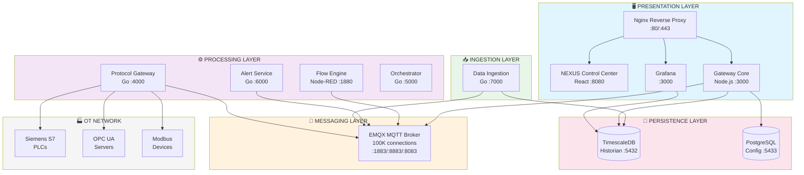

```
╔══════════════════════════════════════════════════════════════════════════════════════════════════════╗
║                                    NEXUS EDGE PLATFORM                                               ║
║                           Industrial IoT Data Acquisition & Control                                  ║
╠══════════════════════════════════════════════════════════════════════════════════════════════════════╣
║                                                                                                      ║
║  ┌─────────────────────────────────────────────────────────────────────────────────────────────┐     ║
║  │                              PRESENTATION LAYER                                             │     ║
║  │  ┌──────────────────┐  ┌──────────────────┐  ┌──────────────────┐  ┌──────────────────┐     │     ║
║  │  │   NEXUS Control  │  │      Nginx       │  │     Gateway      │  │    Grafana       │     │     ║
║  │  │   Center (React) │  │   Reverse Proxy  │  │       Core       │  │   (Optional)     │     │     ║
║  │  │   Port: 8080     │  │   Port: 80/443   │  │   Port: 3000     │  │   Port: 3000     │     │     ║
║  │  └────────┬─────────┘  └────────┬─────────┘  └────────┬─────────┘  └────────┬─────────┘     │     ║
║  └───────────┼─────────────────────┼─────────────────────┼─────────────────────┼───────────────┘     ║
║              │                     │                     │                     │                     ║
║              └─────────────────────┴──────────┬──────────┴─────────────────────┘                     ║
║                                               │                                                      ║
║  ┌────────────────────────────────────────────┼─────────────────────────────────────────────────┐    ║
║  │                          MESSAGING LAYER   │                                                 │    ║
║  │                    ┌───────────────────────┴───────────────────────┐                         │    ║
║  │                    │              EMQX MQTT BROKER                 │                         │    ║
║  │                    │     High-Performance Message Bus (100K conn)  │                         │    ║
║  │                    │                                               │                         │    ║
║  │                    │   Ports: 1883 (TCP) | 8883 (SSL)              │                         │    ║
║  │                    │          8083 (WS)  | 8084 (WSS)              │                         │    ║
║  │                    │          18083 (Dashboard)                    │                         │    ║
║  │                    └───────────────────────┬───────────────────────┘                         │    ║
║  └────────────────────────────────────────────┼─────────────────────────────────────────────────┘    ║
║                                               │                                                      ║
║                    ┌──────────────────────────┼──────────────────────────┐                           ║
║                    │                          │                          │                           ║
║  ┌─────────────────┴──────────────────┐ ┌─────┴─────────────────┐ ┌──────┴─────────────────────┐     ║
║  │        PROCESSING LAYER            │ │   INGESTION LAYER     │ │    PERSISTENCE LAYER       │     ║
║  │  ┌────────────────────────────┐    │ │  ┌─────────────────┐  │ │  ┌──────────────────────┐  │     ║
║  │  │     Protocol Gateway       │    │ │  │  Data Ingestion │  │ │  │     TimescaleDB      │  │     ║
║  │  │          (Go)              │    │ │  │      (Go)       │  │ │  │     (Historian)      │  │     ║
║  │  │      Port: 4000            │    │ │  │   Port: 7000    │  │ │  │    Port: 5432        │  │     ║
║  │  └────────────────────────────┘    │ │  └─────────────────┘  │ │  └──────────────────────┘  │     ║
║  │  ┌────────────────────────────┐    │ └───────────────────────┘ │  ┌──────────────────────┐  │     ║
║  │  │      Flow Engine           │    │                           │  │     PostgreSQL       │  │     ║
║  │  │     (Node-RED)             │    │                           │  │   (Config Store)     │  │     ║
║  │  │      Port: 1880            │    │                           │  │    Port: 5433        │  │     ║
║  │  └────────────────────────────┘    │                           │  └──────────────────────┘  │     ║
║  │  ┌────────────────────────────┐    │                           └────────────────────────────┘     ║
║  │  │     Alert Service          │    │                                                              ║
║  │  │         (Go)               │    │                                                              ║
║  │  │      Port: 6000            │    │                                                              ║
║  │  └────────────────────────────┘    │                                                              ║
║  │  ┌────────────────────────────┐    │                                                              ║
║  │  │     Orchestrator           │    │                                                              ║
║  │  │     (Go/Docker)            │    │                                                              ║
║  │  │      Port: 5000            │    │                                                              ║
║  │  └────────────────────────────┘    │                                                              ║
║  └────────────────────────────────────┘                                                              ║
║                                                                                                      ║
╚══════════════════════════════════════════════════════════════════════════════════════════════════════╝
```

---

## 🔌 Protocol Gateway - Deep Architecture

### Overview

The **Protocol Gateway** is the heart of device communication, written in Go for maximum performance. It handles bidirectional communication with industrial devices using three major protocols: **Siemens S7**, **OPC UA**, and **Modbus**. 

**Core responsibilities:**
- **Polling Service**: Orchestrates interval-based polling with jitter distribution to prevent synchronized bursts
- **Command Handler**: Processes write commands from MQTT with rate limiting and back-pressure
- **Protocol Pools**: Manages connection pools with circuit breakers for fault tolerance

**Optimizations:**
- Worker pool with back-pressure (skips polls when overloaded)
- sync.Pool for DataPoint slices (reduces GC pressure)
- Circuit breaker pattern prevents cascade failures

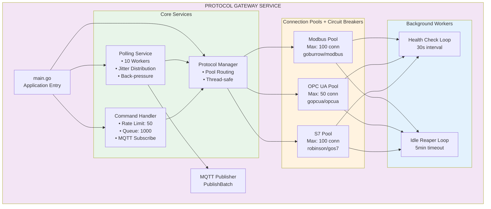

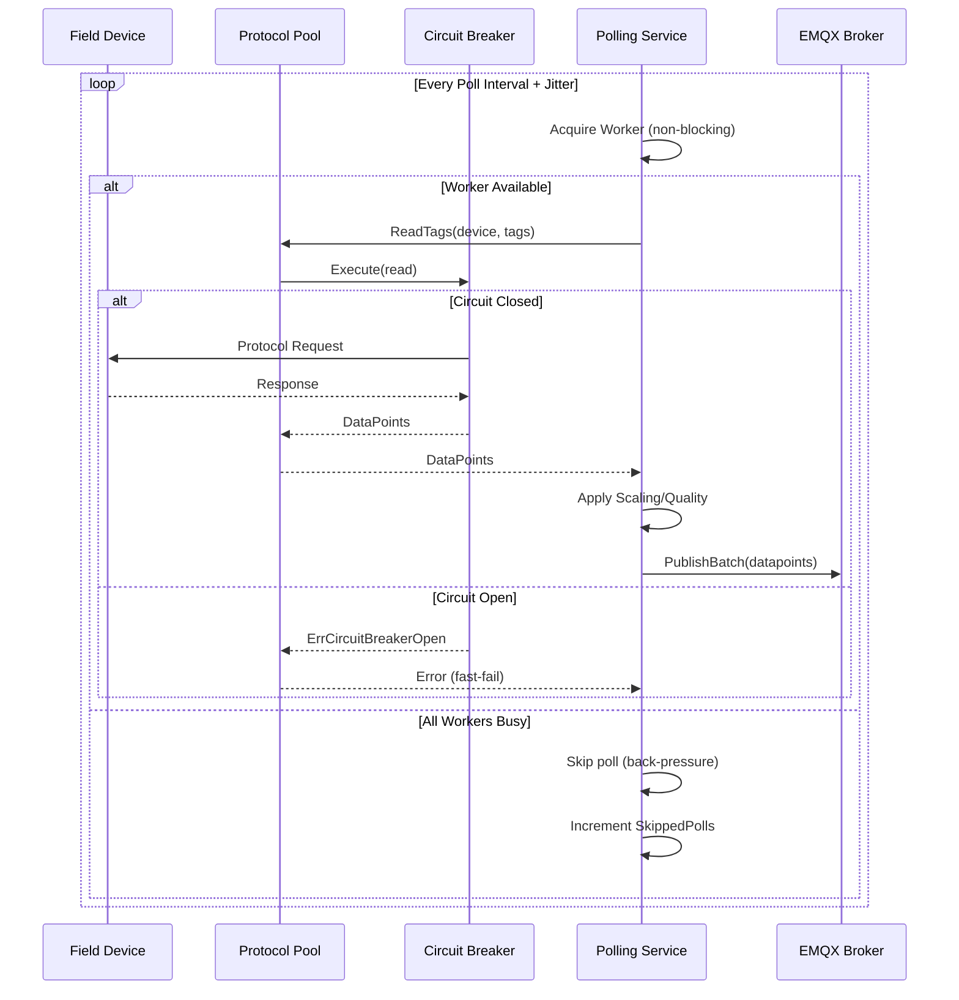

```
╔═════════════════════════════════════════════════════════════════════════════════════════════════════╗
║                              PROTOCOL GATEWAY SERVICE (Go)                                          ║
║                                  High-Performance Device I/O                                        ║
╠═════════════════════════════════════════════════════════════════════════════════════════════════════╣
║                                                                                                     ║
║  ┌────────────────────────────────────────────────────────────────────────────────────────────┐     ║
║  │                                    MAIN APPLICATION                                        │     ║
║  │                                       cmd/gateway/main.go                                  │     ║
║  └─────────────────────────────────────────────┬──────────────────────────────────────────────┘     ║
║                                                │                                                    ║
║              ┌─────────────────────────────────┼─────────────────────────────────┐                  ║
║              │                                 │                                 │                  ║
║              ▼                                 ▼                                 ▼                  ║
║  ┌───────────────────────┐     ┌───────────────────────────┐     ┌───────────────────────┐          ║
║  │    POLLING SERVICE    │     │     COMMAND HANDLER       │     │    PROTOCOL MANAGER   │          ║
║  │    ═══════════════    │     │     ═══════════════       │     │    ═══════════════    │          ║
║  │                       │     │                           │     │                       │          ║
║  │  • Device orchestrator│     │  • MQTT cmd subscriber    │     │  • Protocol routing   │          ║
║  │  • Interval-based poll│     │  • Write request handler  │     │  • Pool management    │          ║
║  │  • Jitter distribution│     │  • Rate limiting (50 max) │     │  • Thread-safe access │          ║
║  │  • Back-pressure ctrl │     │  • Bounded queue (1000)   │     │                       │          ║
║  │                       │     │  • Response publishing    │     │  RegisteredProtocols: │          ║
║  │  PollingConfig:       │     │                           │     │  • MODBUS             │          ║
║  │  ┌─────────────────┐  │     │  CommandConfig:           │     │  • OPC_UA             │          ║
║  │  │ WorkerCount: 10 │  │     │  ┌─────────────────────┐  │     │  • S7                 │          ║
║  │  │ BatchSize: 50   │  │     │  │ MaxConcurrentWrites │  │     │                       │          ║
║  │  │ Interval: 1s    │  │     │  │      = 50           │  │     │  Interface:           │          ║
║  │  │ Retries: 3      │  │     │  │ QueueSize = 1000    │  │     │  ┌─────────────────┐  │          ║
║  │  │ Shutdown: 30s   │  │     │  │ WriteTimeout: 10s   │  │     │  │ ReadTags()      │  │          ║   
║  │  └─────────────────┘  │     │  └─────────────────────┘  │     │  │ ReadTag()       │  │          ║
║  │                       │     │                           │     │  │ WriteTag()      │  │          ║
║  │  Stats Tracking:      │     │  Stats:                   │     │  │ Close()         │  │          ║
║  │  ┌─────────────────┐  │     │  ┌─────────────────────┐  │     │  │ HealthCheck()   │  │          ║
║  │  │ TotalPolls      │  │     │  │ CommandsReceived    │  │     │  └─────────────────┘  │          ║
║  │  │ SuccessPolls    │  │     │  │ CommandsSucceeded   │  │     │                       │          ║
║  │  │ FailedPolls     │  │     │  │ CommandsFailed      │  │     └───────────┬───────────┘          ║
║  │  │ SkippedPolls    │  │     │  │ CommandsRejected    │  │                 │                      ║ 
║  │  │ PointsRead      │  │     │  └─────────────────────┘  │                 │                      ║
║  │  │ PointsPublished │  │     │                           │                 │                      ║ 
║  │  └─────────────────┘  │     └─────────────┬─────────────┘                 │                      ║
║  └───────────┬───────────┘                   │                               │                      ║
║              │                               │                               │                      ║
║              └───────────────────────────────┼───────────────────────────────┘                      ║
║                                              │                                                      ║
║                                              ▼                                                      ║
║  ╔══════════════════════════════════════════════════════════════════════════════════════════════╗   ║
║  ║                                   PROTOCOL POOLS                                             ║   ║
║  ║                       Connection Pooling + Circuit Breaker Pattern                           ║   ║
║  ╠══════════════════════════════════════════════════════════════════════════════════════════════╣   ║
║  ║                                                                                              ║   ║
║  ║  ┌────────────────────────────┐ ┌────────────────────────────┐ ┌────────────────────────────┐║   ║
║  ║  │      MODBUS POOL           │ │       OPC UA POOL          │ │         S7 POOL            │║   ║
║  ║  │      ══════════            │ │       ══════════           │ │         ═══════            │║   ║
║  ║  │                            │ │                            │ │                            │║   ║
║  ║  │  Library: goburrow/modbus  │ │  Library: gopcua/opcua     │ │  Library: robinson/gos7    │║   ║
║  ║  │                            │ │                            │ │                            │║   ║
║  ║  │  PoolConfig:               │ │  PoolConfig:               │ │  PoolConfig:               │║   ║
║  ║  │  ┌────────────────────┐    │ │  ┌────────────────────┐    │ │  ┌────────────────────┐    │║   ║
║  ║  │  │ MaxConn: 100       │    │ │  │ MaxConn: 50        │    │ │  │ MaxConn: 100       │    │║   ║
║  ║  │  │ IdleTimeout: 5min  │    │ │  │ IdleTimeout: 5min  │    │ │  │ IdleTimeout: 5min  │    │║   ║
║  ║  │  │ HealthCheck: 30s   │    │ │  │ HealthCheck: 30s   │    │ │  │ HealthCheck: 30s   │    │║   ║
║  ║  │  │ ConnTimeout: 10s   │    │ │  │ ConnTimeout: 15s   │    │ │  │ ConnTimeout: 10s   │    │║   ║
║  ║  │  │ RetryAttempts: 3   │    │ │  │ RetryAttempts: 3   │    │ │  │ RetryAttempts: 3   │    │║   ║
║  ║  │  │ RetryDelay: 100ms  │    │ │  │ RetryDelay: 500ms  │    │ │  │ RetryDelay: 100ms  │    │║   ║
║  ║  │  └────────────────────┘    │ │  └────────────────────┘    │ │  └────────────────────┘    │║   ║
║  ║  │                            │ │                            │ │                            │║   ║
║  ║  │  Circuit Breaker:          │ │  Circuit Breaker:          │ │  Circuit Breaker:          │║   ║
║  ║  │  ┌────────────────────┐    │ │  ┌────────────────────┐    │ │  ┌────────────────────┐    │║   ║
║  ║  │  │ MaxRequests: 3     │    │ │  │ MaxRequests: 3     │    │ │  │ MaxRequests: 3     │    │║   ║
║  ║  │  │ Interval: 10s      │    │ │  │ Interval: 10s      │    │ │  │ Interval: 10s      │    │║   ║
║  ║  │  │ Timeout: 30s       │    │ │  │ Timeout: 60s       │    │ │  │ Timeout: 30s       │    │║   ║
║  ║  │  │ FailRatio: 60%     │    │ │  │ FailRatio: 60%     │    │ │  │ FailRatio: 50%     │    │║   ║
║  ║  │  │ MinRequests: 10    │    │ │  │ MinRequests: 5     │    │ │  │ MinRequests: 5     │    │║   ║
║  ║  │  └────────────────────┘    │ │  └────────────────────┘    │ │  └────────────────────┘    │║   ║
║  ║  │                            │ │                            │ │                            │║   ║
║  ║  │  Background Workers:       │ │  Background Workers:       │ │  Background Workers:       │║   ║
║  ║  │  • healthCheckLoop()       │ │  • healthCheckLoop()       │ │  • healthCheckLoop()       │║   ║
║  ║  │  • idleReaperLoop()        │ │  • idleReaperLoop()        │ │  • checkConnections()      │║   ║
║  ║  │                            │ │                            │ │  • evictIdleConnection()   │║   ║
║  ║  │  Supported Function Codes: │ │  Features:                 │ │                            │║   ║
║  ║  │  • FC01/02 (Read Coils)    │ │  • Browse Address Space    │ │  Supported PLCs:           │║   ║
║  ║  │  • FC03/04 (Read Regs)     │ │  • MonitoredItems Subs     │ │  • S7-300/400 (Classic)    │║   ║ 
║  ║  │  • FC05/06 (Write Single)  │ │  • Security: None/Sign/Enc │ │  • S7-1200 (Optimized)     │║   ║
║  ║  │  • FC15/16 (Write Multi)   │ │  • Auth: Anon/User/Cert    │ │  • S7-1500 (Optimized)     │║   ║
║  ║  │                            │ │  • WriteRequest Support    │ │                            │║   ║
║  ║  └────────────────────────────┘ └────────────────────────────┘ └────────────────────────────┘║   ║
║  ║                                                                                              ║   ║
║  ╚══════════════════════════════════════════════════════════════════════════════════════════════╝   ║
║                                                                                                     ║
║  ┌──────────────────────────────────────────────────────────────────────────────────────────────┐   ║
║  │                                      MQTT PUBLISHER                                          │   ║
║  │  • QoS selection (0, 1, 2)                                                                   │   ║
║  │  • Batch publishing (PublishBatch)                                                           │   ║
║  │  • Topic mapping: {enterprise}/{site}/{area}/{line}/{device}/{datapoint}                     │   ║
║  │  • Automatic reconnection                                                                    │   ║
║  └──────────────────────────────────────────────────────────────────────────────────────────────┘   ║
║                                                                                                     ║
╚═════════════════════════════════════════════════════════════════════════════════════════════════════╝
```

---

## 📥 Data Ingestion Service - Deep Architecture

### Overview

The **Data Ingestion Service** is a high-throughput pipeline that moves data from MQTT to TimescaleDB. Written in Go, it's optimized for processing hundreds of thousands of data points per second.

**Pipeline stages:**
1. **MQTT Subscriber**: Subscribes to UNS topics, parses JSON/SparkplugB messages
2. **Points Channel**: 10,000-capacity buffer with non-blocking back-pressure
3. **Batcher**: Accumulates points into batches (1000 points or 100ms flush)
4. **Writer Pool**: 4 parallel writers using PostgreSQL COPY protocol

**Key optimizations:**
- **COPY FROM STDIN**: 10-100x faster than individual INSERTs
- **Batch object pooling**: Reuses batch containers to reduce GC
- **Non-blocking channels**: Drops data gracefully under extreme load

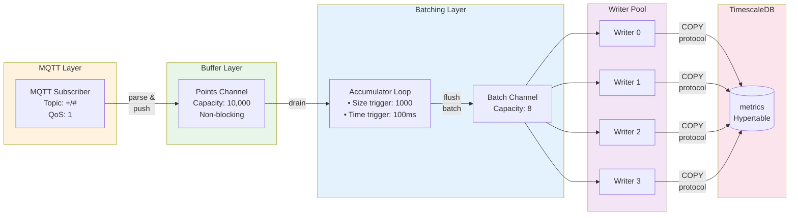

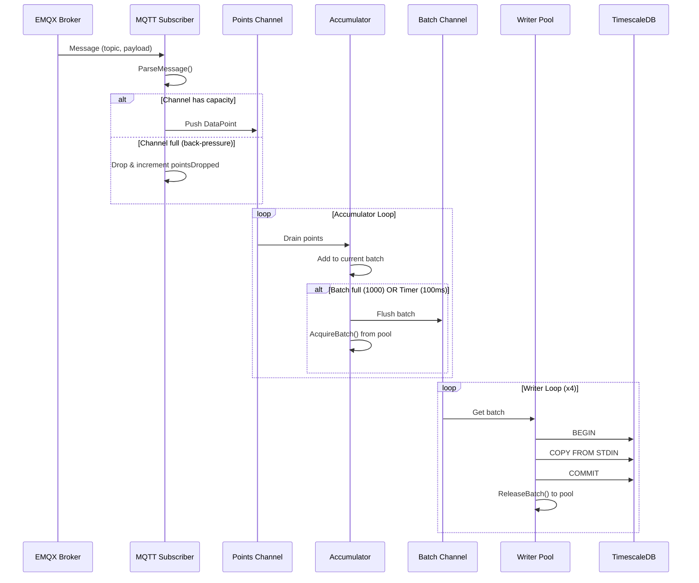

```
╔═════════════════════════════════════════════════════════════════════════════════════════════════════╗
║                              DATA INGESTION SERVICE (Go)                                            ║
║                           High-Throughput MQTT → TimescaleDB Pipeline                               ║
╠═════════════════════════════════════════════════════════════════════════════════════════════════════╣
║                                                                                                     ║
║  ┌──────────────────────────────────────────────────────────────────────────────────────────────┐   ║
║  │                                   INGESTION SERVICE                                          │   ║
║  │                                                                                              │   ║
║  │  IngestionConfig:                                                                            │   ║
║  │  ┌─────────────────────────────────────────────────────────────────────────────────────┐     │   ║
║  │  │  BufferSize: 10000       │  BatchSize: 1000       │  FlushInterval: 100ms           │     │   ║
║  │  │  WriterCount: 4          │                        │                                 │     │   ║
║  │  └─────────────────────────────────────────────────────────────────────────────────────┘     │   ║
║  │                                                                                              │   ║
║  └────────────────────────────────────────────┬─────────────────────────────────────────────────┘   ║
║                                               │                                                     ║
║         ┌─────────────────────────────────────┼─────────────────────────────────────┐               ║
║         │                                     │                                     │               ║
║         ▼                                     ▼                                     ▼               ║
║  ┌────────────────────┐            ┌──────────────────────┐            ┌────────────────────────┐   ║
║  │   MQTT SUBSCRIBER  │            │   POINTS CHANNEL     │            │     BATCHER            │   ║
║  │   ══════════════   │────────────│   ══════════════     │────────────│     ═══════            │   ║
║  │                    │   push     │                      │   drain    │                        │   ║
║  │  • Topic: +/#      │            │  Buffered Chan       │            │  BatcherConfig:        │   ║
║  │  • QoS: 1          │            │  Cap: 10000          │            │  ┌──────────────────┐  │   ║
║  │  • HandleMessage() │            │                      │            │  │ BatchSize: 1000  │  │   ║
║  │                    │            │  Back-pressure:      │            │  │ FlushInterval:   │  │   ║
║  │  ParseMessage:     │            │  Non-blocking send   │            │  │   100ms          │  │   ║
║  │  • JSON decode     │            │  Drop on full        │            │  │ WriterCount: 4   │  │   ║
║  │  • SparkplugB      │            │  Track pointsDropped │            │  └──────────────────┘  │   ║
║  │                    │            │                      │            │                        │   ║
║  └────────────────────┘            └──────────────────────┘            │  Workers:              │   ║
║                                                                        │  ┌──────────────────┐  │   ║
║                                                                        │  │ accumulatorLoop  │  │   ║
║                                                                        │  │ writerLoop(0)    │  │   ║
║                                                                        │  │ writerLoop(1)    │  │   ║
║                                                                        │  │ writerLoop(2)    │  │   ║
║                                                                        │  │ writerLoop(3)    │  │   ║
║                                                                        │  └──────────────────┘  │   ║
║                                                                        └───────────┬────────────┘   ║
║                                                                                    │                ║
║                                                                                    ▼                ║
║  ┌──────────────────────────────────────────────────────────────────────────────────────────────┐   ║
║  │                                   BATCH CHANNEL                                              │   ║
║  │                              Completed batches waiting for write                             │   ║
║  │                                  Capacity: WriterCount * 2 = 8                               │   ║
║  └────────────────────────────────────────────┬─────────────────────────────────────────────────┘   ║
║                                               │                                                     ║
║                                               ▼                                                     ║
║  ┌──────────────────────────────────────────────────────────────────────────────────────────────┐   ║
║  │                                  TIMESCALEDB WRITER                                          │   ║
║  │                                                                                              │   ║
║  │  WriteBatch():                                                                               │   ║
║  │  ┌────────────────────────────────────────────────────────────────────────────────────────┐  │   ║
║  │  │  1. Acquire connection from pgx pool                                                   │  │   ║
║  │  │  2. Begin transaction                                                                  │  │   ║
║  │  │  3. COPY FROM STDIN (bulk insert)  ◄─── Optimized for high throughput                  │  │   ║
║  │  │  4. Commit transaction                                                                 │  │   ║
║  │  │  5. Return connection to pool                                                          │  │   ║
║  │  └────────────────────────────────────────────────────────────────────────────────────────┘  │   ║
║  │                                                                                              │   ║
║  │  Target Table: metrics (hypertable)                                                          │   ║
║  │  ┌────────────────────────────────────────────────────────────────────────────────────────┐  │   ║
║  │  │  time TIMESTAMPTZ │ topic TEXT │ value DOUBLE │ value_str TEXT │ quality SMALLINT      │  │   ║
║  │  └────────────────────────────────────────────────────────────────────────────────────────┘  │   ║
║  │                                                                                              │   ║
║  └──────────────────────────────────────────────────────────────────────────────────────────────┘   ║
║                                                                                                     ║
╚═════════════════════════════════════════════════════════════════════════════════════════════════════╝
```

---

## 🔄 Data Flow - Complete Pipeline

### Overview

The complete data flow demonstrates how industrial data moves from field devices to persistent storage and real-time consumers. The architecture follows the **Unified Namespace (UNS)** pattern where all data flows through a central MQTT broker with a hierarchical topic structure.

**Data flow path:**
1. **Field Devices** → Protocol-specific communication (S7/OPC UA/Modbus)
2. **Protocol Gateway** → Reads, transforms, publishes to MQTT
3. **EMQX Broker** → Central message bus with UNS topics
4. **Multiple Consumers** → Data Ingestion, Flow Engine, Alert Service, Frontend

**UNS Topic Structure:**
```
{enterprise}/{site}/{area}/{line}/{device}/{datapoint}
Example: acme/plant-chicago/building-a/line-1/plc-001/temperature
```

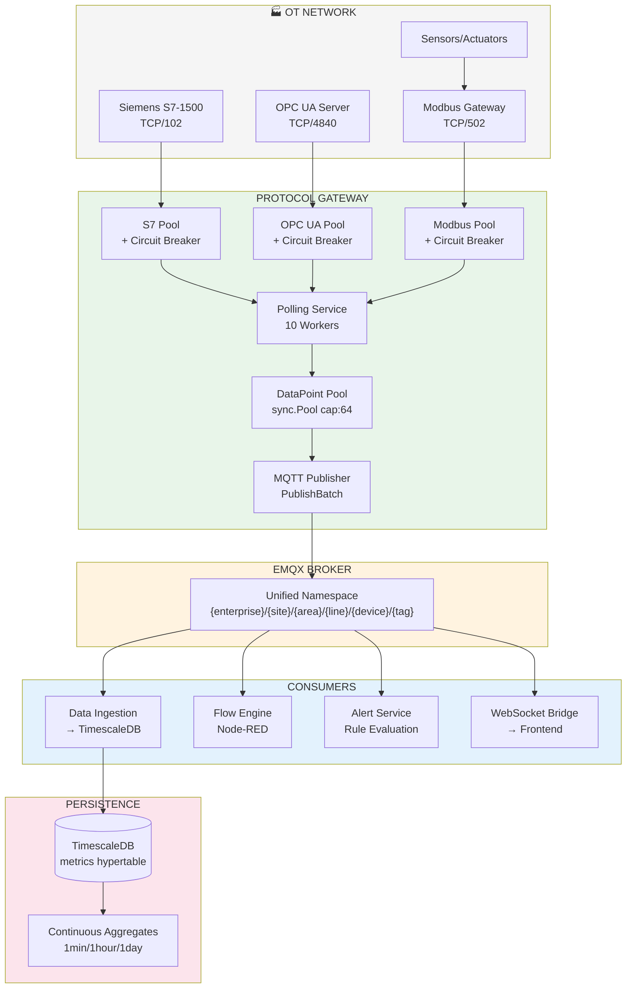

```mermaid
sequenceDiagram
    participant PLC as Field Device
    participant Pool as Protocol Pool
    participant Poll as Polling Service
    participant MQTT as EMQX Broker
    participant Ingestion as Data Ingestion
    participant DB as TimescaleDB

    Note over PLC,DB: Read Flow (every poll interval)
    
    Poll->>Pool: ReadTags(device, tags)
    Pool->>PLC: Protocol Request
    PLC-->>Pool: Raw Values
    Pool-->>Poll: DataPoints[]
    
    Poll->>Poll: Set topic from UNS prefix
    Poll->>Poll: Apply scaling if configured
    Poll->>Poll: Set quality flags
    
    Poll->>MQTT: PublishBatch(datapoints)
    
    par Parallel Consumers
        MQTT->>Ingestion: Message (topic, payload)
        Ingestion->>Ingestion: Buffer → Batch
        Ingestion->>DB: COPY batch
    and
        MQTT->>Note: Flow Engine processes
    and
        MQTT->>Note: Alert Service evaluates
    end
```

```
╔═════════════════════════════════════════════════════════════════════════════════════════════════════╗
║                                    COMPLETE DATA FLOW                                               ║
╠═════════════════════════════════════════════════════════════════════════════════════════════════════╣
║                                                                                                     ║
║  ┌─────────────────────────────────────────────────────────────────────────────────────────────┐    ║
║  │                               OT NETWORK / FIELD DEVICES                                    │    ║
║  │                                                                                             │    ║
║  │   ┌─────────────┐    ┌─────────────┐    ┌─────────────┐    ┌─────────────┐                  │    ║
║  │   │  Siemens    │    │   Beckhoff  │    │   Schneider │    │   Generic   │                  │    ║
║  │   │  S7-1500    │    │  OPC UA     │    │   Modbus    │    │   Sensors   │                  │    ║
║  │   │  PLC        │    │  Server     │    │   Gateway   │    │             │                  │    ║
║  │   └──────┬──────┘    └──────┬──────┘    └──────┬──────┘    └──────┬──────┘                  │    ║
║  │          │                  │                  │                  │                         │    ║
║  └──────────┼──────────────────┼──────────────────┼──────────────────┼─────────────────────────┘    ║
║             │ TCP/102          │ TCP/4840         │ TCP/502          │                              ║
║             │ S7 Protocol      │ OPC UA           │ Modbus TCP       │                              ║
║             │                  │                  │                  │                              ║
║  ═══════════╪══════════════════╪══════════════════╪══════════════════╪═══════════════════════════   ║
║             │                  │                  │                  │                              ║
║             ▼                  ▼                  ▼                  ▼                              ║
║  ┌──────────────────────────────────────────────────────────────────────────────────────────────┐   ║
║  │                                PROTOCOL GATEWAY                                              │   ║
║  │  ┌─────────────────┐  ┌─────────────────┐  ┌─────────────────┐                               │   ║
║  │  │    S7 Pool      │  │   OPC UA Pool   │  │   Modbus Pool   │                               │   ║
║  │  │   (gos7)        │  │   (gopcua)      │  │   (go-modbus)   │                               │   ║
║  │  │                 │  │                 │  │                 │                               │   ║
║  │  │  Circuit        │  │  Circuit        │  │  Circuit        │                               │   ║
║  │  │  Breaker        │  │  Breaker        │  │  Breaker        │                               │   ║
║  │  └────────┬────────┘  └────────┬────────┘  └────────┬────────┘                               │   ║
║  │           │                    │                    │                                        │   ║
║  │           └────────────────────┼────────────────────┘                                        │   ║
║  │                                ▼                                                             │   ║
║  │  ┌──────────────────────────────────────────────────────────────────┐                        │   ║
║  │  │                    POLLING SERVICE                               │                        │   ║
║  │  │                                                                  │                        │   ║
║  │  │    Worker Pool (10)  ←──┐                                        │                        │   ║
║  │  │         │               │ Back-pressure: Skip poll if busy       │                        │   ║
║  │  │         ▼               │                                        │                        │   ║
║  │  │    ┌─────────────────────────────────────────────────────────┐   │                        │   ║
║  │  │    │ Device Pollers (per device goroutine)                   │   │                        │   ║
║  │  │    │                                                         │   │                        │   ║
║  │  │    │  • Jitter: 0-10% of interval (spread polls over time)   │   │                        │   ║
║  │  │    │  • Ticker-based scheduling                              │   │                        │   ║
║  │  │    │  • Timeout: device.Connection.Timeout                   │   │                        │   ║
║  │  │    └─────────────────────────────────────────────────────────┘   │                        │   ║
║  │  └──────────────────────────────────────────────────────────────────┘                        │   ║
║  │                                │                                                             │   ║
║  │                                ▼                                                             │   ║
║  │  ┌──────────────────────────────────────────────────────────────────┐                        │   ║
║  │  │                    DataPoint Pool (sync.Pool)                    │                        │   ║
║  │  │                    Pre-allocated slices, cap: 64                 │                        │   ║
║  │  │                    Reduces GC pressure                           │                        │   ║
║  │  └────────────────────────────────┬─────────────────────────────────┘                        │   ║
║  │                                   │                                                          │   ║
║  │                                   ▼                                                          │   ║
║  │  ┌──────────────────────────────────────────────────────────────────┐                        │   ║
║  │  │                    MQTT PUBLISHER                                │                        │   ║
║  │  │                    PublishBatch() for efficiency                 │                        │   ║
║  │  └────────────────────────────────┬─────────────────────────────────┘                        │   ║
║  │                                   │                                                          │   ║
║  └───────────────────────────────────┼──────────────────────────────────────────────────────────┘   ║
║                                      │                                                              ║
║                                      │  Topic: {uns_prefix}/{topic_suffix}                          ║
║                                      │  Example: acme/plant-1/line-1/plc-001/temperature            ║
║                                      ▼                                                              ║
║  ┌──────────────────────────────────────────────────────────────────────────────────────────────┐   ║
║  │                                    EMQX BROKER                                               │   ║
║  │                                                                                              │   ║
║  │   ┌─────────────────────────────────────────────────────────────────────────────────────┐    │   ║
║  │   │  Unified Namespace (UNS)                                                            │    │   ║
║  │   │  {enterprise}/{site}/{area}/{line}/{device}/{datapoint}                             │    │   ║
║  │   │                                                                                     │    │   ║
║  │   │  Examples:                                                                          │    │   ║
║  │   │  • acme/plant-chicago/building-a/line-1/plc-001/temperature                         │    │   ║
║  │   │  • acme/plant-chicago/building-a/line-1/sensor-temp-01/value                        │    │   ║
║  │   │  • acme/plant-chicago/building-a/line-2/robot-arm/position/x                        │    │   ║
║  │   └─────────────────────────────────────────────────────────────────────────────────────┘    │   ║
║  │                                                                                              │   ║
║  │   Subscribers:                                                                               │   ║
║  │   • Data Ingestion Service (historian)                                                       │   ║
║  │   • Flow Engine (processing)                                                                 │   ║
║  │   • Alert Service (monitoring)                                                               │   ║
║  │   • Frontend (WebSocket bridge)                                                              │   ║
║  │                                                                                              │   ║
║  └─────────────────────────────────────┬────────────────────────────────────────────────────────┘   ║
║                                        │                                                            ║
║              ┌─────────────────────────┼─────────────────────────┐                                  ║
║              │                         │                         │                                  ║
║              ▼                         ▼                         ▼                                  ║
║  ┌────────────────────┐   ┌────────────────────┐   ┌────────────────────────┐                       ║
║  │  DATA INGESTION    │   │    FLOW ENGINE     │   │    ALERT SERVICE       │                       ║
║  │                    │   │                    │   │                        │                       ║
║  │  Batcher →         │   │  MQTT In →         │   │  Rule Evaluation →     │                       ║
║  │  WriterPool →      │   │  Transform →       │   │  Threshold Check →     │                       ║
║  │  TimescaleDB       │   │  MQTT Out          │   │  Notification          │                       ║
║  │                    │   │                    │   │                        │                       ║
║  └─────────┬──────────┘   └────────────────────┘   └────────────────────────┘                       ║
║            │                                                                                        ║
║            ▼                                                                                        ║
║  ┌──────────────────────────────────────────────────────────────────────────────────────────────┐   ║
║  │                                    TIMESCALEDB                                               │   ║
║  │                                                                                              │   ║
║  │   Hypertable: metrics                                                                        │   ║
║  │   ┌───────────────────────────────────────────────────────────────────────────────────────┐  │   ║
║  │   │  time TIMESTAMPTZ │ topic TEXT │ value DOUBLE │ quality SMALLINT │ metadata JSONB     │  │   ║
║  │   └───────────────────────────────────────────────────────────────────────────────────────┘  │   ║
║  │                                                                                              │   ║
║  │   Continuous Aggregates:                                                                     │   ║
║  │   • metrics_1min   (1-minute rollups)                                                        │   ║
║  │   • metrics_1hour  (1-hour rollups)                                                          │   ║
║  │   • metrics_1day   (1-day rollups)                                                           │   ║
║  │                                                                                              │   ║
║  │   Policies:                                                                                  │   ║
║  │   • Compression: After 7 days                                                                │   ║
║  │   • Retention: Raw=30d, Hourly=1y, Daily=5y                                                  │   ║
║  │                                                                                              │   ║
║  └──────────────────────────────────────────────────────────────────────────────────────────────┘   ║
║                                                                                                     ║
╚═════════════════════════════════════════════════════════════════════════════════════════════════════╝
```

---

## 📝 Command Flow (Bidirectional Control)

### Overview

The **Command Handler** enables bidirectional control by processing write commands received via MQTT. This allows applications, the frontend, or the Flow Engine to write values back to field devices.

**Command topics:**
- `$nexus/cmd/{device_id}/write` - JSON payload with tag_id and value
- `$nexus/cmd/{device_id}/{tag_id}/set` - Direct value on topic

**Protection mechanisms:**
1. **Bounded Queue (1000)**: Prevents memory exhaustion under load
2. **Write Semaphore (50)**: Limits concurrent writes to devices
3. **Validation**: Checks device/tag existence and writability
4. **Circuit Breaker**: Fast-fails for known-bad connections

**Response flow:**
All commands receive an acknowledgement on `$nexus/cmd/response/{device_id}/{tag_id}` with success/failure status and timing information.

```mermaid
flowchart TB
    subgraph Sources["Command Sources"]
        APP[Application]
        UI[Frontend UI]
        FE[Flow Engine]
    end

    subgraph Handler["COMMAND HANDLER"]
        SUB[MQTT Subscriber<br/>$nexus/cmd/+/write<br/>$nexus/cmd/+/+/set]
        Q[Bounded Queue<br/>Capacity: 1000]
        SEM[Write Semaphore<br/>Max: 50 concurrent]
        VAL[Validator<br/>• Device exists?<br/>• Tag exists?<br/>• Tag writable?]
        PROC[processCommandQueue<br/>Single goroutine]
    end

    subgraph Pools["Protocol Pools"]
        MP[Modbus Pool]
        OP[OPC UA Pool]
        SP[S7 Pool]
    end

    subgraph Devices["Field Devices"]
        DEV[PLCs / Gateways]
    end

    subgraph Response["Response"]
        RESP[MQTT Publish<br/>$nexus/cmd/response/{device}/{tag}]
    end

    APP -->|publish| SUB
    UI -->|publish| SUB
    FE -->|publish| SUB

    SUB -->|"non-blocking<br/>enqueue"| Q
    Q --> PROC
    PROC -->|acquire| SEM
    SEM --> VAL
    VAL -->|WriteTag| MP
    VAL -->|WriteTag| OP
    VAL -->|WriteTag| SP
    
    MP --> DEV
    OP --> DEV
    SP --> DEV

    DEV -->|result| RESP

    style Sources fill:#e8f5e9
    style Handler fill:#fff3e0
    style Pools fill:#e3f2fd
    style Response fill:#f3e5f5
```

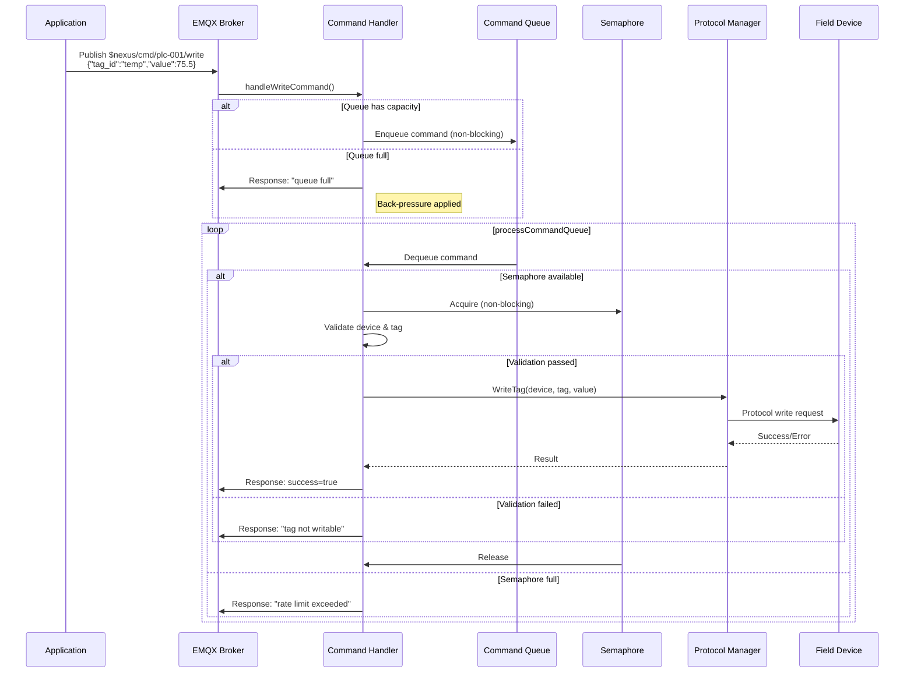

```
╔═════════════════════════════════════════════════════════════════════════════════════════════════════╗
║                               WRITE COMMAND FLOW (Bidirectional)                                    ║
╠═════════════════════════════════════════════════════════════════════════════════════════════════════╣
║                                                                                                     ║
║   ┌─────────────────────────────────────────────────────────────────────────────────────────────┐   ║
║   │  APPLICATION / FRONTEND / FLOW ENGINE                                                       │   ║
║   │                                                                                             │   ║
║   │  Publish to: $nexus/cmd/{device_id}/write                                                   │   ║
║   │              $nexus/cmd/{device_id}/{tag_id}/set                                            │   ║
║   │                                                                                             │   ║
║   │  Payload: {"tag_id": "temp", "value": 75.5, "request_id": "abc123"}                         │   ║
║   │                                                                                             │   ║
║   └────────────────────────────────────────────┬────────────────────────────────────────────────┘   ║
║                                                │                                                    ║
║                                                ▼                                                    ║
║   ┌─────────────────────────────────────────────────────────────────────────────────────────────┐   ║
║   │                              COMMAND HANDLER                                                │   ║
║   │                                                                                             │   ║
║   │   ┌─────────────────────────────────────────────────────────────────────────────────────┐   │   ║
║   │   │  1. MQTT Message Received                                                           │   │   ║
║   │   │     handleWriteCommand() or handleTagWriteCommand()                                 │   │   ║
║   │   └─────────────────────────────────────────────────────────────────────────────────────┘   │   ║
║   │                                           │                                                 │   ║
║   │                                           ▼                                                 │   ║
║   │   ┌─────────────────────────────────────────────────────────────────────────────────────┐   │   ║
║   │   │  2. Queue Command (non-blocking, bounded queue: 1000)                               │   │   ║
║   │   │     Back-pressure: Reject with "queue full" if capacity reached                     │   │   ║
║   │   └─────────────────────────────────────────────────────────────────────────────────────┘   │   ║
║   │                                           │                                                 │   ║
║   │                                           ▼                                                 │   ║
║   │   ┌─────────────────────────────────────────────────────────────────────────────────────┐   │   ║
║   │   │  3. processCommandQueue() - Single goroutine processes queue                        │   │   ║
║   │   │     Acquire semaphore (max 50 concurrent writes)                                    │   │   ║
║   │   │     Rate limit: Reject with "rate limit exceeded" if semaphore full                 │   │   ║
║   │   └─────────────────────────────────────────────────────────────────────────────────────┘   │   ║
║   │                                           │                                                 │   ║
║   │                                           ▼                                                 │   ║
║   │   ┌─────────────────────────────────────────────────────────────────────────────────────┐   │   ║
║   │   │  4. Validate                                                                        │   │   ║
║   │   │     • Device exists?                                                                │   │   ║
║   │   │     • Tag exists?                                                                   │   │   ║
║   │   │     • Tag writable? (tag.IsWritable())                                              │   │   ║
║   │   └─────────────────────────────────────────────────────────────────────────────────────┘   │   ║
║   │                                           │                                                 │   ║
║   │                                           ▼                                                 │   ║
║   │   ┌─────────────────────────────────────────────────────────────────────────────────────┐   │   ║
║   │   │  5. Execute Write via Protocol Manager                                              │   │   ║
║   │   │     protocolManager.WriteTag(ctx, device, tag, value)                               │   │   ║
║   │   │     Timeout: 10s (configurable)                                                     │   │   ║
║   │   └─────────────────────────────────────────────────────────────────────────────────────┘   │   ║
║   │                                                                                             │   ║
║   └────────────────────────────────────────────┬────────────────────────────────────────────────┘   ║
║                                                │                                                    ║
║                                                ▼                                                    ║
║   ┌─────────────────────────────────────────────────────────────────────────────────────────────┐   ║
║   │                              PROTOCOL POOLS                                                 │   ║
║   │                                                                                             │   ║
║   │   ┌──────────────────┐    ┌──────────────────┐    ┌──────────────────┐                      │   ║
║   │   │  Modbus Pool     │    │  OPC UA Pool     │    │    S7 Pool       │                      │   ║
║   │   │                  │    │                  │    │                  │                      │   ║
║   │   │  WriteTag()      │    │  WriteTag()      │    │  WriteTag()      │                      │   ║
║   │   │  WriteSingleCoil │    │  WriteTags()     │    │  WriteTags()     │                      │   ║
║   │   │  WriteSingle     │    │                  │    │                  │                      │   ║
║   │   │    Register      │    │                  │    │                  │                      │   ║
║   │   │  WriteMultiple   │    │                  │    │                  │                      │   ║
║   │   │    Registers     │    │                  │    │                  │                      │   ║
║   │   │  WriteMultiple   │    │                  │    │                  │                      │   ║
║   │   │    Coils         │    │                  │    │                  │                      │   ║
║   │   └────────┬─────────┘    └────────┬─────────┘    └────────┬─────────┘                      │   ║
║   │            │                       │                       │                                │   ║
║   │            │    Circuit Breaker    │    Circuit Breaker    │    Circuit Breaker             │   ║
║   │            │    Protection         │    Protection         │    Protection                  │   ║
║   │            │                       │                       │                                │   ║
║   └────────────┼───────────────────────┼───────────────────────┼────────────────────────────────┘   ║
║                │                       │                       │                                    ║
║                ▼                       ▼                       ▼                                    ║
║   ┌─────────────────────────────────────────────────────────────────────────────────────────────┐   ║
║   │                                   FIELD DEVICES                                             │   ║
║   │                                                                                             │   ║
║   │   [Modbus Slave]              [OPC UA Server]              [S7 PLC]                         │   ║
║   │    FC05/06/15/16               WriteRequest                 Write DB                        │   ║
║   │                                                                                             │   ║
║   └─────────────────────────────────────────────────────────────────────────────────────────────┘   ║
║                                                │                                                    ║
║                                                │ Result                                             ║
║                                                ▼                                                    ║
║   ┌─────────────────────────────────────────────────────────────────────────────────────────────┐   ║
║   │  RESPONSE PUBLISHED                                                                         │   ║
║   │                                                                                             │   ║
║   │  Topic: $nexus/cmd/response/{device_id}/{tag_id}                                            │   ║
║   │                                                                                             │   ║
║   │  Payload: {                                                                                 │   ║
║   │    "request_id": "abc123",                                                                  │   ║
║   │    "device_id": "plc-001",                                                                  │   ║
║   │    "tag_id": "temp",                                                                        │   ║
║   │    "success": true,                                                                         │   ║
║   │    "timestamp": "2024-01-15T10:30:00Z",                                                     │   ║
║   │    "duration_ms": 45                                                                        │   ║
║   │  }                                                                                          │   ║
║   │                                                                                             │   ║
║   └─────────────────────────────────────────────────────────────────────────────────────────────┘   ║
║                                                                                                     ║
╚═════════════════════════════════════════════════════════════════════════════════════════════════════╝
```

---

## ⚙️ Optimizations Summary

### Overview

The NEXUS platform employs multiple optimization techniques to achieve high throughput and low latency while maintaining stability under varying loads.

**Key optimization categories:**
1. **Memory Management**: Object pooling, atomic counters
2. **Connection Pooling**: Per-protocol pools with lazy creation
3. **Circuit Breaker**: Fault tolerance and fast-fail
4. **Back-Pressure**: Graceful degradation under load
5. **Batching**: Reduced I/O overhead
6. **Database Optimization**: TimescaleDB-specific features

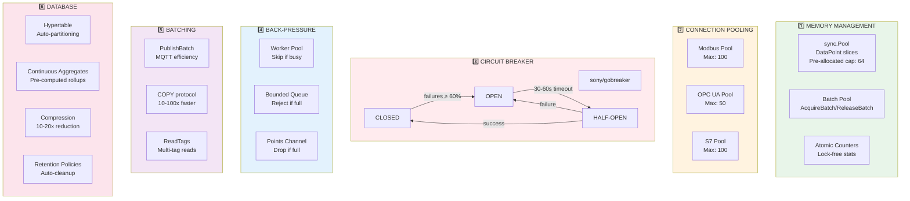

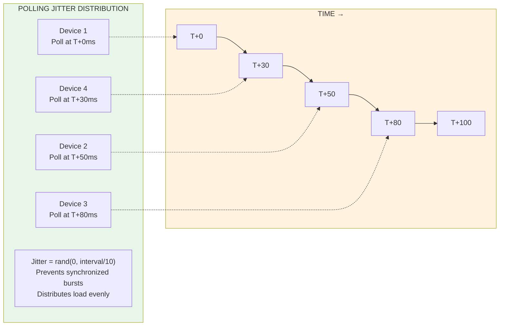

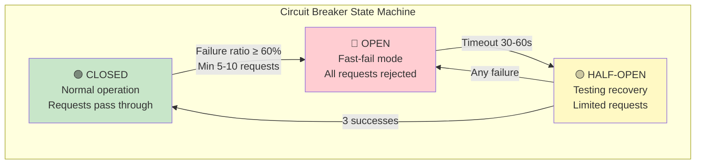

```
╔═════════════════════════════════════════════════════════════════════════════════════════════════════╗
║                                   OPTIMIZATION TECHNIQUES                                           ║
╠═════════════════════════════════════════════════════════════════════════════════════════════════════╣
║                                                                                                     ║
║  ┌──────────────────────────────────────────────────────────────────────────────────────────────┐   ║
║  │  1. MEMORY MANAGEMENT                                                                        │   ║
║  │  ─────────────────────────────────────────────────────────────────────────────────────────   │   ║
║  │                                                                                              │   ║
║  │  • sync.Pool for DataPoint slices (pre-allocated cap: 64)                                    │   ║
║  │    → Reduces GC pressure by recycling allocations                                            │   ║
║  │                                                                                              │   ║
║  │  • Batch domain object pool (AcquireBatch/ReleaseBatch)                                      │   ║
║  │    → Reuses batch containers in high-throughput ingestion                                    │   ║
║  │                                                                                              │   ║
║  │  • Atomic counters (sync/atomic) for statistics                                              │   ║
║  │    → Lock-free performance tracking                                                          │   ║
║  │                                                                                              │   ║
║  └──────────────────────────────────────────────────────────────────────────────────────────────┘   ║
║                                                                                                     ║
║  ┌──────────────────────────────────────────────────────────────────────────────────────────────┐   ║
║  │  2. CONNECTION POOLING                                                                       │   ║
║  │  ─────────────────────────────────────────────────────────────────────────────────────────   │   ║
║  │                                                                                              │   ║
║  │  Per-Protocol Pools:                                                                         │   ║
║  │  ┌────────────────────┬────────────────────┬────────────────────┐                            │   ║
║  │  │  Modbus Pool       │  OPC UA Pool       │  S7 Pool           │                            │   ║
║  │  │  Max: 100          │  Max: 50           │  Max: 100          │                            │   ║
║  │  └────────────────────┴────────────────────┴────────────────────┘                            │   ║
║  │                                                                                              │   ║
║  │  Features:                                                                                   │   ║
║  │  • Lazy connection creation (on-demand)                                                      │   ║
║  │  • Background health check loops (30s interval)                                              │   ║
║  │  • Idle connection reaper (5min timeout)                                                     │   ║
║  │  • Automatic reconnection on connection loss                                                 │   ║
║  │  • Connection eviction under pressure (LRU)                                                  │   ║
║  │                                                                                              │   ║
║  └──────────────────────────────────────────────────────────────────────────────────────────────┘   ║
║                                                                                                     ║
║  ┌──────────────────────────────────────────────────────────────────────────────────────────────┐   ║
║  │  3. CIRCUIT BREAKER PATTERN (sony/gobreaker)                                                 │   ║
║  │  ─────────────────────────────────────────────────────────────────────────────────────────   │   ║
║  │                                                                                              │   ║
║  │  States: CLOSED ─failure rate ≥ threshold──> OPEN ──timeout──> HALF-OPEN ──success──> CLOSED │   ║
║  │                                                                                              │   ║
║  │  Configuration:                                                                              │   ║
║  │  • MaxRequests (half-open): 3                                                                │   ║
║  │  • Interval (count reset): 10s                                                               │   ║
║  │  • Timeout (open → half-open): 30-60s                                                        │   ║
║  │  • FailureRatio threshold: 50-60%                                                            │   ║
║  │  • MinRequests before trip: 5-10                                                             │   ║
║  │                                                                                              │   ║
║  │  Benefits:                                                                                   │   ║
║  │  • Prevents cascade failures                                                                 │   ║
║  │  • Fast-fail for known-bad connections                                                       │   ║
║  │  • Automatic recovery attempts                                                               │   ║
║  │                                                                                              │   ║
║  └──────────────────────────────────────────────────────────────────────────────────────────────┘   ║
║                                                                                                     ║
║  ┌──────────────────────────────────────────────────────────────────────────────────────────────┐   ║
║  │  4. BACK-PRESSURE MECHANISMS                                                                 │   ║
║  │  ─────────────────────────────────────────────────────────────────────────────────────────   │   ║
║  │                                                                                              │   ║
║  │  Protocol Gateway (Polling):                                                                 │   ║
║  │  ┌─────────────────────────────────────────────────────────────────────────────────────┐     │   ║
║  │  │  Worker Pool (chan struct{}, size: 10)                                              │     │   ║
║  │  │  • Non-blocking acquire with `select { case ... default: skip }`                    │     │   ║
║  │  │  • Skip poll cycle if all workers busy                                              │     │   ║
║  │  │  • Track skipped polls in stats (SkippedPolls counter)                              │     │   ║
║  │  └─────────────────────────────────────────────────────────────────────────────────────┘     │   ║
║  │                                                                                              │   ║
║  │  Protocol Gateway (Commands):                                                                │   ║
║  │  ┌─────────────────────────────────────────────────────────────────────────────────────┐     │   ║
║  │  │  Bounded Queue (chan WriteCommand, size: 1000)                                      │     │   ║
║  │  │  • Non-blocking enqueue with `select { case ... default: reject }`                  │     │   ║
║  │  │  • Reject commands when queue full                                                  │     │   ║
║  │  │  • Return error response: "queue full, try again later"                             │     │   ║
║  │  │                                                                                     │     │   ║
║  │  │  Write Semaphore (chan struct{}, size: 50)                                          │     │   ║
║  │  │  • Limits concurrent write operations                                               │     │   ║
║  │  │  • Reject when rate limit exceeded                                                  │     │   ║
║  │  └─────────────────────────────────────────────────────────────────────────────────────┘     │   ║
║  │                                                                                              │   ║
║  │  Data Ingestion:                                                                             │   ║
║  │  ┌─────────────────────────────────────────────────────────────────────────────────────┐     │   ║
║  │  │  Points Channel (chan *DataPoint, size: 10000)                                      │     │   ║
║  │  │  • Non-blocking send with `select { case ... default: drop }`                       │     │   ║
║  │  │  • Drop data points when buffer full                                                │     │   ║
║  │  │  • Track dropped points (pointsDropped counter)                                     │     │   ║
║  │  └─────────────────────────────────────────────────────────────────────────────────────┘     │   ║
║  │                                                                                              │   ║
║  └──────────────────────────────────────────────────────────────────────────────────────────────┘   ║
║                                                                                                     ║
║  ┌──────────────────────────────────────────────────────────────────────────────────────────────┐   ║
║  │  5. BATCHING & BULK OPERATIONS                                                               │   ║
║  │  ─────────────────────────────────────────────────────────────────────────────────────────   │   ║
║  │                                                                                              │   ║
║  │  MQTT Publishing:                                                                            │   ║
║  │  • PublishBatch() for multiple data points in single operation                               │   ║
║  │  • Reduces MQTT round-trips                                                                  │   ║
║  │                                                                                              │   ║
║  │  Database Writes:                                                                            │   ║
║  │  • Batcher accumulates points (BatchSize: 1000)                                              │   ║
║  │  • Time-based flush (FlushInterval: 100ms)                                                   │   ║
║  │  • COPY FROM STDIN protocol (pgx)                                                            │   ║
║  │    → 10-100x faster than individual INSERTs                                                  │   ║
║  │                                                                                              │   ║
║  │  Protocol Reads:                                                                             │   ║
║  │  • ReadTags() reads multiple tags per request                                                │   ║
║  │  • Reduces protocol overhead (connection setup, framing)                                     │   ║
║  │                                                                                              │   ║
║  └──────────────────────────────────────────────────────────────────────────────────────────────┘   ║
║                                                                                                     ║
║  ┌──────────────────────────────────────────────────────────────────────────────────────────────┐   ║
║  │  6. POLLING OPTIMIZATION                                                                     │   ║
║  │  ─────────────────────────────────────────────────────────────────────────────────────────   │   ║
║  │                                                                                              │   ║
║  │  Jitter Distribution:                                                                        │   ║
║  │  ┌─────────────────────────────────────────────────────────────────────────────────────┐     │   ║
║  │  │  // Spread device polls over 0-10% of interval                                      │     │   ║
║  │  │  jitterMax := device.PollInterval / 10                                              │     │   ║
║  │  │  jitter := time.Duration(rand.Int63n(int64(jitterMax)))                             │     │   ║
║  │  │  time.Sleep(jitter)  // Initial delay before first poll                             │     │   ║
║  │  └─────────────────────────────────────────────────────────────────────────────────────┘     │   ║
║  │                                                                                              │   ║
║  │  Benefits:                                                                                   │   ║
║  │  • Prevents synchronized bursts                                                              │   ║
║  │  • Distributes load evenly over time                                                         │   ║
║  │  • Reduces peak CPU/memory usage                                                             │   ║
║  │                                                                                              │   ║
║  └──────────────────────────────────────────────────────────────────────────────────────────────┘   ║
║                                                                                                     ║
║  ┌──────────────────────────────────────────────────────────────────────────────────────────────┐   ║
║  │  7. DATABASE OPTIMIZATION (TimescaleDB)                                                      │   ║
║  │  ─────────────────────────────────────────────────────────────────────────────────────────   │   ║
║  │                                                                                              │   ║
║  │  Hypertable:                                                                                 │   ║
║  │  • Automatic time-based partitioning (chunks)                                                │   ║
║  │  • Index on (topic, time DESC) for efficient queries                                         │   ║
║  │                                                                                              │   ║
║  │  Continuous Aggregates:                                                                      │   ║
║  │  • metrics_1min, metrics_1hour, metrics_1day                                                 │   ║
║  │  • Pre-computed AVG, MIN, MAX, COUNT                                                         │   ║
║  │  • Automatic refresh on new data                                                             │   ║
║  │                                                                                              │   ║
║  │  Compression:                                                                                │   ║
║  │  • Compress data older than 7 days                                                           │   ║
║  │  • Segment by topic for optimal compression                                                  │   ║
║  │  • 10-20x storage reduction                                                                  │   ║
║  │                                                                                              │   ║
║  │  Retention:                                                                                  │   ║
║  │  • Raw data: 30 days                                                                         │   ║
║  │  • Hourly aggregates: 1 year                                                                 │   ║
║  │  • Daily aggregates: 5 years                                                                 │   ║
║  │                                                                                              │   ║
║  └──────────────────────────────────────────────────────────────────────────────────────────────┘   ║
║                                                                                                     ║
╚═════════════════════════════════════════════════════════════════════════════════════════════════════╝
```

---

## 🏛️ Infrastructure & Deployment

### Overview

The NEXUS platform supports two deployment modes: **Docker Compose** for development and **Kubernetes** for production. Both configurations provide networking isolation, persistent storage, and health monitoring.

**Network architecture:**
- **nexus-internal**: Bridge network for service-to-service communication (172.28.0.0/16)
- **nexus-ot**: Bridge to OT network for Protocol Gateway access to PLCs

**Kubernetes features:**
- Horizontal Pod Autoscaler (HPA) for automatic scaling
- Pod Disruption Budgets (PDB) for high availability
- Network Policies for security isolation
- Resource quotas and limits for fair scheduling

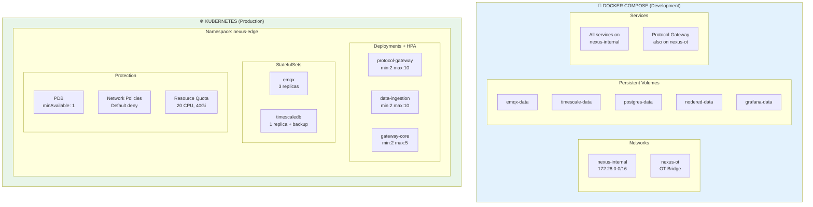

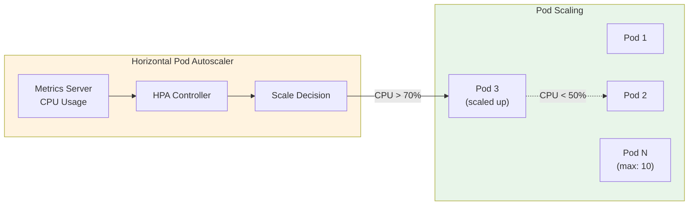

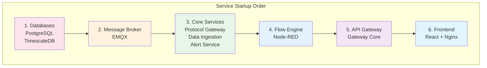

```
╔═════════════════════════════════════════════════════════════════════════════════════════════════════╗
║                                  DEPLOYMENT ARCHITECTURE                                            ║
╠═════════════════════════════════════════════════════════════════════════════════════════════════════╣
║                                                                                                     ║
║  ┌────────────────────────────────────────────────────────────────────────────────────────────┐     ║
║  │                               DOCKER COMPOSE (Development)                                 │     ║
║  │                                                                                            │     ║
║  │  Networks:                                                                                 │     ║
║  │  ┌─────────────────────────┐  ┌─────────────────────────┐                                  │     ║
║  │  │  nexus-internal         │  │  nexus-ot               │                                  │     ║
║  │  │  172.28.0.0/16          │  │  (OT Network Bridge)    │                                  │     ║
║  │  │                         │  │                         │                                  │     ║
║  │  │  All services           │  │  Protocol Gateway       │                                  │     ║
║  │  │  communicate here       │  │  ↔ PLCs/Devices         │                                  │     ║
║  │  └─────────────────────────┘  └─────────────────────────┘                                  │     ║
║  │                                                                                            │     ║
║  │  Volumes:                                                                                  │     ║
║  │  • emqx-data, emqx-log                                                                     │     ║
║  │  • timescale-data                                                                          │     ║
║  │  • postgres-data                                                                           │     ║
║  │  • nodered-data                                                                            │     ║
║  │  • grafana-data                                                                            │     ║
║  │  • gateway-logs                                                                            │     ║
║  │                                                                                            │     ║
║  └────────────────────────────────────────────────────────────────────────────────────────────┘     ║
║                                                                                                     ║
║  ┌────────────────────────────────────────────────────────────────────────────────────────────┐     ║
║  │                               KUBERNETES (Production)                                      │     ║
║  │                                                                                            │     ║
║  │  Namespace: nexus-edge                                                                     │     ║
║  │                                                                                            │     ║
║  │  ┌─────────────────────────────────────────────────────────────────────────────────────┐   │     ║
║  │  │  Deployments with HPA (Horizontal Pod Autoscaler)                                   │   │     ║
║  │  │                                                                                     │   │     ║
║  │  │  ┌─────────────────┐  ┌─────────────────┐  ┌─────────────────┐                      │   │     ║
║  │  │  │ protocol-gateway│  │ data-ingestion  │  │ gateway-core    │                      │   │     ║
║  │  │  │ min: 2, max: 10 │  │ min: 2, max: 10 │  │ min: 2, max: 5  │                      │   │     ║
║  │  │  │ CPU target: 70% │  │ CPU target: 70% │  │ CPU target: 70% │                      │   │     ║
║  │  │  └─────────────────┘  └─────────────────┘  └─────────────────┘                      │   │     ║
║  │  │                                                                                     │   │     ║
║  │  └─────────────────────────────────────────────────────────────────────────────────────┘   │     ║
║  │                                                                                            │     ║
║  │  ┌─────────────────────────────────────────────────────────────────────────────────────┐   │     ║
║  │  │  StatefulSets (Stateful Services)                                                   │   │     ║
║  │  │                                                                                     │   │     ║
║  │  │  ┌─────────────────┐  ┌─────────────────┐                                           │   │     ║
║  │  │  │ emqx            │  │ timescaledb     │                                           │   │     ║
║  │  │  │ replicas: 3     │  │ replicas: 1     │                                           │   │     ║
║  │  │  │ (cluster mode)  │  │ (with backups)  │                                           │   │     ║
║  │  │  └─────────────────┘  └─────────────────┘                                           │   │     ║
║  │  │                                                                                     │   │     ║
║  │  └─────────────────────────────────────────────────────────────────────────────────────┘   │     ║
║  │                                                                                            │     ║
║  │  ┌─────────────────────────────────────────────────────────────────────────────────────┐   │     ║
║  │  │  Pod Disruption Budgets (PDB)                                                       │   │     ║
║  │  │                                                                                     │   │     ║
║  │  │  All services: minAvailable: 1                                                      │   │     ║
║  │  │  → Ensures at least 1 pod during rolling updates                                    │   │     ║
║  │  │                                                                                     │   │     ║
║  │  └─────────────────────────────────────────────────────────────────────────────────────┘   │     ║
║  │                                                                                            │     ║
║  │  ┌─────────────────────────────────────────────────────────────────────────────────────┐   │     ║
║  │  │  Network Policies                                                                   │   │     ║
║  │  │                                                                                     │   │     ║
║  │  │  • Default deny all ingress                                                         │   │     ║
║  │  │  • Allow internal namespace traffic                                                 │   │     ║
║  │  │  • Allow ingress from nginx-ingress namespace                                       │   │     ║
║  │  │  • Protocol gateway: allow OT network egress                                        │   │     ║
║  │  │                                                                                     │   │     ║
║  │  └─────────────────────────────────────────────────────────────────────────────────────┘   │     ║
║  │                                                                                            │     ║
║  │  ┌─────────────────────────────────────────────────────────────────────────────────────┐   │     ║
║  │  │  Resource Controls                                                                  │   │     ║
║  │  │                                                                                     │   │     ║
║  │  │  LimitRange (default):                                                              │   │     ║
║  │  │  • CPU: 100m request, 1000m limit                                                   │   │     ║
║  │  │  • Memory: 128Mi request, 512Mi limit                                               │   │     ║
║  │  │                                                                                     │   │     ║
║  │  │  ResourceQuota (namespace):                                                         │   │     ║
║  │  │  • Total CPU: 20 cores                                                              │   │     ║
║  │  │  • Total Memory: 40Gi                                                               │   │     ║
║  │  │  • Max Pods: 100                                                                    │   │     ║
║  │  │                                                                                     │   │     ║
║  │  └─────────────────────────────────────────────────────────────────────────────────────┘   │     ║
║  │                                                                                            │     ║
║  └────────────────────────────────────────────────────────────────────────────────────────────┘     ║
║                                                                                                     ║
╚═════════════════════════════════════════════════════════════════════════════════════════════════════╝
```

---

## 📈 Service Dependencies Graph

### Overview

Understanding service dependencies is crucial for proper deployment ordering, debugging, and planning maintenance windows. The NEXUS platform follows a layered dependency model.

**Dependency hierarchy:**
- **Foundation Layer**: PostgreSQL, TimescaleDB (no dependencies)
- **Messaging Layer**: EMQX (depends on nothing)
- **Core Services**: Protocol Gateway, Data Ingestion, Alert Service (depend on EMQX + databases)
- **Processing Layer**: Flow Engine (depends on EMQX + TimescaleDB)
- **API Layer**: Gateway Core (depends on all core services)
- **Presentation Layer**: Frontend, Nginx (depend on Gateway Core)

**Health check cascade:**
If EMQX goes down, all dependent services will show degraded health. TimescaleDB outage affects Data Ingestion and historical queries but not real-time data flow.

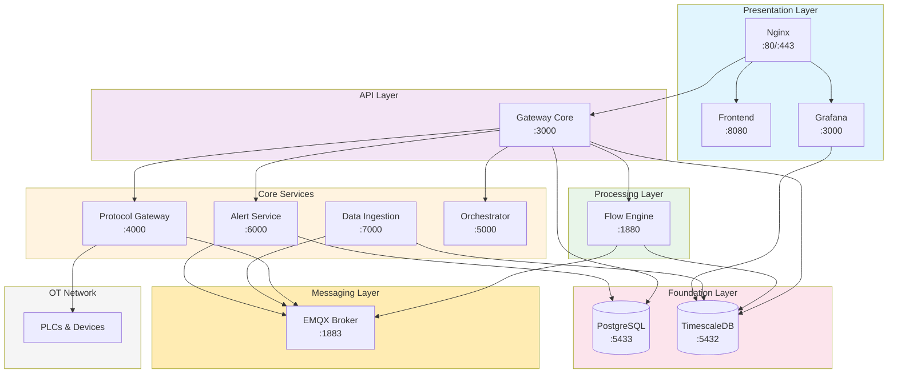

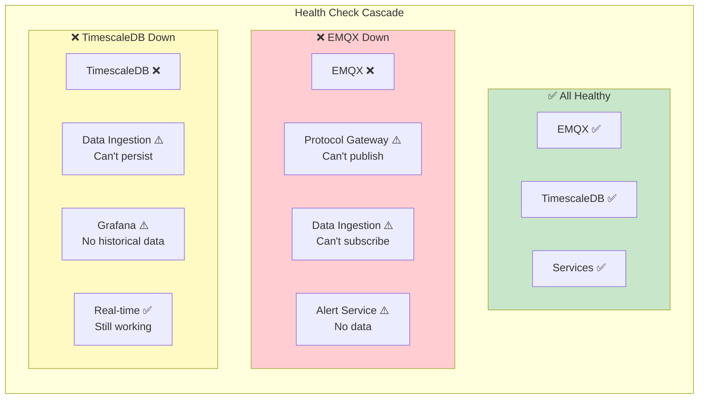

```
╔═════════════════════════════════════════════════════════════════════════════════════════════════════╗
║                                  SERVICE DEPENDENCY MAP                                             ║
╠═════════════════════════════════════════════════════════════════════════════════════════════════════╣
║                                                                                                     ║
║                                                                                                     ║
║                              ┌───────────────────────────────┐                                      ║
║                              │         NGINX                 │                                      ║
║                              │      (Reverse Proxy)          │                                      ║
║                              │       :80, :443               │                                      ║
║                              └──────────────┬────────────────┘                                      ║
║                                             │                                                       ║
║                           ┌─────────────────┼─────────────────┐                                     ║
║                           │                 │                 │                                     ║
║                           ▼                 ▼                 ▼                                     ║
║              ┌────────────────────┐ ┌───────────────┐ ┌────────────────────┐                        ║
║              │     FRONTEND       │ │ GATEWAY CORE  │ │     GRAFANA        │                        ║
║              │   (React SPA)      │ │  (API GW)     │ │  (Visualization)   │                        ║
║              │     :8080          │ │    :3000      │ │     :3000          │                        ║
║              └────────────────────┘ └───────┬───────┘ └─────────┬──────────┘                        ║
║                                             │                   │                                   ║
║                           ┌─────────────────┼───────────────────┼─────────────────┐                 ║
║                           │                 │                   │                 │                 ║
║                           ▼                 ▼                   ▼                 ▼                 ║
║    ┌──────────────┐ ┌──────────────┐ ┌──────────────┐ ┌──────────────┐ ┌──────────────┐             ║
║    │  PROTOCOL    │ │    FLOW      │ │    ALERT     │ │ ORCHESTRATOR │ │    DATA      │             ║
║    │  GATEWAY     │ │   ENGINE     │ │   SERVICE    │ │   SERVICE    │ │  INGESTION   │             ║
║    │   (Go)       │ │ (Node-RED)   │ │    (Go)      │ │    (Go)      │ │    (Go)      │             ║
║    │   :4000      │ │   :1880      │ │   :6000      │ │   :5000      │ │   :7000      │             ║
║    └──────┬───────┘ └──────┬───────┘ └──────┬───────┘ └──────────────┘ └──────┬───────┘             ║
║           │                │                │                                  │                    ║
║           │                └────────────────┼──────────────────────────────────┤                    ║
║           │                                 │                                  │                    ║
║           ▼                                 ▼                                  ▼                    ║
║    ┌─────────────────────────────────────────────────────────────────────────────────────┐          ║
║    │                                    EMQX BROKER                                      │          ║
║    │                               (MQTT Message Bus)                                    │          ║
║    │                            :1883, :8883, :8083, :8084                               │          ║
║    └─────────────────────────────────────────────────────────────────────────────────────┘          ║
║           │                                                                    │                    ║
║           │                                                                    │                    ║
║           ▼                                                                    ▼                    ║
║    ┌─────────────────────────────┐                    ┌─────────────────────────────────┐           ║
║    │        POSTGRESQL           │                    │          TIMESCALEDB            │           ║
║    │     (Config Store)          │                    │          (Historian)            │           ║
║    │         :5433               │                    │            :5432                │           ║
║    └─────────────────────────────┘                    └─────────────────────────────────┘           ║
║                                                                                                     ║
║                                                                                                     ║
║  ═══════════════════════════════════════════════════════════════════════════════════════════════    ║
║                                                                                                     ║
║  Legend:                                                                                            ║
║  ────────────────────────────────────────────────────────────────────────────────────────────────   ║
║  │  →  Depends on / Connects to                                                                     ║
║  │  ══════════════════════════════════════════════════════════════════════════════════════════      ║
║  │                                                                                                  ║
║  │  Startup Order (Docker Compose / K8s):                                                           ║
║  │  1. PostgreSQL, TimescaleDB (databases)                                                          ║
║  │  2. EMQX (message broker)                                                                        ║
║  │  3. Protocol Gateway, Data Ingestion, Alert Service (core services)                              ║
║  │  4. Flow Engine (depends on EMQX + TimescaleDB)                                                  ║
║  │  5. Gateway Core (depends on all services)                                                       ║
║  │  6. Frontend, Nginx (presentation layer)                                                         ║
║  │                                                                                                  ║
╚═════════════════════════════════════════════════════════════════════════════════════════════════════╝
```

---

## 📋 Technology Stack Summary

### Overview

The NEXUS platform uses a carefully selected technology stack optimized for **industrial IoT workloads**. Go is chosen for performance-critical services due to its low memory footprint and excellent concurrency model. TypeScript provides type safety for frontend and API development.

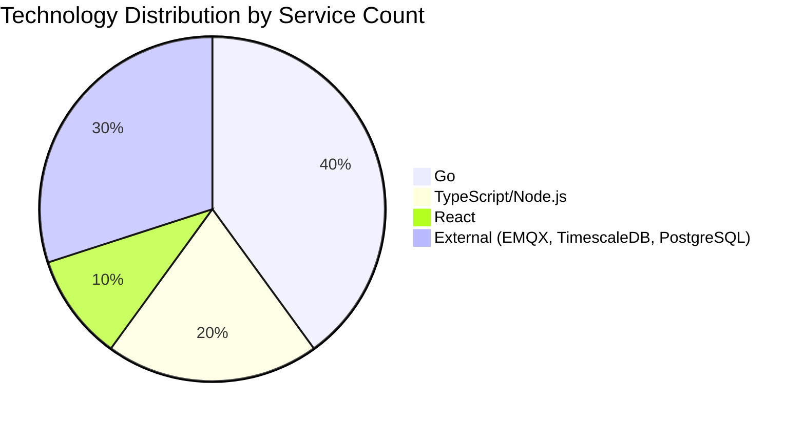

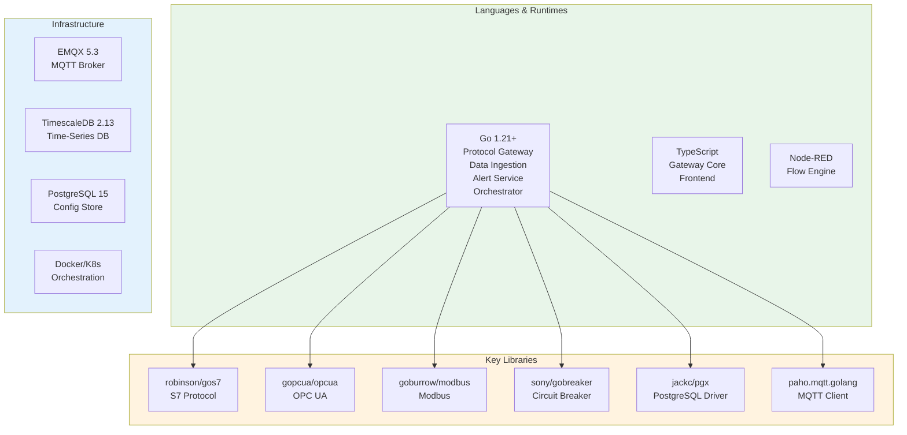

| Layer | Component | Technology | Port |
|-------|-----------|------------|------|
| **Presentation** | NEXUS Control Center | React + TypeScript + TailwindCSS | 8080 |
| | Reverse Proxy | Nginx | 80, 443 |
| | API Gateway | Node.js/Express (Gateway Core) | 3000 |
| **Processing** | Protocol Gateway | Go (gos7, gopcua, go-modbus) | 4000 |
| | Flow Engine | Node-RED | 1880 |
| | Alert Service | Go | 6000 |
| | Orchestrator | Go (Docker SDK / client-go) | 5000 |
| **Ingestion** | Data Ingestion | Go (pgx COPY) | 7000 |
| **Messaging** | MQTT Broker | EMQX 5.3 | 1883, 8883, 8083 |
| **Persistence** | Time-Series DB | TimescaleDB 2.13 (PostgreSQL 15) | 5432 |
| | Config DB | PostgreSQL 15 | 5433 |
| **Visualization** | Dashboards | Grafana (optional) | 3000 |

---

## 🔑 Key Design Patterns

### Overview

The NEXUS platform implements several proven design patterns to achieve reliability, scalability, and maintainability in industrial environments.

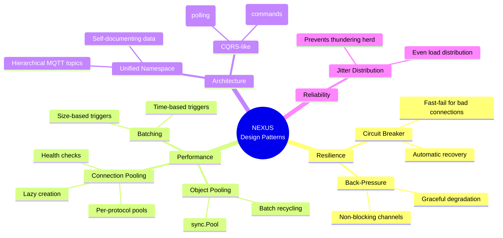

```mermaid
flowchart LR
    subgraph CQRS["CQRS-like Pattern"]
        direction TB
        
        subgraph Read["READ PATH"]
            POLL["Polling Service<br/>Interval-based"]
            PROTO["Protocol Pools<br/>ReadTags()"]
            PUB["MQTT Publish<br/>Data flow"]
        end
        
        subgraph Write["WRITE PATH"]
            SUB["MQTT Subscribe<br/>$nexus/cmd/#"]
            CMD["Command Handler<br/>Validation"]
            WR["Protocol Pools<br/>WriteTag()"]
        end
        
        POLL --> PROTO --> PUB
        SUB --> CMD --> WR
    end

    style Read fill:#e8f5e9
    style Write fill:#fff3e0
```

```mermaid
flowchart TB
    subgraph UNS["Unified Namespace Pattern"]
        direction LR
        
        ROOT["Enterprise"]
        SITE["Site"]
        AREA["Area"]
        LINE["Line"]
        DEV["Device"]
        TAG["Tag"]
        
        ROOT --> SITE --> AREA --> LINE --> DEV --> TAG
        
        EX1["acme/chicago/bldg-a/line-1/plc-001/temperature"]
        EX2["acme/chicago/bldg-a/line-1/plc-001/pressure"]
        EX3["acme/chicago/bldg-a/line-2/robot-01/position"]
    end

    subgraph Benefits["Benefits"]
        B1["✓ Self-documenting"]
        B2["✓ Wildcard subscriptions"]
        B3["✓ Easy integration"]
        B4["✓ Natural hierarchy"]
    end

    style UNS fill:#e8f5e9
    style Benefits fill:#e3f2fd
```

| Pattern | Implementation | Purpose |
|---------|---------------|---------|
| **Connection Pooling** | Per-protocol pools (Modbus/OPC UA/S7) | Efficient connection reuse, reduced latency |
| **Circuit Breaker** | sony/gobreaker | Fault tolerance, cascade failure prevention |
| **Back-Pressure** | Non-blocking channels with bounded queues | Graceful degradation under load |
| **Object Pooling** | sync.Pool for DataPoint slices | Reduced GC pressure, lower latency |
| **Batching** | Size (1000) + Time (100ms) triggers | Reduced I/O overhead, higher throughput |
| **Jitter Distribution** | Random 0-10% of poll interval | Prevents synchronized bursts |
| **Unified Namespace** | Hierarchical MQTT topics | Self-documenting, easy integration |
| **CQRS-like** | Separate read/write paths | Optimized for each use case |

---

## 📊 Quick Reference Diagrams

### Service Communication Matrix

```mermaid
flowchart TB
    subgraph External["External Access"]
        USER["👤 Users"]
        PLCS["🏭 PLCs"]
    end

    subgraph Platform["NEXUS Platform"]
        FE["Frontend"]
        GW["Gateway"]
        PG["Protocol GW"]
        DI["Ingestion"]
        EMQX["EMQX"]
        TSDB["TimescaleDB"]
    end

    USER -->|"HTTP/WS"| FE
    USER -->|"REST API"| GW
    PLCS -->|"S7/OPC/Modbus"| PG
    
    FE -->|"REST"| GW
    GW -->|"MQTT"| EMQX
    PG -->|"MQTT"| EMQX
    DI -->|"MQTT"| EMQX
    DI -->|"SQL"| TSDB
    GW -->|"SQL"| TSDB
```

### Data Throughput Path

```mermaid
flowchart LR
    A["📡 100+ Devices<br/>1000+ Tags"] 
    B["⚙️ Protocol Gateway<br/>10 Workers"]
    C["📨 EMQX<br/>100K msg/s"]
    D["📥 Data Ingestion<br/>4 Writers"]
    E["💾 TimescaleDB<br/>COPY protocol"]

    A -->|"Poll every 1s"| B
    B -->|"PublishBatch"| C
    C -->|"Subscribe +/#"| D
    D -->|"1000 pts/batch"| E

    style A fill:#f5f5f5
    style B fill:#e8f5e9
    style C fill:#fff3e0
    style D fill:#e3f2fd
    style E fill:#fce4ec
```

---

*Generated from codebase analysis - Last updated: January 2026*

> 💡 **Tip**: View this file with Mermaid support enabled (GitHub, GitLab, VS Code with extension) for interactive diagrams.

