# 🎨 NEXUS Edge - Visual Architecture Diagrams

> **Comprehensive Mermaid diagrams for the NEXUS Edge Industrial IoT Platform**

This document provides visual representations of the NEXUS Edge architecture, data flows, and system interactions. All diagrams are rendered using Mermaid syntax.

---

## 📋 Table of Contents

1. [High-Level System Architecture](#1-high-level-system-architecture)
2. [Operational Hierarchy](#2-operational-hierarchy)
3. [Complete Data Flow Pipeline](#3-complete-data-flow-pipeline)
4. [Protocol Gateway Architecture](#4-protocol-gateway-architecture)
5. [Data Ingestion Service Architecture](#5-data-ingestion-service-architecture)
6. [MQTT Unified Namespace (UNS)](#6-mqtt-unified-namespace-uns)
7. [Kubernetes Deployment Architecture](#7-kubernetes-deployment-architecture)
8. [Database Schema & Storage](#8-database-schema--storage)
9. [Sequence Diagrams](#9-sequence-diagrams)
10. [Service Communication Patterns](#10-service-communication-patterns)
11. [Horizontal Scaling Architecture](#11-horizontal-scaling-architecture)
12. [Security Architecture](#12-security-architecture)
13. [Alert System Flow](#13-alert-system-flow)
14. [Development Roadmap](#14-development-roadmap)
15. [Component State Diagrams](#15-component-state-diagrams)

---

## 1. High-Level System Architecture

### 1.1 Complete Platform Overview

```mermaid
flowchart TB
    subgraph DEVICES["🏭 INDUSTRIAL DEVICES"]
        direction LR
        PLC1[("🔧 Siemens S7\nPLC")]
        PLC2[("🔧 Modbus\nPLC/RTU")]
        PLC3[("🔧 OPC UA\nServer")]
        SENSOR[("📡 MQTT\nSensors")]
    end

    subgraph NEXUS["📦 NEXUS EDGE PLATFORM"]
        direction TB
        
        subgraph CONNECTIVITY["🔌 Connectivity Layer"]
            GATEWAY["Protocol Gateway\n(Go)"]
        end
        
        subgraph MESSAGING["📨 Messaging Layer"]
            EMQX[("EMQX Broker\n(MQTT 5.0)")]
        end
        
        subgraph PROCESSING["⚙️ Processing Layer"]
            INGESTION["Data Ingestion\n(Go)"]
            FLOWS["Flow Engine\n(Node-RED)"]
            ALERTS["Alert Service\n(Go)"]
        end
        
        subgraph PERSISTENCE["💾 Persistence Layer"]
            TSDB[("TimescaleDB\nHistorian")]
            POSTGRES[("PostgreSQL\nConfig Store")]
        end
        
        subgraph PRESENTATION["🖥️ Presentation Layer"]
            CORE["Gateway Core\n(API)"]
            UI["NEXUS Control Center\n(React)"]
        end
    end

    subgraph CLOUD["☁️ CLOUD (Optional)"]
        CLOUDMGMT["Fleet Management\nAnalytics"]
    end

    %% Device connections
    PLC1 -->|S7 TCP/102| GATEWAY
    PLC2 -->|Modbus TCP/502| GATEWAY
    PLC3 -->|OPC UA/4840| GATEWAY
    SENSOR -->|MQTT/1883| EMQX

    %% Internal flow
    GATEWAY -->|Publish| EMQX
    EMQX -->|Subscribe| INGESTION
    EMQX -->|Subscribe| FLOWS
    EMQX -->|Subscribe| ALERTS
    
    INGESTION -->|COPY Protocol| TSDB
    FLOWS -->|Read/Write| POSTGRES
    ALERTS -->|Store| POSTGRES
    
    CORE -->|Query| TSDB
    CORE -->|Query| POSTGRES
    CORE -->|Pub/Sub| EMQX
    UI -->|REST/WebSocket| CORE

    %% Cloud connection
    CORE -.->|TLS| CLOUDMGMT

    classDef device fill:#e1f5fe,stroke:#01579b,stroke-width:2px
    classDef gateway fill:#fff3e0,stroke:#e65100,stroke-width:2px
    classDef broker fill:#f3e5f5,stroke:#7b1fa2,stroke-width:2px
    classDef service fill:#e8f5e9,stroke:#2e7d32,stroke-width:2px
    classDef storage fill:#fce4ec,stroke:#c2185b,stroke-width:2px
    classDef ui fill:#e3f2fd,stroke:#1565c0,stroke-width:2px
    classDef cloud fill:#f5f5f5,stroke:#616161,stroke-width:2px,stroke-dasharray: 5 5

    class PLC1,PLC2,PLC3,SENSOR device
    class GATEWAY gateway
    class EMQX broker
    class INGESTION,FLOWS,ALERTS service
    class TSDB,POSTGRES storage
    class CORE,UI ui
    class CLOUDMGMT cloud
```

### 1.2 Simplified Architecture View

```mermaid
graph LR
    subgraph Sources["Data Sources"]
        D1["🔧 PLCs"]
        D2["📡 Sensors"]
        D3["🖥️ SCADA"]
    end

    subgraph Edge["NEXUS Edge"]
        GW["Protocol\nGateway"]
        MQ["EMQX\nBroker"]
        IN["Data\nIngestion"]
        DB[("Historian")]
    end

    subgraph Apps["Applications"]
        UI["Dashboard"]
        API["REST API"]
        AN["Analytics"]
    end

    D1 & D2 & D3 --> GW
    GW --> MQ
    MQ --> IN
    IN --> DB
    DB --> API
    API --> UI & AN

    style GW fill:#ff9800,color:#fff
    style MQ fill:#9c27b0,color:#fff
    style IN fill:#4caf50,color:#fff
    style DB fill:#e91e63,color:#fff
```

---

## 2. Operational Hierarchy

### 2.1 ISA-95 Levels in NEXUS

```mermaid
graph TB
    subgraph L4["Level 4: Enterprise (Cloud)"]
        CLOUD["☁️ Fleet Management\nAnalytics Aggregation\nML Model Training"]
    end

    subgraph L3["Level 3: NEXUS Edge Platform"]
        direction LR
        PROC["⚙️ Processing"]
        STORE["💾 Storage"]
        VIS["📊 Visualization"]
    end

    subgraph L2["Level 2: Protocol Gateways"]
        GW["🔌 Protocol Gateway\nS7 | OPC UA | Modbus"]
    end

    subgraph L1["Level 1: Field Devices"]
        direction LR
        PLC["PLC"]
        HMI["HMI"]
        DCS["DCS"]
        SENSOR["Sensors"]
    end

    subgraph L0["Level 0: Physical Process"]
        direction LR
        MOTOR["Motors"]
        VALVE["Valves"]
        PUMP["Pumps"]
    end

    L0 --> L1
    L1 --> L2
    L2 --> L3
    L3 -.-> L4

    classDef level4 fill:#bbdefb,stroke:#1976d2
    classDef level3 fill:#c8e6c9,stroke:#388e3c
    classDef level2 fill:#fff9c4,stroke:#f9a825
    classDef level1 fill:#ffccbc,stroke:#e64a19
    classDef level0 fill:#f5f5f5,stroke:#757575

    class CLOUD level4
    class PROC,STORE,VIS level3
    class GW level2
    class PLC,HMI,DCS,SENSOR level1
    class MOTOR,VALVE,PUMP level0
```

### 2.2 Edge-First Design Philosophy

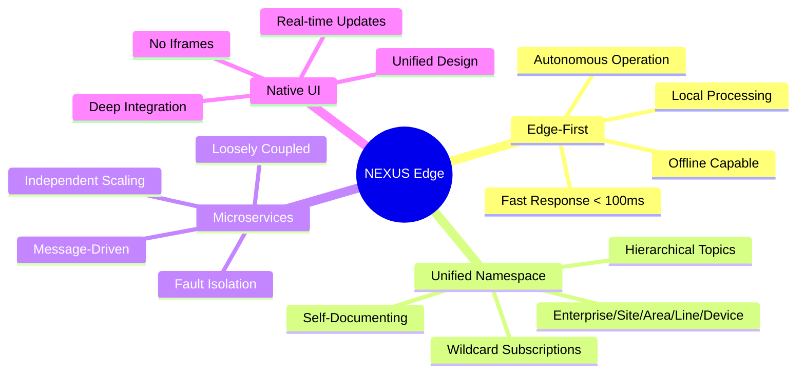

---

## 3. Complete Data Flow Pipeline

### 3.1 Read Flow (Device → Historian)

```mermaid
sequenceDiagram
    autonumber
    participant PLC as 🔧 PLC
    participant Pool as Connection Pool
    participant GW as Protocol Gateway
    participant MQTT as EMQX Broker
    participant ING as Data Ingestion
    participant DB as TimescaleDB

    rect rgb(255, 243, 224)
        Note over PLC,Pool: Protocol Layer
        GW->>Pool: Request Connection
        Pool->>Pool: Circuit Breaker Check
        Pool->>PLC: Read Tags (Modbus FC03)
        PLC-->>Pool: Raw Bytes
        Pool-->>GW: Typed Values
    end

    rect rgb(243, 229, 245)
        Note over GW,MQTT: Messaging Layer
        GW->>GW: Apply Scaling/Units
        GW->>MQTT: Publish (QoS 1)
        Note right of MQTT: Topic: plant/line/device/tag
    end

    rect rgb(232, 245, 233)
        Note over MQTT,DB: Persistence Layer
        MQTT->>ING: Deliver ($share/ingestion/#)
        ING->>ING: Batch Accumulator (5000 pts)
        ING->>DB: COPY Protocol Write
        DB-->>ING: Acknowledge
    end
```

### 3.2 Write Flow (Application → Device)

```mermaid
sequenceDiagram
    autonumber
    participant UI as 🖥️ Frontend
    participant API as Gateway Core
    participant MQTT as EMQX Broker
    participant GW as Protocol Gateway
    participant PLC as 🔧 PLC

    UI->>API: POST /api/devices/{id}/write
    API->>MQTT: Publish $nexus/cmd/{device}/{tag}/set
    Note right of MQTT: {"value": 75.5, "request_id": "uuid"}
    
    MQTT->>GW: Deliver Command
    GW->>GW: Validate & Reverse Scale
    GW->>PLC: Write (Modbus FC06)
    PLC-->>GW: Acknowledge
    
    GW->>MQTT: Publish Response
    Note right of MQTT: $nexus/cmd/response/{device}/{tag}
    MQTT->>API: Deliver Response
    API-->>UI: {"success": true, "duration_ms": 45}
```

### 3.3 End-to-End Data Pipeline

```mermaid
flowchart LR
    subgraph INPUT["📥 Data Acquisition"]
        PLC["PLC\nDB1.DBD0"]
        POLL["Poll\n@1000ms"]
    end

    subgraph TRANSFORM["🔄 Transformation"]
        PARSE["Parse\nBytes→Float"]
        SCALE["Scale\n×0.1"]
        ENRICH["Enrich\n+metadata"]
    end

    subgraph TRANSPORT["📨 Transport"]
        PUB["Publish\nQoS 1"]
        TOPIC["Topic\nplant/line/plc/temp"]
        SUB["Subscribe\n$share/ing/#"]
    end

    subgraph STORE["💾 Storage"]
        BATCH["Batch\n5000 pts"]
        COPY["COPY\nProtocol"]
        HYPER["Hypertable\nmetrics"]
    end

    PLC --> POLL --> PARSE --> SCALE --> ENRICH
    ENRICH --> PUB --> TOPIC --> SUB
    SUB --> BATCH --> COPY --> HYPER

    style PLC fill:#ff9800
    style TOPIC fill:#9c27b0,color:#fff
    style HYPER fill:#e91e63,color:#fff
```

---

## 4. Protocol Gateway Architecture

### 4.1 Internal Structure

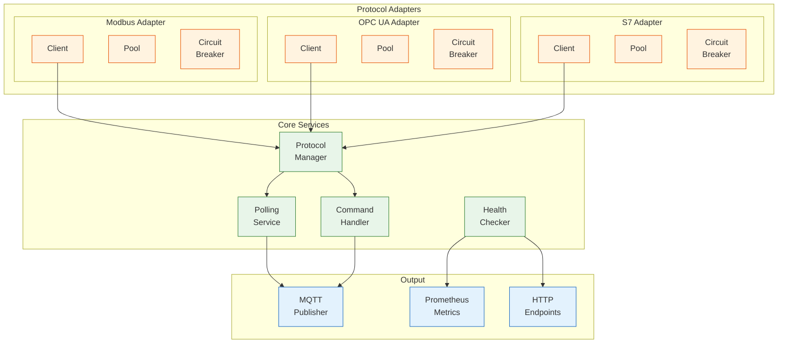

### 4.2 Connection Pool with Circuit Breaker

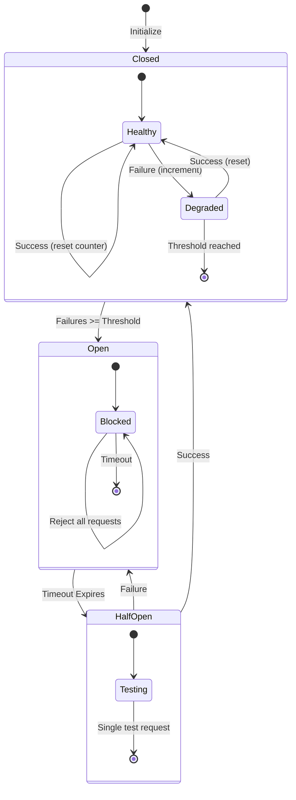

### 4.3 Worker Pool Architecture

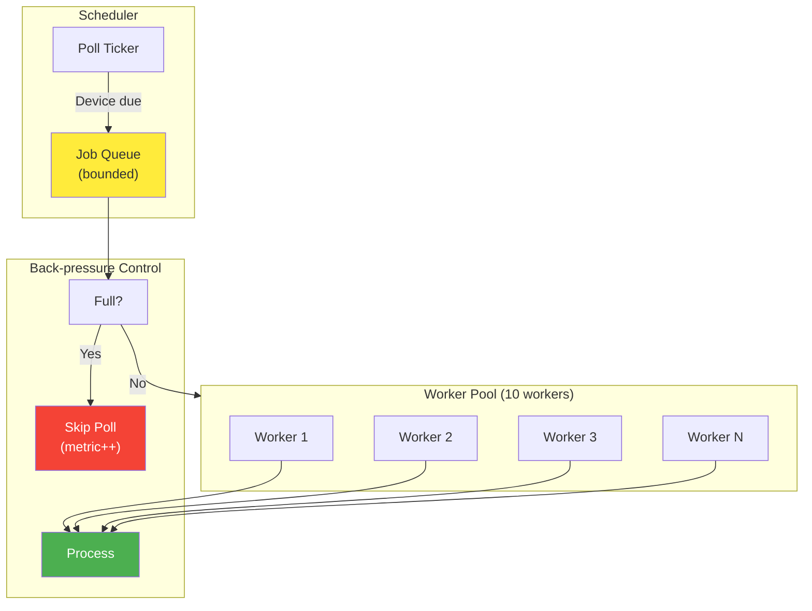

---

## 5. Data Ingestion Service Architecture

### 5.1 Internal Pipeline

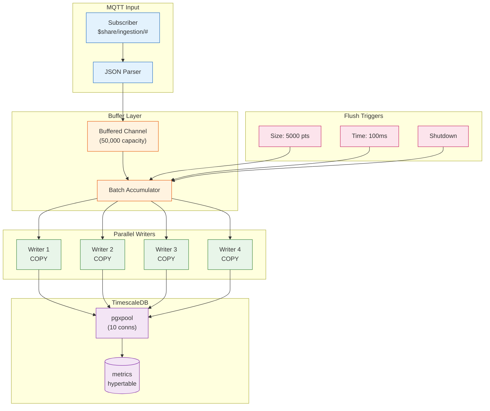

### 5.2 Shared Subscription Load Balancing

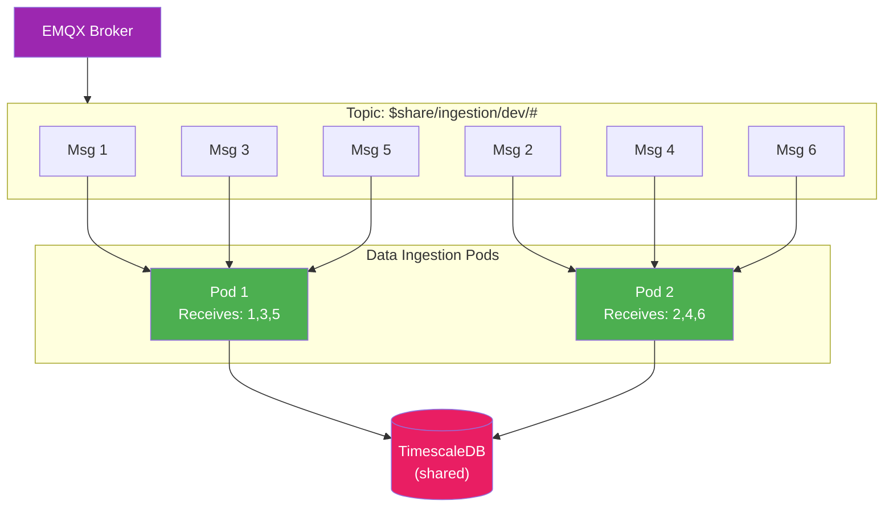

### 5.3 Performance: COPY vs INSERT

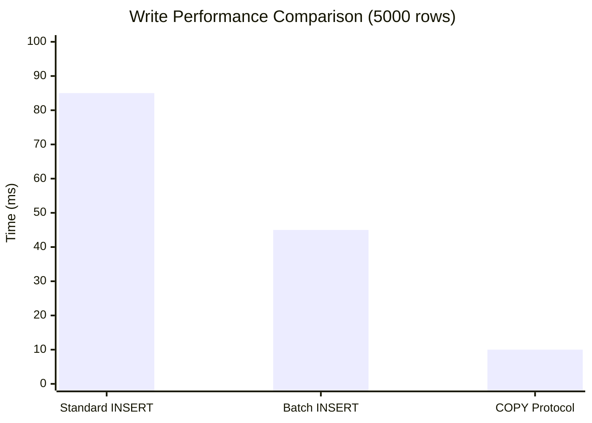

---

## 6. MQTT Unified Namespace (UNS)

### 6.1 Topic Hierarchy

```mermaid
flowchart TB
    ROOT["🌐 Enterprise"]
    
    ROOT --> SITE1["📍 Site: plant-chicago"]
    ROOT --> SITE2["📍 Site: plant-munich"]
    
    SITE1 --> AREA1["🏢 Area: building-a"]
    SITE1 --> AREA2["🏢 Area: building-b"]
    
    AREA1 --> LINE1["🔧 Line: line-1"]
    AREA1 --> LINE2["🔧 Line: line-2"]
    
    LINE1 --> DEV1["📟 Device: plc-001"]
    LINE1 --> DEV2["📟 Device: sensor-temp-01"]
    
    DEV1 --> TAG1["🔢 temperature"]
    DEV1 --> TAG2["🔢 pressure"]
    DEV1 --> TAG3["🔢 motor_speed"]

    style ROOT fill:#1976d2,color:#fff
    style SITE1,SITE2 fill:#388e3c,color:#fff
    style AREA1,AREA2 fill:#f9a825,color:#000
    style LINE1,LINE2 fill:#e64a19,color:#fff
    style DEV1,DEV2 fill:#7b1fa2,color:#fff
    style TAG1,TAG2,TAG3 fill:#c2185b,color:#fff
```

### 6.2 Topic Structure Examples

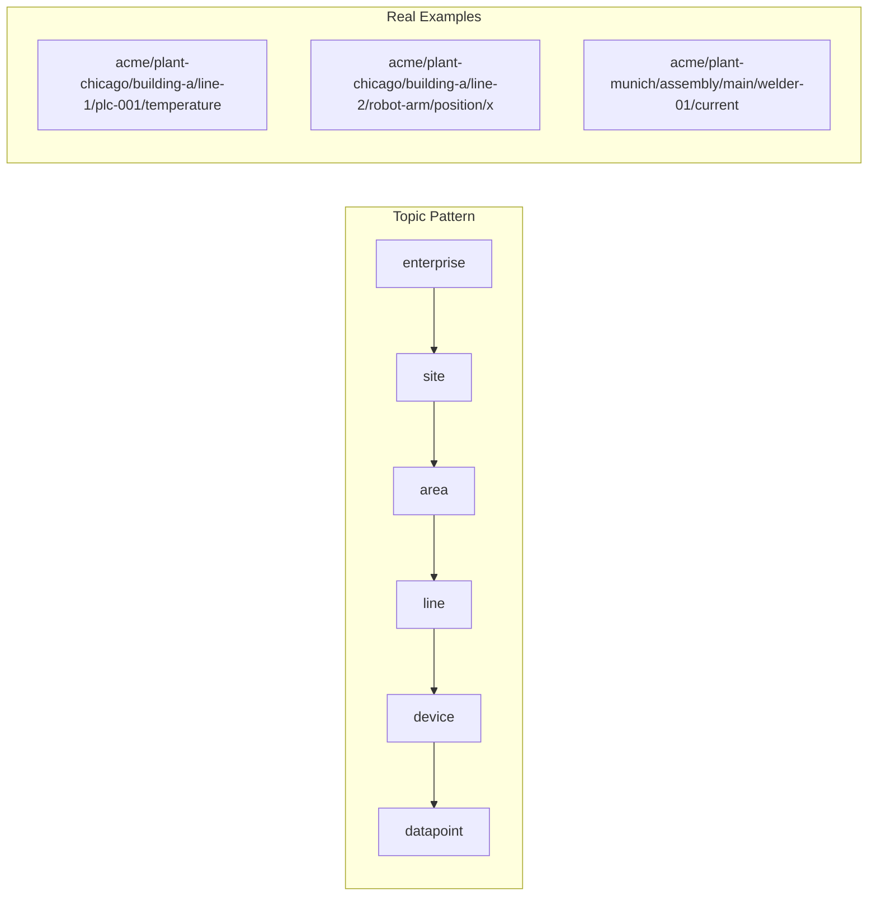

### 6.3 Subscription Patterns

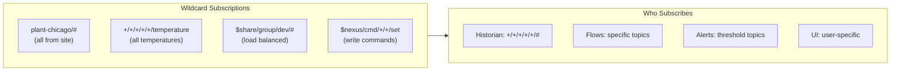

---

## 7. Kubernetes Deployment Architecture

### 7.1 Complete K8s Deployment

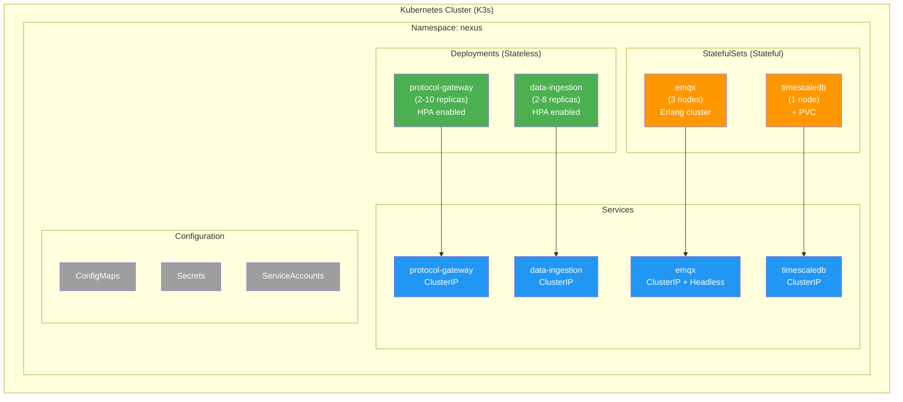

### 7.2 Pod Distribution

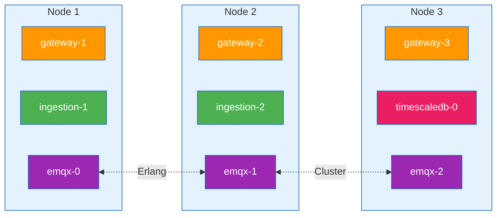

### 7.3 Horizontal Pod Autoscaler (HPA)

```mermaid
flowchart TB
    subgraph HPA["HPA Controller"]
        METRICS["Metrics Server"]
        CALC["Calculate Desired"]
        SCALE["Scale Decision"]
    end

    subgraph THRESHOLDS["Thresholds"]
        CPU["CPU > 70%\n→ Scale Up"]
        MEM["Memory > 80%\n→ Scale Up"]
        MIN["Min: 2 replicas"]
        MAX["Max: 10 replicas"]
    end

    subgraph DEPLOY["Deployment"]
        R1["Pod 1"]
        R2["Pod 2"]
        RN["Pod N..."]
    end

    METRICS --> CALC
    THRESHOLDS --> CALC
    CALC --> SCALE
    SCALE --> DEPLOY

    style HPA fill:#2196f3,color:#fff
    style THRESHOLDS fill:#ff9800
    style DEPLOY fill:#4caf50,color:#fff
```

---

## 8. Database Schema & Storage

### 8.1 TimescaleDB Schema

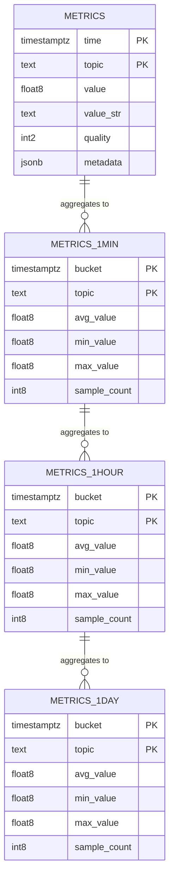

### 8.2 Data Retention Policy

```mermaid
gantt
    title Data Retention Timeline
    dateFormat YYYY-MM-DD
    axisFormat %d

    section Raw Data
    Raw Metrics (30 days)    :active, raw, 2025-01-01, 30d

    section Compressed
    Compressed (after 7d)    :crit, comp, after raw, 23d

    section Aggregates
    1-Min Rollups (90 days)  :agg1, 2025-01-01, 90d
    1-Hour Rollups (1 year)  :agg2, 2025-01-01, 365d
    1-Day Rollups (5 years)  :agg3, 2025-01-01, 1825d
```

### 8.3 PostgreSQL Configuration Schema

```mermaid
erDiagram
    USERS ||--o{ USER_ROLES : has
    USERS ||--o{ API_KEYS : owns
    DEVICES ||--o{ DEVICE_TAGS : contains
    DASHBOARDS ||--o{ WIDGETS : contains
    ALERT_RULES ||--o{ ALERT_HISTORY : triggers

    USERS {
        uuid id PK
        varchar email UK
        varchar password_hash
        varchar name
        boolean enabled
        timestamp created_at
    }

    DEVICES {
        uuid id PK
        varchar name
        varchar protocol
        boolean enabled
        jsonb connection
        jsonb metadata
    }

    DEVICE_TAGS {
        uuid id PK
        uuid device_id FK
        varchar name
        varchar address
        varchar data_type
        varchar mqtt_topic
        jsonb scaling
    }

    ALERT_RULES {
        uuid id PK
        varchar name
        varchar severity
        jsonb condition
        boolean enabled
        jsonb notifications
    }

    DASHBOARDS {
        uuid id PK
        varchar name
        uuid owner_id FK
        jsonb layout
    }
```

---

## 9. Sequence Diagrams

### 9.1 Device Registration Flow

```mermaid
sequenceDiagram
    autonumber
    actor User
    participant UI as NEXUS UI
    participant API as Gateway Core
    participant DB as PostgreSQL
    participant MQTT as EMQX
    participant GW as Protocol Gateway
    participant PLC as Device

    User->>UI: Add New Device
    UI->>UI: Device Wizard
    UI->>API: POST /api/devices
    
    API->>API: Validate Config
    API->>DB: INSERT device
    DB-->>API: Device ID
    
    API->>MQTT: Publish config update
    Note over MQTT: $nexus/config/devices/{id}
    
    MQTT->>GW: Deliver config
    GW->>GW: Register device
    GW->>PLC: Test connection
    PLC-->>GW: OK
    GW->>GW: Start polling
    
    GW->>MQTT: Publish telemetry
    Note over MQTT: plant/line/device/tag
    
    API-->>UI: 201 Created
    UI-->>User: Device Online ✓
```

### 9.2 Alert Lifecycle

```mermaid
sequenceDiagram
    participant MQTT as EMQX
    participant ALERT as Alert Service
    participant DB as PostgreSQL
    participant NOTIFY as Notifications
    participant USER as Operator

    MQTT->>ALERT: Value: 95°C
    ALERT->>ALERT: Evaluate: > 90°C?
    Note over ALERT: Trigger Delay: 5s
    
    ALERT->>ALERT: Still > 90°C
    ALERT->>DB: INSERT alert_history
    ALERT->>NOTIFY: Send notification
    NOTIFY->>USER: 📧 Email + 🔔 Push
    
    USER->>ALERT: Acknowledge
    ALERT->>DB: UPDATE status='ack'
    
    MQTT->>ALERT: Value: 85°C
    ALERT->>ALERT: Evaluate: < 90°C
    Note over ALERT: Clear Delay: 10s
    
    ALERT->>DB: UPDATE status='cleared'
    ALERT->>USER: Alert Cleared ✓
```

### 9.3 OPC UA Subscription Flow

```mermaid
sequenceDiagram
    participant GW as Protocol Gateway
    participant OPC as OPC UA Server
    participant MQTT as EMQX

    GW->>OPC: CreateSession
    OPC-->>GW: SessionID
    
    GW->>OPC: CreateSubscription
    Note right of GW: PublishInterval: 500ms
    OPC-->>GW: SubscriptionID
    
    GW->>OPC: CreateMonitoredItems
    Note right of GW: NodeIDs to monitor
    OPC-->>GW: MonitoredItemIDs
    
    loop Report by Exception
        OPC->>GW: Publish (DataChange)
        GW->>MQTT: Publish to UNS
    end
    
    GW->>OPC: DeleteSubscription
    GW->>OPC: CloseSession
```

---

## 10. Service Communication Patterns

### 10.1 Communication Overview

```mermaid
flowchart TB
    subgraph PRIMARY["Primary: MQTT Pub/Sub"]
        GW1["Protocol\nGateway"]
        EMQX1["EMQX"]
        ING1["Historian"]
        FLOW1["Flow Engine"]
        ALERT1["Alerts"]
        
        GW1 -->|publish| EMQX1
        EMQX1 -->|subscribe| ING1
        EMQX1 -->|subscribe| FLOW1
        EMQX1 -->|subscribe| ALERT1
    end

    subgraph SECONDARY["Secondary: REST API"]
        UI2["Frontend"]
        CORE2["Gateway Core"]
        DB2[("PostgreSQL")]
        TSDB2[("TimescaleDB")]
        
        UI2 -->|HTTP| CORE2
        CORE2 -->|SQL| DB2
        CORE2 -->|SQL| TSDB2
    end

    subgraph TERTIARY["Tertiary: WebSocket"]
        UI3["Browser"]
        CORE3["Gateway"]
        EMQX3["EMQX"]
        
        UI3 <-->|WS| CORE3
        CORE3 <-->|MQTT| EMQX3
    end
```

### 10.2 Service Mesh

```mermaid
graph TB
    subgraph EXTERNAL["External Access"]
        LB["Load Balancer\n/ Ingress"]
    end

    subgraph INTERNAL["Internal Services"]
        GW["protocol-gateway"]
        ING["data-ingestion"]
        CORE["gateway-core"]
        
        subgraph DATA["Data Services"]
            EMQX["emqx:1883"]
            TSDB["timescaledb:5432"]
            PG["postgres:5432"]
        end
    end

    LB --> CORE
    GW <--> EMQX
    ING <--> EMQX
    ING --> TSDB
    CORE --> EMQX
    CORE --> TSDB
    CORE --> PG

    style LB fill:#ff9800
    style EMQX fill:#9c27b0,color:#fff
    style TSDB fill:#e91e63,color:#fff
```

---

## 11. Horizontal Scaling Architecture

### 11.1 Scaling Strategy

```mermaid
flowchart TB
    subgraph DEVICES["1000 Devices"]
        D1["Devices 1-300"]
        D2["Devices 301-600"]
        D3["Devices 601-1000"]
    end

    subgraph GATEWAYS["Protocol Gateway Pods"]
        GW1["Gateway 1\n(~300 devices)"]
        GW2["Gateway 2\n(~300 devices)"]
        GW3["Gateway 3\n(~400 devices)"]
    end

    subgraph EMQX["EMQX Cluster"]
        E1["emqx-0"]
        E2["emqx-1"]
        E3["emqx-2"]
    end

    subgraph INGESTION["Data Ingestion Pods"]
        I1["Ingestion 1\n(50% msgs)"]
        I2["Ingestion 2\n(50% msgs)"]
    end

    subgraph DB["TimescaleDB"]
        TSDB[("Single Instance\n400K pts/sec")]
    end

    D1 --> GW1
    D2 --> GW2
    D3 --> GW3
    GW1 & GW2 & GW3 --> E1 & E2 & E3
    E1 & E2 & E3 -->|$share/ingestion/#| I1 & I2
    I1 & I2 --> TSDB

    style EMQX fill:#9c27b0,color:#fff
    style TSDB fill:#e91e63,color:#fff
```

### 11.2 Capacity Planning

```mermaid
xychart-beta
    title "Pods Required by Device Count"
    x-axis ["100", "500", "1K", "2K", "5K", "10K"]
    y-axis "Number of Pods" 0 --> 15
    bar [1, 2, 3, 5, 10, 15]
```

### 11.3 Message Throughput

```mermaid
pie title "Message Distribution (Shared Subscriptions)"
    "Pod 1" : 33.3
    "Pod 2" : 33.3
    "Pod 3" : 33.4
```

---

## 12. Security Architecture

### 12.1 Security Layers

```mermaid
flowchart TB
    subgraph L1["Layer 1: Network Segmentation"]
        OT["OT Network\n192.168.1.0/24"]
        EDGE["Edge Platform\n10.0.0.0/24"]
        IT["IT Network\nCorporate"]
    end

    subgraph L2["Layer 2: Authentication"]
        LOCAL["Local Users"]
        LDAP["LDAP/AD"]
        OAUTH["OAuth2/OIDC"]
    end

    subgraph L3["Layer 3: Authorization"]
        ADMIN["Admin\nFull access"]
        ENG["Engineer\nDevice + Flows"]
        OP["Operator\nView only"]
    end

    subgraph L4["Layer 4: Transport"]
        TLS["TLS 1.3"]
        MTLS["mTLS"]
        CERTS["X.509 Certs"]
    end

    OT -->|"S7/Modbus"| EDGE
    EDGE -->|"TLS"| IT
    L2 --> L3
    L3 --> L4

    classDef network fill:#e3f2fd,stroke:#1565c0
    classDef auth fill:#e8f5e9,stroke:#2e7d32
    classDef role fill:#fff3e0,stroke:#e65100
    classDef transport fill:#fce4ec,stroke:#c2185b

    class OT,EDGE,IT network
    class LOCAL,LDAP,OAUTH auth
    class ADMIN,ENG,OP role
    class TLS,MTLS,CERTS transport
```

### 12.2 RBAC Permissions Matrix

```mermaid
graph TB
    subgraph ROLES["Roles"]
        ADMIN["👑 Admin"]
        ENG["🔧 Engineer"]
        OP["👁️ Operator"]
    end

    subgraph RESOURCES["Resources"]
        DEV["Devices"]
        FLOW["Flows"]
        DASH["Dashboards"]
        ALERT["Alerts"]
        SYS["System"]
    end

    ADMIN -->|"CRUD"| DEV & FLOW & DASH & ALERT & SYS
    ENG -->|"CRUD"| DEV & FLOW & DASH
    ENG -->|"Read"| ALERT
    OP -->|"Read"| DASH & ALERT
    OP -->|"Ack"| ALERT
```

---

## 13. Alert System Flow

### 13.1 Alert Processing Pipeline

```mermaid
flowchart TB
    subgraph INPUT["Data Input"]
        MQTT["MQTT Message"]
        TOPIC["Topic: plant/line/device/tag"]
        VALUE["Value: 95.5"]
    end

    subgraph RULES["Rule Evaluation"]
        R1["Threshold\n> 90°C"]
        R2["Rate of Change\n> 5°C/min"]
        R3["Absence\nNo data 60s"]
        R4["Pattern\nregex match"]
    end

    subgraph STATE["State Machine"]
        NORM["Normal"]
        PEND["Pending\n(debounce)"]
        ACT["Active"]
        ACK["Acknowledged"]
    end

    subgraph NOTIFY["Notifications"]
        EMAIL["📧 Email"]
        WEBHOOK["🔗 Webhook"]
        MQTTA["📨 MQTT Alert"]
        PUSH["📱 Push"]
    end

    MQTT --> RULES
    R1 & R2 & R3 & R4 --> STATE
    NORM -->|"Condition true"| PEND
    PEND -->|"Still true after delay"| ACT
    ACT -->|"User ack"| ACK
    ACT & ACK -->|"Condition false"| NORM
    ACT --> NOTIFY

    style ACT fill:#f44336,color:#fff
    style PEND fill:#ff9800,color:#fff
    style NORM fill:#4caf50,color:#fff
```

### 13.2 Alert State Diagram

```mermaid
stateDiagram-v2
    [*] --> Normal
    
    Normal --> Pending: Condition True
    Pending --> Normal: Condition False\n(before delay)
    Pending --> Active: Delay Elapsed
    
    Active --> Acknowledged: User Ack
    Active --> Normal: Condition False\n+ Clear Delay
    
    Acknowledged --> Normal: Condition False
    
    state Active {
        [*] --> Alerting
        Alerting --> Notified: Send Notifications
        Notified --> Escalated: No response\n+ escalation delay
    }
```

---

## 14. Development Roadmap

### 14.1 Phase Progress

```mermaid
gantt
    title NEXUS Edge Development Roadmap
    dateFormat YYYY-MM
    axisFormat %b %Y

    section Phase 1: Foundation
    Protocol Gateway     :done, p1a, 2025-11, 30d
    Data Ingestion       :done, p1b, 2025-11, 30d
    MQTT Integration     :done, p1c, 2025-11, 20d
    
    section Phase 2: Kubernetes
    K8s Manifests        :done, p2a, 2025-12, 20d
    HPA & PDB            :done, p2b, 2025-12, 15d
    EMQX Clustering      :done, p2c, 2025-12, 15d
    
    section Phase 3: Gateway Core
    Device API           :active, p3a, 2026-02, 30d
    Web UI               :p3b, 2026-03, 45d
    Dynamic Config       :p3c, 2026-04, 30d
    
    section Phase 4: Analytics
    Edge Aggregation     :p4a, 2026-05, 30d
    Deadband Filtering   :p4b, 2026-06, 20d
    OEE Calculations     :p4c, 2026-07, 30d
    
    section Phase 5: Enterprise
    Container Management :p5a, 2026-08, 30d
    Flow Designer        :p5b, 2026-09, 45d
    Security Hardening   :p5c, 2026-10, 30d
    v1.0 Release         :milestone, m1, 2026-12, 0d
```

### 14.2 Feature Completion

```mermaid
pie title Development Progress by Phase
    "Phase 1 (Complete)" : 100
    "Phase 2 (Complete)" : 95
    "Phase 3 (Not Started)" : 0
    "Phase 4 (Not Started)" : 0
    "Phase 5 (Not Started)" : 0
```

### 14.3 Technology Stack

```mermaid
mindmap
  root((NEXUS Stack))
    Backend
      Go 1.22+
        Protocol Gateway
        Data Ingestion
        Alert Service
      TypeScript
        Gateway Core
        Frontend
    Frontend
      React 18
      TailwindCSS
      React Flow
      Recharts
      Zustand
    Infrastructure
      K3s/Kubernetes
      Docker
      Kustomize
    Data
      TimescaleDB
      PostgreSQL
      EMQX 5.x
    Observability
      Prometheus
      Grafana
      Zerolog
```

---

## 15. Component State Diagrams

### 15.1 Device Connection State

```mermaid
stateDiagram-v2
    [*] --> Disconnected
    
    Disconnected --> Connecting: Start
    Connecting --> Connected: Success
    Connecting --> Failed: Error
    
    Connected --> Polling: Begin
    Polling --> Connected: Poll Success
    Polling --> Degraded: Poll Fail
    
    Degraded --> Polling: Retry
    Degraded --> CircuitOpen: Max Retries
    
    CircuitOpen --> Disconnected: Timeout
    
    Failed --> Disconnected: Reset
    
    Connected --> Disconnected: Disconnect
```

### 15.2 MQTT Publisher State

```mermaid
stateDiagram-v2
    [*] --> Idle
    
    Idle --> Connecting: Connect()
    Connecting --> Connected: OnConnect
    Connecting --> Reconnecting: OnConnectError
    
    Connected --> Publishing: Publish()
    Publishing --> Connected: Success
    Publishing --> Buffering: Fail
    
    Buffering --> Publishing: Retry
    Buffering --> Reconnecting: Connection Lost
    
    Reconnecting --> Connecting: Backoff Elapsed
    Connected --> Disconnected: Disconnect()
    
    Disconnected --> [*]
```

### 15.3 Ingestion Service State

```mermaid
stateDiagram-v2
    [*] --> Starting
    
    Starting --> Running: Start()
    
    state Running {
        [*] --> Receiving
        Receiving --> Batching: Message
        Batching --> Receiving: Buffered
        Batching --> Flushing: Batch Full/Timeout
        Flushing --> Receiving: Write Success
        Flushing --> Retrying: Write Error
        Retrying --> Flushing: Retry
        Retrying --> Dropping: Max Retries
        Dropping --> Receiving: Log & Continue
    }
    
    Running --> Draining: Shutdown Signal
    Draining --> Stopped: All Flushed
    
    Stopped --> [*]
```

---

## 📚 Additional Resources

- **Architecture Documentation**: [`docs/ARCHITECTURE.md`](docs/ARCHITECTURE.md)
- **Development Roadmap**: [`ROADMAP.md`](ROADMAP.md)
- **Infrastructure Guide**: [`infrastructure/infrastructure.md`](infrastructure/infrastructure.md)
- **Kubernetes Deployment**: [`infrastructure/k8s/README.md`](infrastructure/k8s/README.md)
- **Protocol Documentation**:
  - [Modbus Adapter](docs/services/protocol-gateway/MODBUS.md)
  - [OPC UA Adapter](docs/services/protocol-gateway/OPCUA.md)
  - [S7 Adapter](docs/services/protocol-gateway/S7.md)

---

<div align="center">

**Built with ❤️ for Industrial IoT**

*Last Updated: December 2025*

</div>

