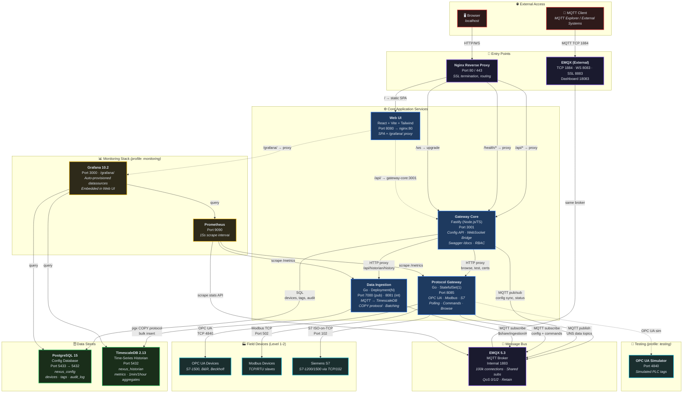
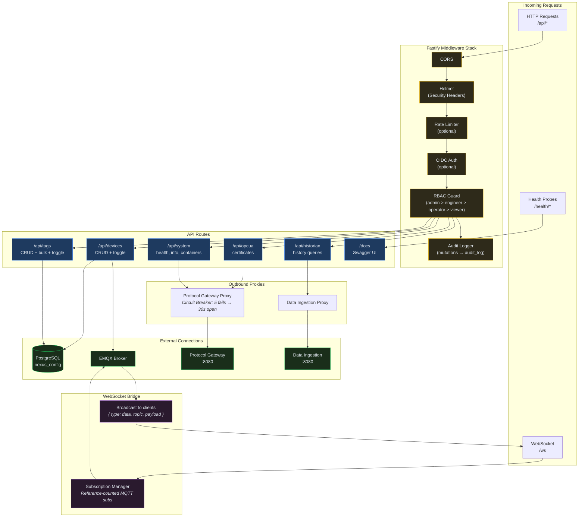
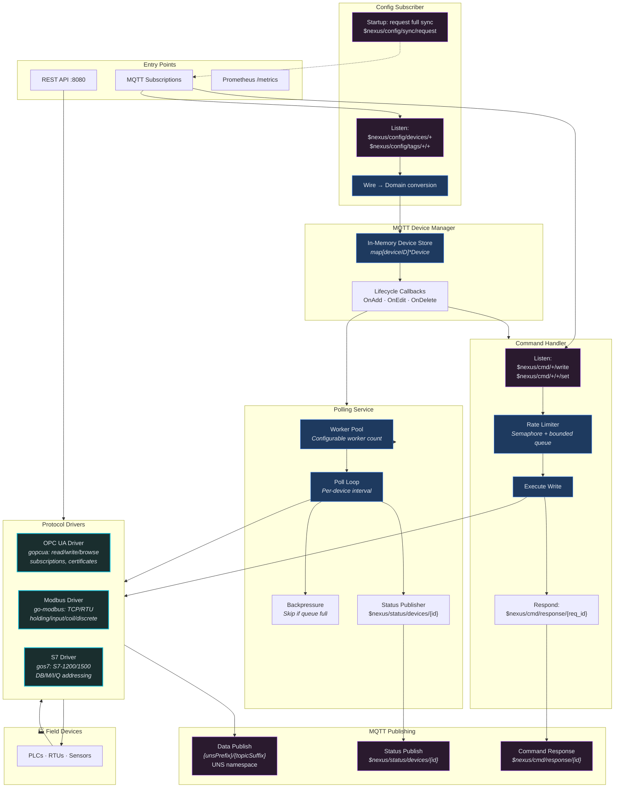
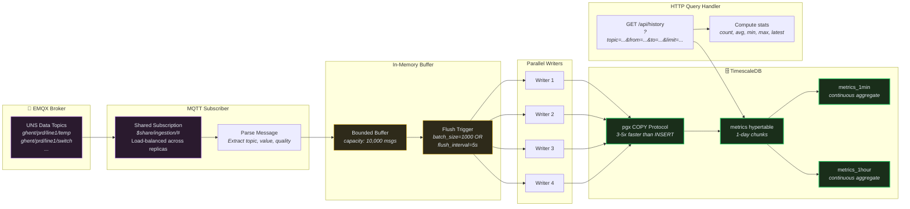
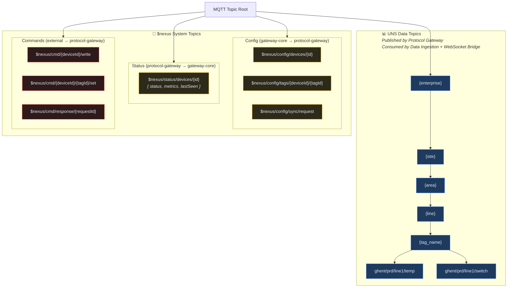
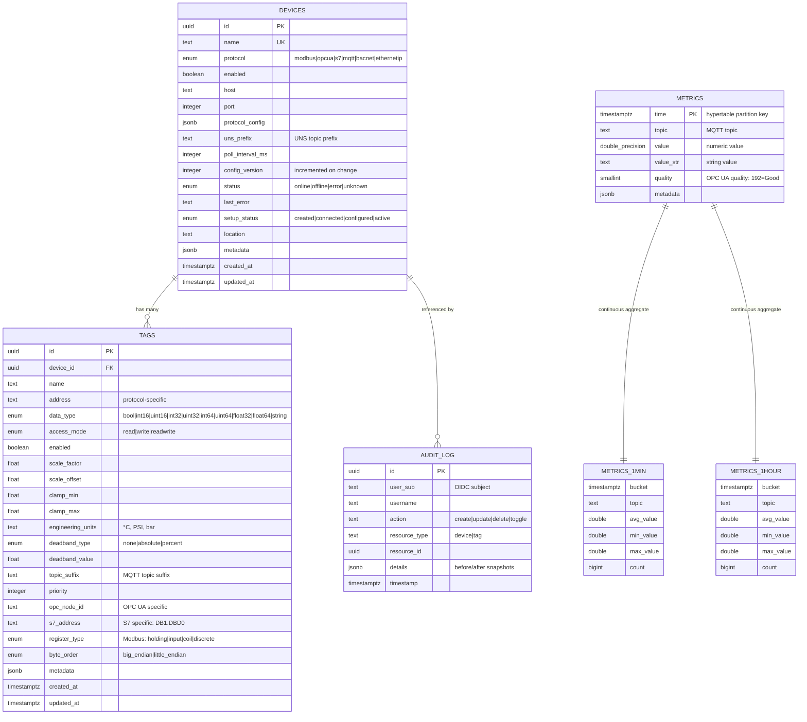
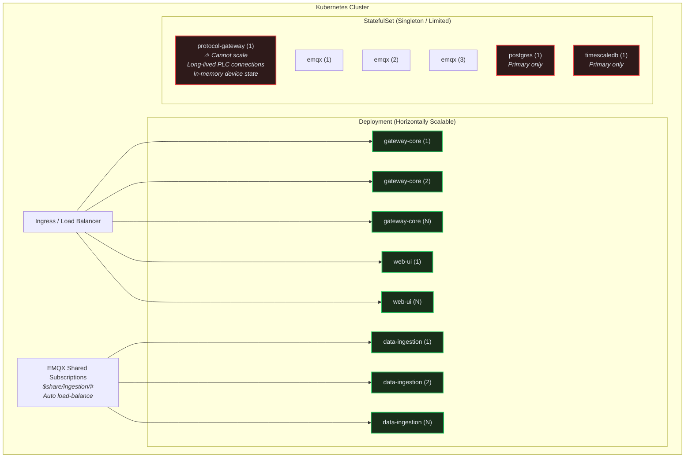

# NEXUS Edge — Complete Platform Architecture

## 1. System Overview



---

## 2. Data Read Path (Device → Browser)

```mermaid
sequenceDiagram
  autonumber
  participant PLC as 🏭 PLC / Field Device
  participant PG as ⚙️ Protocol Gateway
  participant EMQX as 📨 EMQX Broker
  participant DI as 📥 Data Ingestion
  participant TSDB as 🗄️ TimescaleDB
  participant GC as 🔌 Gateway Core
  participant UI as 🖥️ Web UI (Browser)

  rect rgb(30, 58, 95)
    Note over PLC,PG: Step 1: Poll Device
    PG->>PLC: OPC UA Read / Modbus Read / S7 Read
    PLC-->>PG: Raw values + quality codes
    PG->>PG: Scale, clamp, apply deadband
  end

  rect rgb(40, 30, 70)
    Note over PG,EMQX: Step 2: Publish to UNS
    PG->>EMQX: PUBLISH ghent/prd/line1/temp<br/>{ value: 21.5, quality: 192 }
    PG->>EMQX: PUBLISH $nexus/status/devices/{id}<br/>{ status: "online" }
  end

  rect rgb(30, 70, 40)
    Note over EMQX,TSDB: Step 3: Ingest & Persist
    EMQX->>DI: DELIVER (shared sub: $share/ingestion/#)
    DI->>DI: Buffer message (batch_size=1000 or 5s flush)
    DI->>TSDB: pgx COPY INTO metrics(time, topic, value, quality)
    TSDB->>TSDB: Continuous aggregates (1min, 1hour)
  end

  rect rgb(70, 50, 20)
    Note over GC,UI: Step 4a: Real-time Push (WebSocket)
    EMQX->>GC: DELIVER ghent/prd/line1/temp
    GC->>UI: WS: { type:"data", topic, payload, timestamp }
  end

  rect rgb(50, 30, 30)
    Note over UI,TSDB: Step 4b: Historical Query
    UI->>GC: GET /api/historian/history?topic=...&from=...&to=...
    GC->>DI: HTTP proxy → /api/history?topic=...
    DI->>TSDB: SELECT time, value, quality FROM metrics WHERE ...
    TSDB-->>DI: Time-series rows + stats (avg/min/max/count)
    DI-->>GC: JSON { topic, stats, points[] }
    GC-->>UI: Forward response
    UI->>UI: Render recharts LineChart + stats table
  end
```



---

## 3. Data Write Path (Command → Device)

```mermaid
sequenceDiagram
  autonumber
  participant Ext as 📡 External System / UI
  participant EMQX as 📨 EMQX Broker
  participant CH as ⚙️ Command Handler<br/>(Protocol Gateway)
  participant Driver as 🔌 Protocol Driver<br/>(OPC UA / Modbus / S7)
  participant PLC as 🏭 PLC / Field Device

  rect rgb(50, 30, 30)
    Note over Ext,EMQX: Step 1: Issue Command
    Ext->>EMQX: PUBLISH $nexus/cmd/{device_id}/{tag_id}/set<br/>{ value: 42.0, request_id: "abc-123" }
  end

  rect rgb(30, 58, 95)
    Note over EMQX,CH: Step 2: Receive & Validate
    EMQX->>CH: DELIVER (subscribed: $nexus/cmd/+/+/set)
    CH->>CH: Lookup device + tag in memory
    CH->>CH: Rate limit check (semaphore + bounded queue)
  end

  rect rgb(30, 70, 40)
    Note over CH,PLC: Step 3: Execute Write
    CH->>Driver: Write(address, value, dataType)
    Driver->>PLC: OPC UA Write / Modbus Write / S7 Write
    PLC-->>Driver: Success / Error
    Driver-->>CH: Result
  end

  rect rgb(40, 30, 70)
    Note over CH,Ext: Step 4: Acknowledge
    CH->>EMQX: PUBLISH $nexus/cmd/response/abc-123<br/>{ success: true, device_id, tag_id, value: 42.0 }
    EMQX->>Ext: DELIVER response
  end
```



---

## 4. Configuration Flow (Hot Reload)

```mermaid
sequenceDiagram
  autonumber
  participant UI as 🖥️ Web UI
  participant GC as 🔌 Gateway Core
  participant DB as 🗄️ PostgreSQL
  participant EMQX as 📨 EMQX Broker
  participant CS as 📋 Config Subscriber<br/>(Protocol Gateway)
  participant PS as ⚙️ Polling Service
  participant CH as 🎯 Command Handler

  rect rgb(30, 58, 95)
    Note over UI,DB: Step 1: User Creates/Updates Device
    UI->>GC: POST /api/devices { name, protocol, host, port, unsPrefix, ... }
    GC->>DB: INSERT INTO devices (...) / UPDATE devices SET ...
    GC->>GC: Increment config_version
    DB-->>GC: Device record (with ID)
    GC-->>UI: 201 Created / 200 OK
  end

  rect rgb(40, 30, 70)
    Note over GC,EMQX: Step 2: Broadcast Config Change
    GC->>EMQX: PUBLISH $nexus/config/devices/{id}<br/>{ action:"created", device: {...} }
  end

  rect rgb(30, 70, 40)
    Note over EMQX,PS: Step 3: Protocol Gateway Reacts
    EMQX->>CS: DELIVER $nexus/config/devices/{id}
    CS->>CS: Parse wire format → domain.Device
    CS->>PS: AddDevice(device) / UpdateDevice(device)
    CS->>CH: AddDevice(device) / UpdateDevice(device)
    PS->>PS: Start polling new device
    CH->>CH: Register device for write commands
  end

  rect rgb(50, 30, 30)
    Note over CS,EMQX: Step 4: Startup Sync
    Note right of CS: On startup, request full config
    CS->>EMQX: PUBLISH $nexus/config/sync/request
    EMQX->>GC: DELIVER sync request
    GC->>DB: SELECT * FROM devices; SELECT * FROM tags
    GC->>EMQX: PUBLISH $nexus/config/devices/{id} (for each device)
    GC->>EMQX: PUBLISH $nexus/config/tags/{deviceId}/{tagId} (for each tag)
    EMQX->>CS: DELIVER all config messages
  end
```

---

## 5. Gateway Core Internal Architecture



---

## 6. Protocol Gateway Internal Architecture



---

## 7. Data Ingestion Pipeline



---

## 8. MQTT Topic Hierarchy (Unified Namespace)



---

## 9. Database Schemas



---

## 10. Network & Port Map

```mermaid
graph TB
  subgraph HostPorts["🖥️ Host Machine (localhost)"]
    H80["Port 80/443<br/>Nginx"]
    H8080["Port 8080<br/>Web UI direct"]
    H3001["Port 3001<br/>Gateway Core API"]
    H8085["Port 8085<br/>Protocol GW API"]
    H7000["Port 7000<br/>Data Ingestion"]
    H1884["Port 1884<br/>MQTT TCP"]
    H8083["Port 8083<br/>MQTT WebSocket"]
    H18083["Port 18083<br/>EMQX Dashboard"]
    H5432["Port 5432<br/>TimescaleDB"]
    H5433["Port 5433<br/>PostgreSQL"]
    H9090["Port 9090<br/>Prometheus"]
    H3000["Port 3000<br/>Grafana"]
  end

  subgraph DockerNet["🐳 nexus-internal (172.28.0.0/16)"]
    C_Nginx["nginx:80"]
    C_WebUI["web-ui:80"]
    C_GC["gateway-core:3001"]
    C_PG["protocol-gateway:8080"]
    C_DI["data-ingestion:8080/8081"]
    C_EMQX["emqx:1883/8083/18083"]
    C_PSQL["postgres:5432"]
    C_TSDB["timescaledb:5432"]
    C_Prom["prometheus:9090"]
    C_Graf["grafana:3000"]
  end

  H80 --> C_Nginx
  H8080 --> C_WebUI
  H3001 --> C_GC
  H8085 --> C_PG
  H7000 --> C_DI
  H1884 --> C_EMQX
  H8083 --> C_EMQX
  H18083 --> C_EMQX
  H5432 --> C_TSDB
  H5433 --> C_PSQL
  H9090 --> C_Prom
  H3000 --> C_Graf

  classDef host fill:#2e1a1a,stroke:#ef4444,stroke-width:1px,color:#e2e8f0
  classDef container fill:#1a2e1a,stroke:#22c55e,stroke-width:1px,color:#e2e8f0

  class H80,H8080,H3001,H8085,H7000,H1884,H8083,H18083,H5432,H5433,H9090,H3000 host
  class C_Nginx,C_WebUI,C_GC,C_PG,C_DI,C_EMQX,C_PSQL,C_TSDB,C_Prom,C_Graf container
```



---

## 11. Deployment & Scaling Strategy



---

## 12. Full Request Lifecycle (Browser → Device → Historian → Chart)

```mermaid
sequenceDiagram
  autonumber
  participant User as 👤 User (Browser)
  participant Nginx as 🚪 Nginx :80
  participant SPA as 🖥️ Web UI SPA
  participant GC as 🔌 Gateway Core
  participant DB as 🗄️ PostgreSQL
  participant EMQX as 📨 EMQX
  participant PG as ⚙️ Protocol Gateway
  participant PLC as 🏭 PLC (OPC UA)
  participant DI as 📥 Data Ingestion
  participant TSDB as 🗄️ TimescaleDB

  Note over User,TSDB: === PHASE 1: Configure Device & Tags ===

  User->>Nginx: GET http://localhost/
  Nginx->>SPA: Serve React SPA
  SPA-->>User: Render Dashboard

  User->>Nginx: POST /api/devices { name:"PLC-001", protocol:"opcua", ... }
  Nginx->>GC: Forward /api/devices
  GC->>DB: INSERT INTO devices (...)
  GC->>EMQX: PUBLISH $nexus/config/devices/{id}
  EMQX->>PG: DELIVER config (ConfigSubscriber)
  PG->>PG: AddDevice → PollingService + CommandHandler
  GC-->>Nginx: 201 Created
  Nginx-->>User: Device created

  User->>Nginx: POST /api/tags { deviceId, name:"temp", address:"ns=2;s=Temp", ... }
  Nginx->>GC: Forward /api/tags
  GC->>DB: INSERT INTO tags (...)
  GC->>EMQX: PUBLISH $nexus/config/tags/{deviceId}/{tagId}
  EMQX->>PG: DELIVER tag config
  PG->>PG: AddTag → include in next poll cycle
  GC-->>User: Tag created

  Note over User,TSDB: === PHASE 2: Data Flows Automatically ===

  loop Every pollIntervalMs (e.g., 10s)
    PG->>PLC: OPC UA ReadRequest [ns=2;s=Temp]
    PLC-->>PG: Value: 21.5, Quality: Good (192)
    PG->>PG: Apply scale/clamp/deadband
    PG->>EMQX: PUBLISH ghent/prd/line1/temp → { value: 21.5, quality: 192 }
    EMQX->>DI: DELIVER ($share/ingestion/#)
    DI->>DI: Buffer → batch
    DI->>TSDB: COPY INTO metrics (time, topic, value, quality)
  end

  Note over User,TSDB: === PHASE 3: User Views Tag History ===

  User->>Nginx: Navigate to /tags/{id} (TagDetailPage)
  SPA->>Nginx: GET /api/tags/{id}
  Nginx->>GC: Forward
  GC->>DB: SELECT * FROM tags WHERE id = ...
  GC-->>SPA: Tag details (name, address, dataType, topicSuffix)

  SPA->>Nginx: GET /api/devices/{deviceId}
  Nginx->>GC: Forward
  GC->>DB: SELECT * FROM devices WHERE id = ...
  GC-->>SPA: Device details (unsPrefix: "ghent/prd/line1")

  SPA->>SPA: Compute topic = unsPrefix + "/" + topicSuffix

  SPA->>Nginx: GET /api/historian/history?topic=ghent/prd/line1/temp&from=...&to=...
  Nginx->>GC: Forward /api/historian/history
  GC->>DI: HTTP proxy → /api/history?topic=...
  DI->>TSDB: SELECT time, value, quality ... + stats (avg/min/max)
  TSDB-->>DI: Rows + aggregates
  DI-->>GC: { topic, stats, points[] }
  GC-->>Nginx: Forward
  Nginx-->>SPA: History data
  SPA->>SPA: Render recharts LineChart + stats table
  SPA-->>User: 📈 Tag detail page with live chart
```
