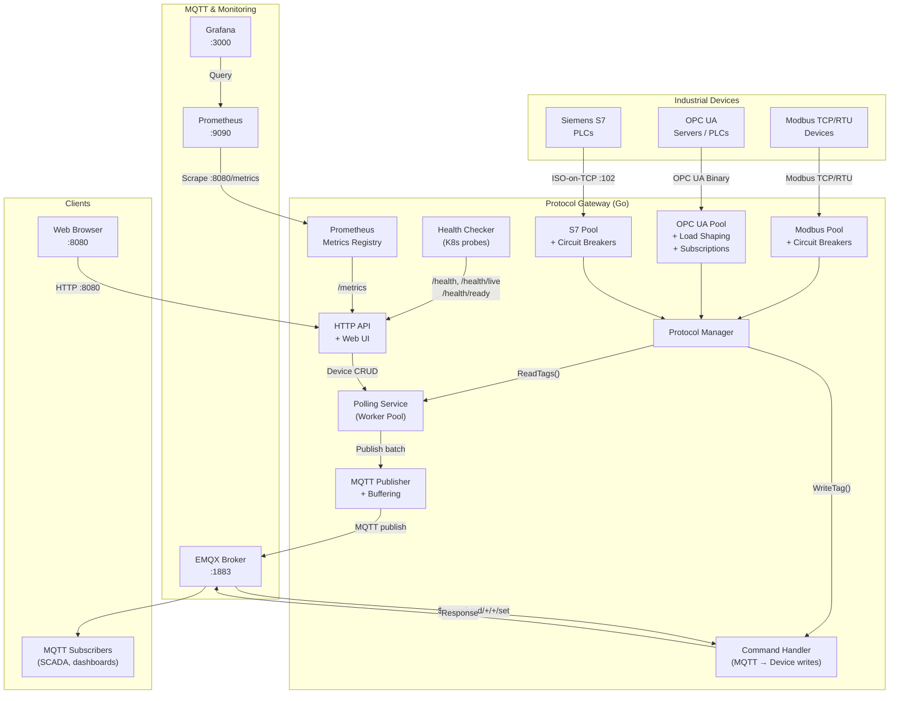
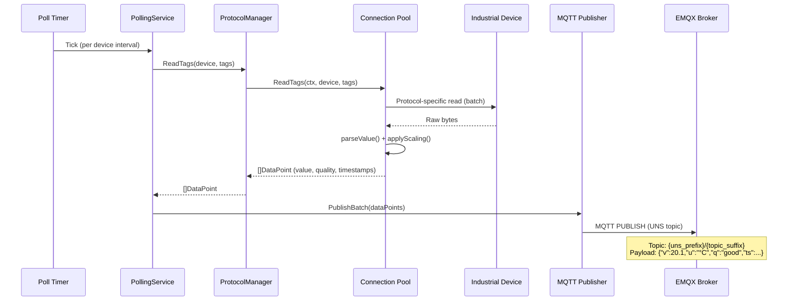
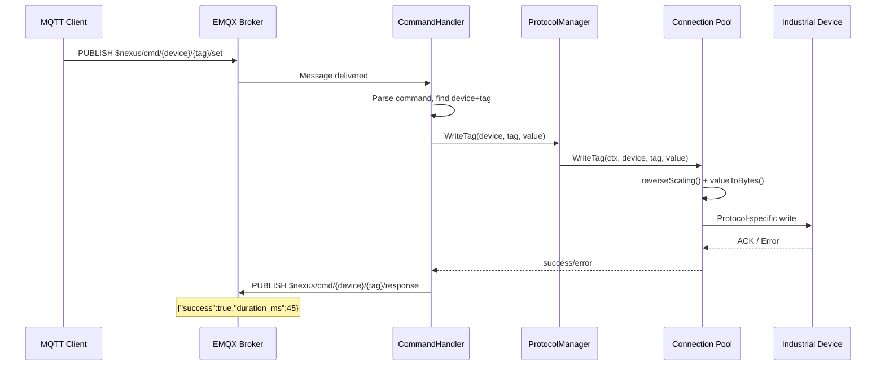

# Protocol Gateway


## Project Summary

The Protocol Gateway is an industrial-grade bridge between heterogeneous automation devices (PLCs, sensors, SCADA systems) and modern IT infrastructure. It polls data from devices speaking **Modbus TCP/RTU**, **OPC UA**, and **Siemens S7** protocols, converts the readings into a normalized format, and publishes them to an **MQTT broker** (EMQX) following the **Unified Namespace (UNS)** pattern. It also supports bidirectional communication — write commands arrive via MQTT and are routed back to the target device. A built-in Web UI provides device management, topic inspection, and container log viewing, while Prometheus metrics and Grafana dashboards give full observability.

## High-Level Architecture



## Documentation

| Section | Description |
|---|---|
| [Gateway Service](./gateway-service.md) | Core service: polling engine, command handler, REST API, Web UI, device management, configuration |
| [Protocol Adapters](./protocol-adapters.md) | Modbus TCP/RTU, OPC UA, Siemens S7 adapters, MQTT publisher — connection pools, circuit breakers, data conversion |
| [Docker & Infrastructure](./docker-infrastructure.md) | Docker Compose stack, container architecture, Prometheus, Grafana, OPC UA simulator |
| [Architecture](./ARCHITECTURE.md) | Complete and detailed architecture of the entire project |

## Tech Stack

| Layer | Technology | Version | Notes |
|---|---|---|---|
| Language | Go | 1.22 | Single statically-linked binary |
| MQTT Broker | EMQX | 5.5 | Clusterable; dashboard on :18083 |
| MQTT Client | eclipse/paho.mqtt.golang | 1.4.3 | Auto-reconnect, QoS 0/1/2 |
| Modbus | goburrow/modbus | 0.1.0 | TCP + RTU; not thread-safe (serialized with mutex) |
| OPC UA | gopcua/opcua | 0.5.3 | Sessions, security, subscriptions |
| Siemens S7 | robinson/gos7 | latest | ISO-on-TCP :102, rack/slot addressing |
| Circuit Breaker | sony/gobreaker | 0.5.0 | Per-device fault isolation |
| Config | spf13/viper | 1.18.2 | YAML + env var override |
| Logging | rs/zerolog | 1.32.0 | Structured JSON + console |
| Metrics | prometheus/client_golang | 1.19.0 | Counters, gauges, histograms |
| Monitoring | Prometheus + Grafana | 2.50 / 10.3 | Auto-provisioned dashboards |
| Container | Docker + Compose | v2 | Multi-stage build, non-root user |
| OPC UA Sim | Python asyncua | — | Local dev/test simulator |

## Project Structure

```
Connector_Gateway/
├── cmd/gateway/main.go              ← Entry point: wiring, lifecycle, HTTP server
├── internal/
│   ├── domain/                      ← Core types: Device, Tag, DataPoint, Protocol, errors
│   ├── adapter/
│   │   ├── config/                  ← YAML config + device file loading
│   │   ├── modbus/                  ← Modbus TCP/RTU client, pool, conversion
│   │   ├── opcua/                   ← OPC UA client, pool, subscriptions, load shaping, security
│   │   ├── s7/                      ← Siemens S7 client, pool, conversion
│   │   └── mqtt/                    ← MQTT publisher with buffering
│   ├── service/
│   │   ├── polling.go               ← Polling engine (worker pool, batch reads)
│   │   └── command_handler.go       ← Bidirectional MQTT → device write commands
│   ├── api/
│   │   ├── handlers.go              ← Middleware: auth, CORS, body size limit
│   │   ├── runtime.go               ← Docker CLI log provider
│   │   └── runtime_handlers.go      ← Device CRUD, topics overview, container logs
│   ├── health/checker.go            ← Health checks with flapping protection, K8s probes
│   └── metrics/registry.go          ← Prometheus metrics (connections, polls, MQTT, devices)
├── pkg/logging/logger.go            ← Structured zerolog wrapper
├── config/
│   ├── config.yaml                  ← Gateway service config
│   ├── devices.yaml                 ← Device + tag definitions
│   ├── prometheus.yml               ← Prometheus scrape config
│   └── grafana/provisioning/        ← Grafana datasource + dashboard provisioning
├── web/index.html                   ← Single-page Web UI (vanilla HTML/JS)
├── tools/opcua-simulator/           ← Python OPC UA simulator for local testing
├── certs/                           ← OPC UA PKI certificates (mounted at runtime)
├── testing/                         ← Unit, integration, benchmark, fuzz, e2e tests
├── Dockerfile                       ← Multi-stage: golang:1.22-alpine → alpine:3.19
├── docker-compose.yaml              ← Dev stack: EMQX + Gateway + OPC UA Sim + Prometheus + Grafana
└── docker-compose.test.yaml         ← Test stack: Mosquitto + Modbus Sim + OPC UA Sim + S7 Sim
```

## Key Data Flows

### Read Path (Device → MQTT)



### Write Path (MQTT → Device)



## Quick Start

```bash
# Clone and start the dev stack
git clone https://github.com/AlexandeC3U/ProtocolGateway
cd Connector_Gateway
docker compose up --build

# Access:
#   Web UI:          http://localhost:8080
#   EMQX Dashboard:  http://localhost:18083  (admin / public)
#   Prometheus:      http://localhost:9090
#   Grafana:         http://localhost:3000    (admin / admin)
```

See [README.md](../README.md) for detailed setup and device configuration instructions.
