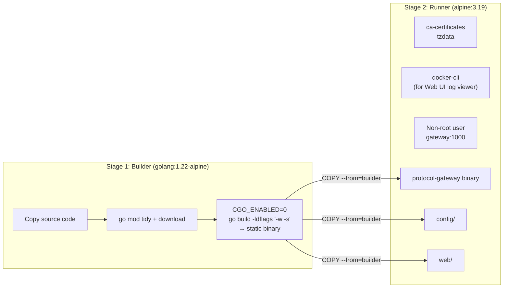
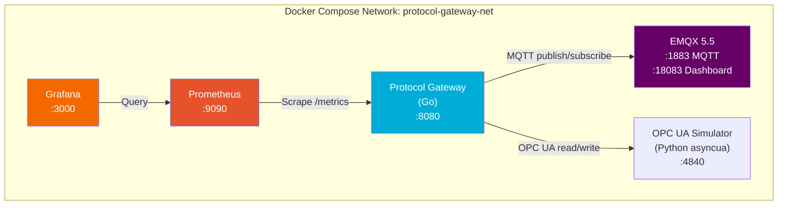
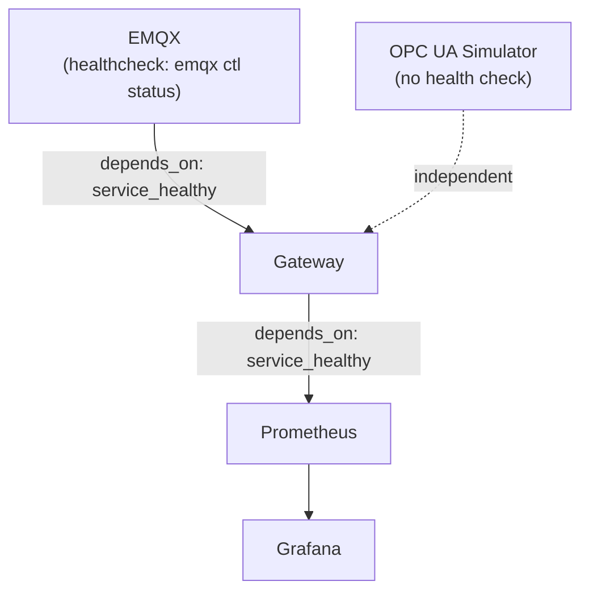
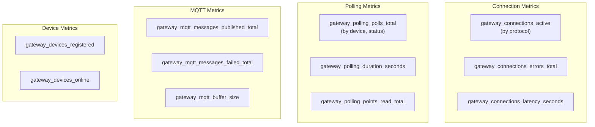
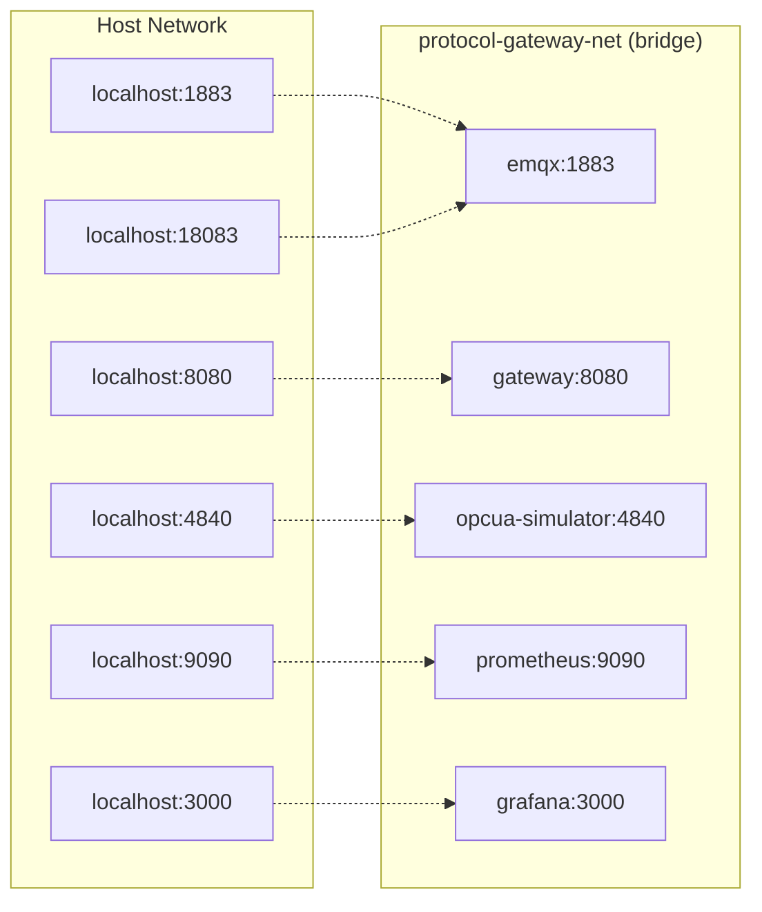

# Docker & Infrastructure

Container architecture, Docker Compose stacks, monitoring pipeline (Prometheus + Grafana), and the OPC UA simulator.

---

## 1. Container Architecture

### Gateway Dockerfile (Multi-Stage Build)



**Key decisions:**
- **Static binary** (`CGO_ENABLED=0`) — no runtime dependency on glibc, minimal attack surface
- **Version tag** embedded via `-ldflags` from `git describe --tags`
- **docker-cli** installed in the runner image so the gateway can execute `docker ps` / `docker logs` against the host engine (for Web UI log viewing). Requires Docker socket mount.
- **Non-root user** (`gateway:1000`) with optional `docker` group membership (GID 999) for socket access
- **Health check** built into the image: `wget http://localhost:8080/health/live`

Final image size: ~30–40 MB (Alpine + Go binary + web assets).

---

## 2. Docker Compose — Development Stack

`docker-compose.yaml` — the primary development/deployment stack.



### Service Details

| Service | Image | Ports | Purpose |
|---|---|---|---|
| `emqx` | `emqx/emqx:5.5` | 1883, 8083, 8084, 8883, 18083 | MQTT broker with dashboard |
| `opcua-simulator` | Local build (`tools/opcua-simulator/`) | 4840 | OPC UA test server with demo variables |
| `gateway` | Local build (`.`) | 8080 | The Protocol Gateway |
| `prometheus` | `prom/prometheus:v2.50.1` | 9090 | Metrics collection and storage |
| `grafana` | `grafana/grafana:10.3.3` | 3000 | Metrics visualization dashboards |

### Startup Order & Health Checks



> **Gotcha**: `depends_on` only waits for the container to *start* or pass a health check — it doesn't guarantee the service inside is fully ready. The gateway has retry logic for MQTT connections, but the initial `mqttPublisher.Connect()` is a hard requirement: if EMQX isn't healthy, the gateway `Fatal`s out. The health check ensures EMQX is ready before the gateway starts.

### Volumes

| Volume | Type | Service | Purpose |
|---|---|---|---|
| `emqx-data` | Named | EMQX | Persist broker data between restarts |
| `emqx-log` | Named | EMQX | Persist broker logs |
| `gateway-data` | Named | Gateway | Application data persistence |
| `prometheus-data` | Named | Prometheus | Metrics storage (7-day retention) |
| `grafana-data` | Named | Grafana | Dashboard and plugin storage |
| `./config/devices.yaml` | Bind mount | Gateway | Device configuration (editable) |
| `./certs/pki` | Bind mount (RO) | Gateway | OPC UA PKI certificates |
| `/var/run/docker.sock` | Bind mount | Gateway | Docker engine access (Web UI logs) |

> Named volumes **persist across `docker compose down`** — your device configs, metrics history, and Grafana dashboards survive restarts. Only `docker compose down -v` removes them.

### Environment Variables (Gateway)

| Variable | Default | Description |
|---|---|---|
| `MQTT_BROKER_URL` | `tcp://emqx:1883` | Broker address (uses Docker DNS) |
| `MQTT_CLIENT_ID` | `protocol-gateway-dev` | MQTT client identifier |
| `HTTP_PORT` | `8080` | HTTP server port |
| `LOG_LEVEL` | `debug` | Logging verbosity |
| `LOG_FORMAT` | `console` | Log format (json/console) |
| `DEVICES_CONFIG_PATH` | `/app/config/devices.yaml` | Path to device configuration |
| `ENVIRONMENT` | `development` | Runtime environment |

---

## 3. Docker Compose — Test Stack

`docker-compose.test.yaml` — simulators for all three protocols, used by integration tests.

| Service | Image | Port | Purpose |
|---|---|---|---|
| `mqtt-broker` | `eclipse-mosquitto:2` | 1883, 9001 | Lightweight MQTT broker for tests |
| `modbus-simulator` | `oitc/modbus-server` | 5020 | Modbus TCP simulator |
| `opcua-simulator` | Local build | 4840 | Same OPC UA simulator as dev stack |
| `s7-simulator` | `mcskol/snap7server` | 102 | Siemens S7 (Snap7) simulator |

All services are on a shared `test-network` bridge with health checks. The gateway itself is NOT in this stack — integration tests run the gateway binary directly against these simulators.

---

## 4. OPC UA Simulator

`tools/opcua-simulator/server.py` — a Python-based OPC UA server for local development and testing.

**Technology:** Python `asyncua` library

**Address space:**

| Node ID | Variable | Type | Behavior |
|---|---|---|---|
| `ns=2;s=Demo.Temperature` | Temperature | Double | Sine wave: 20.0 ± 5.0°C (period ~19s) |
| `ns=2;s=Demo.Pressure` | Pressure | Double | Sine wave: 1.2 ± 0.2 bar (period ~31s) |
| `ns=2;s=Demo.Status` | Status | String | Flips between "OK" and "WARN" every 15s |
| `ns=2;s=Demo.Switch` | Switch | Boolean | Static (writable from gateway) |
| `ns=2;s=Demo.WriteTest` | WriteTest | Boolean | Test node for write operations |

**Configuration via environment:**

| Variable | Default | Description |
|---|---|---|
| `OPCUA_HOST` | `0.0.0.0` | Bind address |
| `OPCUA_PORT` | `4840` | OPC UA port |
| `OPCUA_AUTO_UPDATE` | `1` | Auto-update values (set `0` for static) |
| `OPCUA_UPDATE_MS` | `500` | Value update interval in ms |

**Security:** NoSecurity only (development simulator).

> **Gotcha — VariantType for booleans:** Python's `bool` is a subclass of `int`, so `asyncua` can infer the stored variant type as `Int64` instead of `Boolean`. This causes `BadTypeMismatch` errors when the Go OPC UA client tries to write a boolean value. The simulator explicitly sets `varianttype=ua.VariantType.Boolean` to avoid this interoperability issue.

---

## 5. Prometheus Monitoring

### Configuration (`config/prometheus.yml`)

Scrape targets:

| Job | Target | Path | Interval | Notes |
|---|---|---|---|---|
| `prometheus` | `localhost:9090` | `/metrics` | 15s | Self-monitoring |
| `protocol-gateway` | `gateway:8080` | `/metrics` | 15s | Gateway metrics |
| `emqx` | `emqx:18083` | `/api/v5/prometheus/stats` | 15s | Broker metrics (basic auth: admin/public) |

Storage: 7-day retention with TSDB.

### Key Gateway Metrics



### Example PromQL Queries

```promql
# Poll success rate over 5 minutes
rate(gateway_polling_polls_total{status="success"}[5m])

# Active connections by protocol
gateway_connections_active

# MQTT publish error rate
rate(gateway_mqtt_messages_failed_total[5m])

# Poll duration 95th percentile
histogram_quantile(0.95, rate(gateway_polling_duration_seconds_bucket[5m]))

# Devices registered vs online
gateway_devices_registered - gateway_devices_online
```

---

## 6. Grafana Dashboards

### Auto-Provisioning

Grafana is configured via provisioning files mounted from `config/grafana/provisioning/`:

- `datasources/datasources.yml` — Auto-configures Prometheus as a data source (`http://prometheus:9090`)
- `dashboards/dashboards.yml` — Dashboard provisioning configuration

### Access

| URL | Credentials | Description |
|---|---|---|
| `http://localhost:3000` | admin / admin | Grafana dashboard |

---

## 7. Network Architecture

All services communicate over a single Docker bridge network: `protocol-gateway-net`.



**Port mapping summary:**

| Host Port | Container | Service |
|---|---|---|
| 1883 | emqx:1883 | MQTT TCP |
| 8083 | emqx:8083 | MQTT WebSocket |
| 8883 | emqx:8883 | MQTT SSL |
| 18083 | emqx:18083 | EMQX Dashboard |
| 4840 | opcua-simulator:4840 | OPC UA |
| 8080 | gateway:8080 | Gateway Web UI + API + Metrics |
| 9090 | prometheus:9090 | Prometheus UI |
| 3000 | grafana:3000 | Grafana UI |
