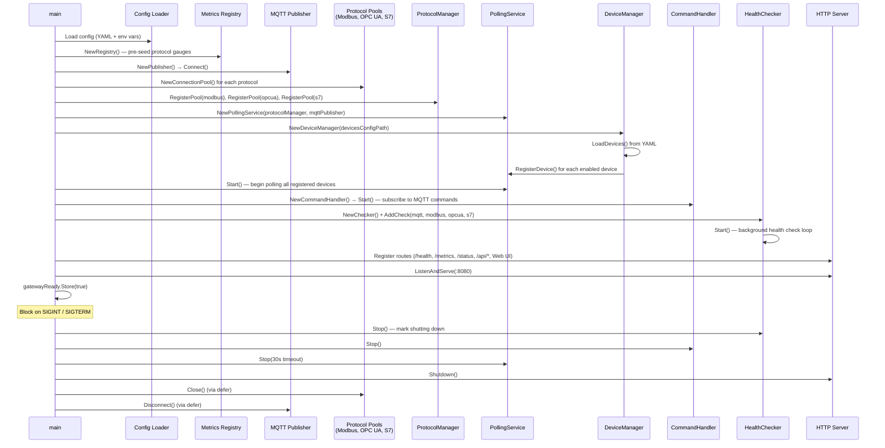
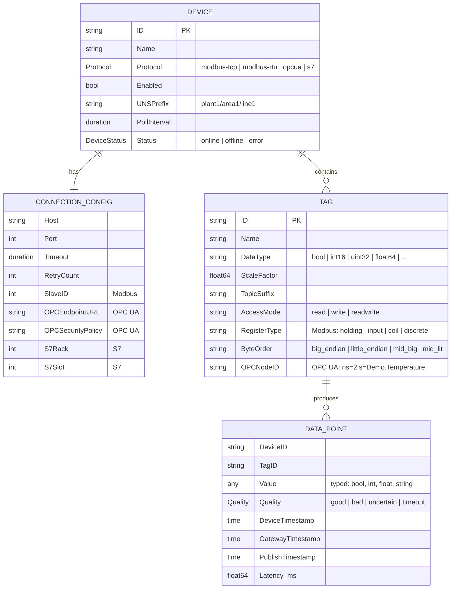
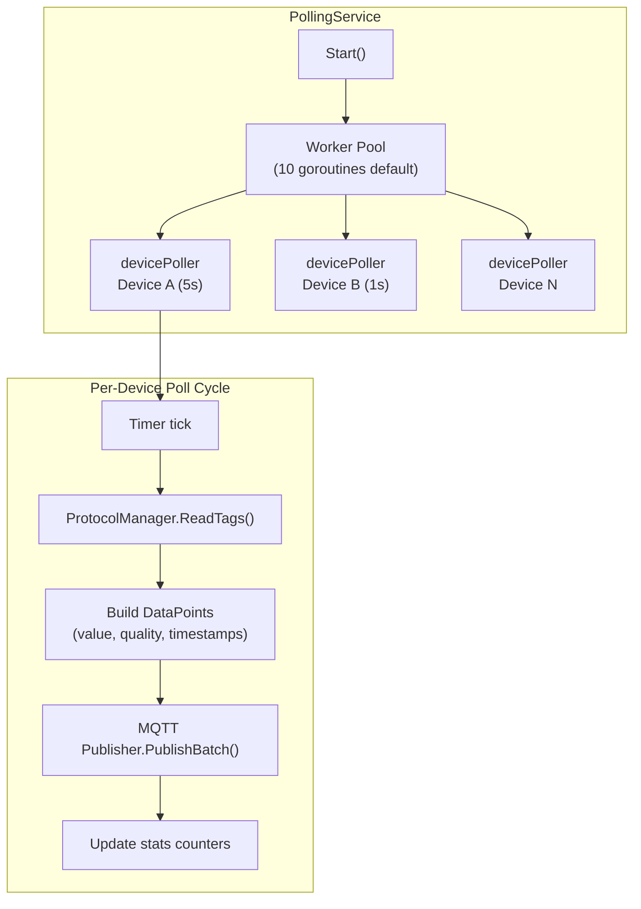
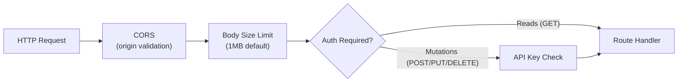
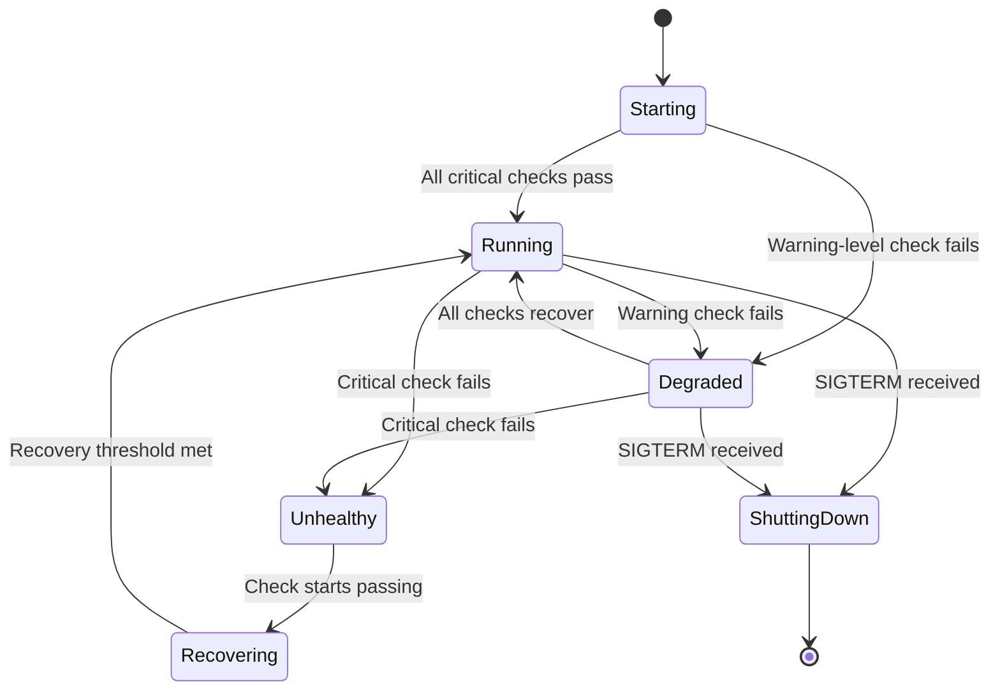

# Gateway Service

The core service layer of the Protocol Gateway: configuration management, device lifecycle, the polling engine, bidirectional command handling, and the HTTP API / Web UI.

---

## 1. Entry Point & Startup Sequence

Everything begins in `cmd/gateway/main.go`. The startup is deterministic and order-dependent:



**Graceful shutdown** follows reverse initialization order: health checker marks the gateway as shutting down (readiness probe returns 503), then command handler stops, polling service drains with a 30-second timeout, HTTP server shuts down, and finally protocol pools and MQTT disconnect via deferred calls.

---

## 2. Configuration Management

### Service Config (`config/config.yaml`)

Loaded by `internal/adapter/config/config.go` using **Viper**. Every field has a sensible default and can be overridden with environment variables.

| Section | Key Settings | Env Override Example |
|---|---|---|
| `http` | Port (8080), read/write/idle timeouts | `HTTP_PORT=9090` |
| `api` | Auth enabled, API key, CORS origins, max body size | `API_AUTH_ENABLED=true`, `API_KEY=secret` |
| `mqtt` | Broker URL, credentials, QoS, TLS, buffer size, reconnect | `MQTT_BROKER_URL=tcp://broker:1883` |
| `modbus` | Max connections (100), idle timeout, health check, retries | — |
| `opcua` | Max connections (50), security defaults, retries | — |
| `s7` | Max connections (100), circuit breaker settings | — |
| `polling` | Worker count (10), batch size (50), default interval (1s), shutdown timeout | — |
| `ntp` | Enabled (true), server (pool.ntp.org), check interval (5m), warn/crit thresholds | `NTP_SERVER=time.google.com` |
| `logging` | Level (info), format (json/console), output (stdout) | `LOG_LEVEL=debug`, `LOG_FORMAT=console` |

### Device Config (`config/devices.yaml`)

Loaded by `internal/adapter/config/devices.go`. Each device declares its protocol, connection parameters, UNS prefix, poll interval, and a list of tags.

```yaml
version: "1.0"
devices:
  - id: "SIM1"
    name: Demo OPC UA
    protocol: opcua
    enabled: true
    uns_prefix: plant1/area1/line1
    poll_interval: 5s
    connection:
      opc_endpoint_url: opc.tcp://opcua-simulator:4840
    tags:
      - id: tag-001
        name: Temperature
        data_type: float64
        topic_suffix: temperature
        opc_node_id: "ns=2;s=Demo.Temperature"
```

**Validation at load time:**
- Duplicate device IDs are rejected
- Protocol-specific rules: Modbus requires slave_id (1–247), OPC UA requires endpoint URL, S7 requires valid rack/slot
- Tag validation: register count ≥ 1, data type must be recognized
- Durations are parsed from strings (`"5s"`, `"100ms"`)
- `SaveDevices()` writes back to YAML with 0600 permissions (credential protection)

---

## 3. Domain Model

Defined in `internal/domain/`. These types are used everywhere.



### DataPoint Pooling

> **What is `sync.Pool` and why is it used here?**
> `sync.Pool` is a Go runtime-managed cache of reusable objects. At high poll rates (hundreds of devices × dozens of tags × sub-second intervals), each poll cycle creates thousands of `DataPoint` structs that live briefly and become garbage. The pool keeps a set of pre-allocated `DataPoint`s that goroutines can borrow (`AcquireDataPoint()`) and return (`ReleaseDataPoint()`), reducing GC pause frequency. All production adapters (S7, Modbus, OPC UA) use `AcquireDataPoint()` to borrow from the pool, and the polling service calls `ReleaseDataPoint()` after publishing — returning them for reuse in the next poll cycle.

### Error Taxonomy

`internal/domain/errors.go` defines sentinel errors for every failure mode:

| Category | Examples |
|---|---|
| Device config | `ErrDeviceIDRequired`, `ErrInvalidProtocol`, `ErrInvalidPollInterval` |
| Connection | `ErrConnectionFailed`, `ErrConnectionTimeout`, `ErrCircuitBreakerOpen` |
| Read/Write | `ErrReadFailed`, `ErrInvalidAddress`, `ErrInvalidDataType` |
| Modbus-specific | `ErrModbusIllegalFunction`, `ErrModbusSlaveDeviceFailure` |
| OPC UA-specific | `ErrOPCUAInvalidNodeID`, `ErrOPCUASessionExpired`, `ErrOPCUASecurityFailed` |
| S7-specific | `ErrS7ConnectionFailed`, `ErrS7InvalidAddress`, `ErrS7CPUError` |
| MQTT | `ErrMQTTPublishFailed`, `ErrMQTTNotConnected` |
| Service | `ErrServiceNotStarted`, `ErrDeviceNotFound`, `ErrTagNotFound` |

---

## 4. Polling Service

`internal/service/polling.go` — the heart of the read path.



**Key behaviors:**
- Each device gets its own polling goroutine with an independent timer (`device.PollInterval`)
- Tags are read in **batch** when the protocol supports it (Modbus range merging, OPC UA multi-read)
- MQTT topic: `{device.UNSPrefix}/{tag.TopicSuffix}` — topic suffixes are sanitized (invalid MQTT chars stripped)
- **Back-pressure**: if a poll cycle takes longer than the interval, the next tick is skipped (and a `polls_skipped` counter increments)
- Runtime device management: `RegisterDevice()` / `UnregisterDevice()` add/remove devices without restarting
- Stats are exposed via `/status` endpoint and Prometheus metrics

### MQTT Payload Format

Each data point is published as compact JSON:

```json
{"v": 20.1, "u": "°C", "q": "good", "ts": 1769445124645}
```

| Field | Description |
|---|---|
| `v` | Value (typed: number, bool, string) |
| `u` | Unit (from tag config, optional) |
| `q` | Quality: good, bad, uncertain, timeout, config_error, etc. |
| `ts` | Timestamp in epoch milliseconds |

---

## 5. Command Handler (Write Path)

`internal/service/command_handler.go` — bidirectional MQTT → device writes.

The handler subscribes to `$nexus/cmd/+/+/set` on the MQTT broker. When a message arrives:

1. Parse topic to extract `device_id` and `tag_id`
2. Look up the device and tag from the registered device list
3. Route to `ProtocolManager.WriteTag(device, tag, value)` which delegates to the correct protocol pool
4. Publish a response to `$nexus/cmd/{device_id}/{tag_id}/response`

**Resilience controls:**
- **Semaphore-based rate limiting** — max concurrent writes (prevents overwhelming a slow PLC)
- **Bounded command queue** (1000 default) — back-pressure when queue full, commands rejected
- **Per-write timeout** — context deadline prevents hanging on unresponsive devices
- **Response acknowledgment** — callers get success/failure + duration

---

## 6. HTTP API & Web UI

### API Endpoints

All routes are registered in `cmd/gateway/main.go` and handled by `internal/api/`.

| Method | Path | Auth | Description |
|---|---|---|---|
| GET | `/health` | No | Full health status with per-component checks |
| GET | `/health/live` | No | Kubernetes liveness probe (200/503) |
| GET | `/health/ready` | No | Kubernetes readiness probe (200/503) |
| GET | `/status` | No | Polling statistics (total/success/failed/skipped polls) |
| GET | `/metrics` | No | Prometheus metrics (gated until gateway ready) |
| GET | `/api/devices` | Yes* | List all devices |
| GET | `/api/devices?id=X` | Yes* | Get single device |
| POST | `/api/devices` | Yes* | Create new device (registers with polling service) |
| PUT | `/api/devices` | Yes* | Update device (unregister + re-register) |
| DELETE | `/api/devices` | Yes* | Delete device (unregisters from polling service) |
| POST | `/api/test-connection` | Yes* | Test live connection to a device (performs a real `ReadTag` against the device's first tag via the protocol pool, with configurable timeout falling back to 10s; returns elapsed time, protocol, and error details on failure with HTTP 503) |
| GET | `/api/topics` | No | Active MQTT topics and configured routes |
| GET | `/api/logs/containers` | No | List running Docker containers |
| GET | `/api/logs` | No | Tail logs from a container |
| GET | `/` | No | Web UI (static files from `./web/`) |

\* Auth required only when `api.auth_enabled: true` in config. API key via `X-API-Key` header or `api_key` query param.

### Security Middleware (`internal/api/handlers.go`)



- **CORS**: Validates `Origin` header against configured allowed origins. Empty list = allow all (development only).
- **Body size limit**: 1MB default to prevent DoS via large payloads.
- **API key auth**: Optional. When enabled, mutations require a valid API key; reads pass through.

### Web UI

A single-page application served from `web/index.html` (vanilla HTML/JS, no build step). Provides:
- Device list with status indicators
- Add/edit/delete device forms
- Tag configuration per device
- Active MQTT topic overview
- Container log viewer (requires Docker socket mount)

### Docker Log Provider (`internal/api/runtime.go`)

The Web UI can display container logs by executing `docker ps` and `docker logs` commands via the mounted Docker socket (`/var/run/docker.sock`). This is optional — the gateway runs fine without the socket; the log viewer simply won't work.

---

## 7. Health Check System

`internal/health/checker.go` — production-grade health monitoring.



**Registered checks:**
| Check | Component | Severity |
|---|---|---|
| `mqtt` | MQTT Publisher | Critical |
| `modbus_pool` | Modbus Connection Pool | Warning |
| `opcua_pool` | OPC UA Connection Pool | Warning |
| `s7_pool` | S7 Connection Pool | Warning |
| `ntp_sync` | NTP Clock Drift Checker | Warning |

**Flapping protection:**
- A check must fail **3 consecutive times** before being marked unhealthy
- A check must pass **2 consecutive times** before being marked recovered
- This prevents spurious alerts from transient network blips

**Kubernetes integration:**
- `/health/live` → 200 if service is running (any state except offline/shutting down). Used for liveness probe.
- `/health/ready` → 200 if healthy or degraded (can serve traffic). 503 if starting or unhealthy. Used for readiness probe.
- `/health` → Full JSON response with per-check details, operational state, timestamps.

---

## 8. Metrics & Observability

`internal/metrics/registry.go` exposes Prometheus-compatible metrics under namespace `gateway`.

### Key Metrics

| Metric | Type | Labels | Description |
|---|---|---|---|
| `gateway_connections_active` | Gauge | protocol | Currently open connections per protocol |
| `gateway_connections_attempts_total` | Counter | protocol | Connection attempts |
| `gateway_connections_errors_total` | Counter | protocol | Connection failures |
| `gateway_connections_latency_seconds` | Histogram | protocol | Connection establishment time |
| `gateway_polling_polls_total` | Counter | device, status | Poll operations (success/failed/skipped) |
| `gateway_polling_duration_seconds` | Histogram | device | Time per poll cycle |
| `gateway_polling_points_read_total` | Counter | — | Total data points read |
| `gateway_polling_points_published_total` | Counter | — | Total data points published to MQTT |
| `gateway_mqtt_messages_published_total` | Counter | — | MQTT messages sent |
| `gateway_mqtt_messages_failed_total` | Counter | — | Failed MQTT publishes |
| `gateway_mqtt_buffer_size` | Gauge | — | Messages buffered during broker downtime |
| `gateway_mqtt_reconnects_total` | Counter | — | MQTT broker reconnections |
| `gateway_devices_registered` | Gauge | — | Total registered devices |
| `gateway_devices_online` | Gauge | — | Devices currently connected |
| `gateway_system_clock_drift_seconds` | Gauge | — | Current NTP clock offset (positive = ahead) |
| `gateway_system_clock_drift_checks_total` | Counter | status | NTP check results (success/error) |
| `gateway_opcua_clock_drift_seconds` | Gauge | device_id | Clock drift between OPC UA server and gateway |

### Metrics Readiness Gate

The `/metrics` endpoint returns `503 Service Unavailable` until `gatewayReady` is set to `true` (after all components initialize). This prevents Prometheus from scraping incomplete or misleading initial values.

### Structured Logging

`pkg/logging/logger.go` wraps **zerolog** with:
- JSON format (default, for log aggregation) or console format (colored, for development)
- Contextual fields: `WithDeviceContext(deviceID, protocol)`, `WithRequestContext(method, path)`
- Log levels: trace, debug, info, warn, error, fatal, panic
- Configured via `LOG_LEVEL` and `LOG_FORMAT` environment variables

---

## 9. File Map

| File | Purpose |
|---|---|
| `cmd/gateway/main.go` | Entry point: wires all components, manages lifecycle, registers HTTP routes |
| `internal/domain/protocol.go` | `ProtocolPool` interface + `ProtocolManager` routing operations to correct pool |
| `internal/domain/device.go` | `Device`, `ConnectionConfig`, `Tag` domain entities with validation |
| `internal/domain/datapoint.go` | `DataPoint` entity, quality enum, MQTT payload format, `sync.Pool` recycling |
| `internal/domain/errors.go` | Sentinel errors for all failure modes across all protocols |
| `internal/adapter/config/config.go` | Service configuration loading (Viper: YAML + env vars) |
| `internal/adapter/config/devices.go` | Device YAML loading, validation, bidirectional serialization |
| `internal/service/polling.go` | Polling engine: per-device goroutines, batch reads, MQTT publishing |
| `internal/service/command_handler.go` | MQTT command subscriber, write routing, rate limiting |
| `internal/api/handlers.go` | HTTP middleware: auth, CORS, body size limit |
| `internal/api/runtime.go` | Docker CLI log provider for Web UI |
| `internal/api/runtime_handlers.go` | API handlers: device CRUD, topics overview, container logs |
| `internal/health/checker.go` | Health check system with flapping protection and K8s probes |
| `internal/health/ntp_checker.go` | NTP clock drift checker (SNTP/RFC 5905) with configurable thresholds |
| `internal/metrics/registry.go` | Prometheus metrics registry (connections, polls, MQTT, devices) |
| `pkg/logging/logger.go` | Structured zerolog wrapper with JSON/console output |

---

## 10. Edge Cases & Gotchas

1. **Device edit = unregister + re-register**: When a device is updated via the API, the polling service unregisters and re-registers it. This resets poll jitter, retry state, and any in-progress operations. A `TODO` in `main.go:192` notes this should be a `ReplaceDevice()` call to preserve state.

2. **Metrics endpoint gating**: `/metrics` returns 503 during startup. If Prometheus is configured with a short scrape interval, initial scrapes will fail — this is intentional to prevent incomplete data from being stored.

3. **Docker socket dependency**: The container log viewer requires `/var/run/docker.sock` mounted into the gateway container. Without it, the feature silently degrades (no logs available).

4. **Configuration hot-reload**: Device configuration changes via the API (`POST/PUT/DELETE /api/devices`) are persisted to `devices.yaml` and take effect immediately (device registered/unregistered with polling service). The service config (`config.yaml`) is only read at startup.

5. **MQTT topic sanitization**: The polling service strips or replaces characters that are invalid in MQTT topics. If a tag's `topic_suffix` contains special characters, the actual MQTT topic may differ from what's configured.

6. **Unsupported protocol handling**: Devices configured with an unrecognized protocol are logged as warnings and skipped during registration. The gateway starts in "degraded" state if any devices fail registration.
