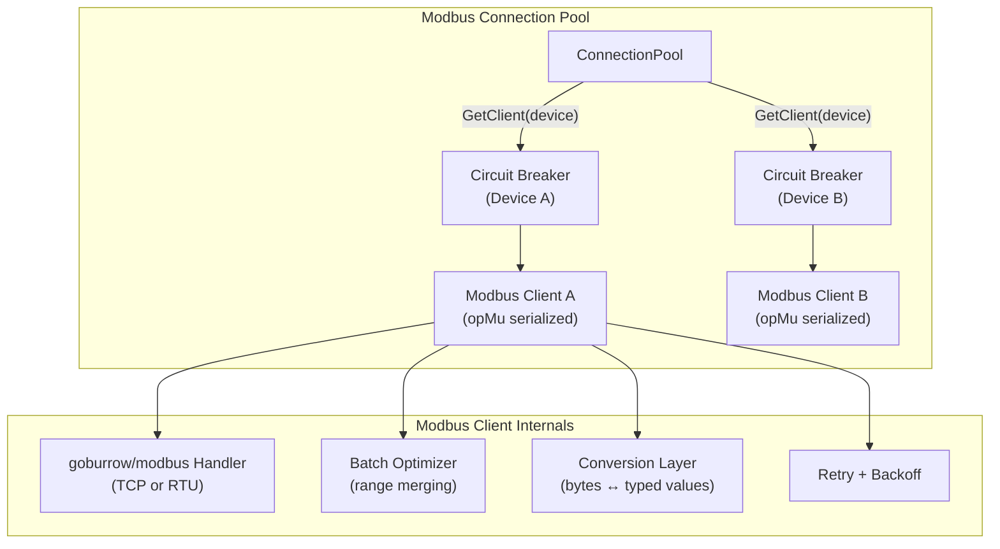
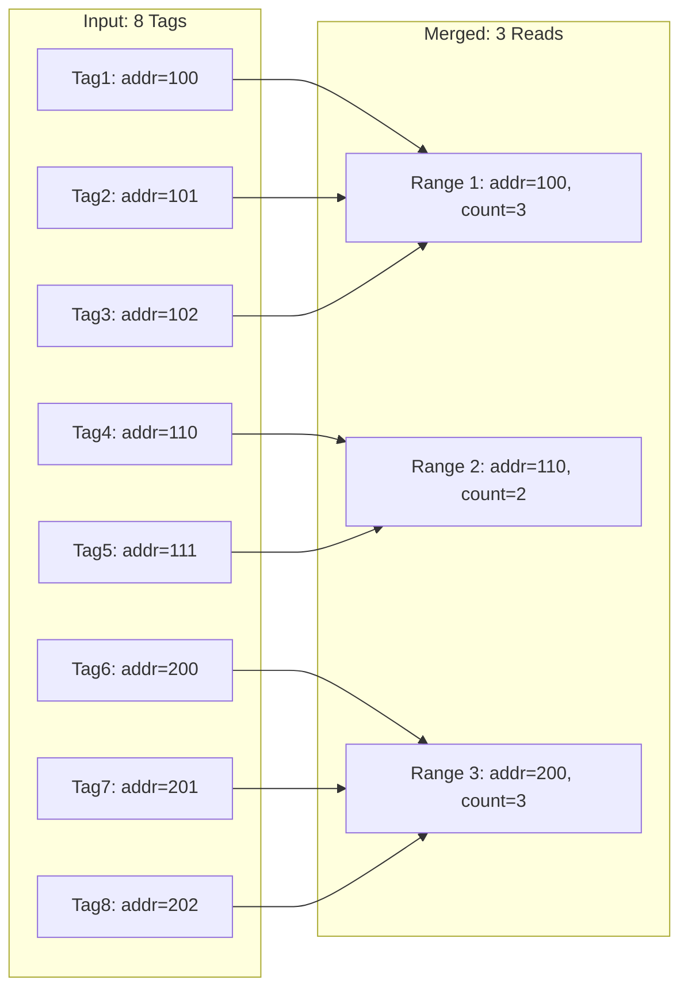
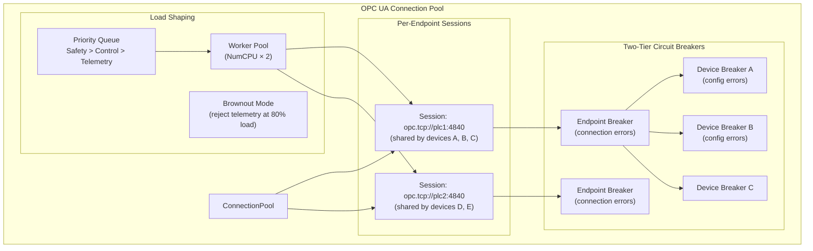
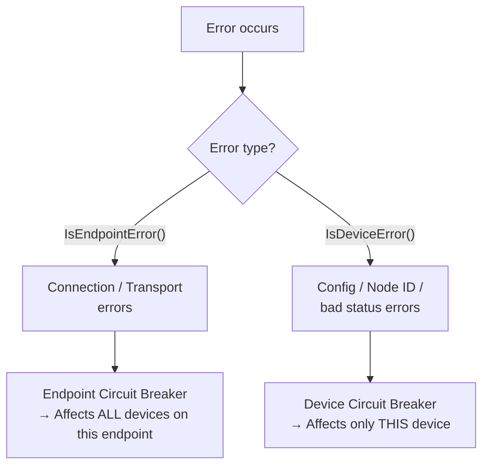
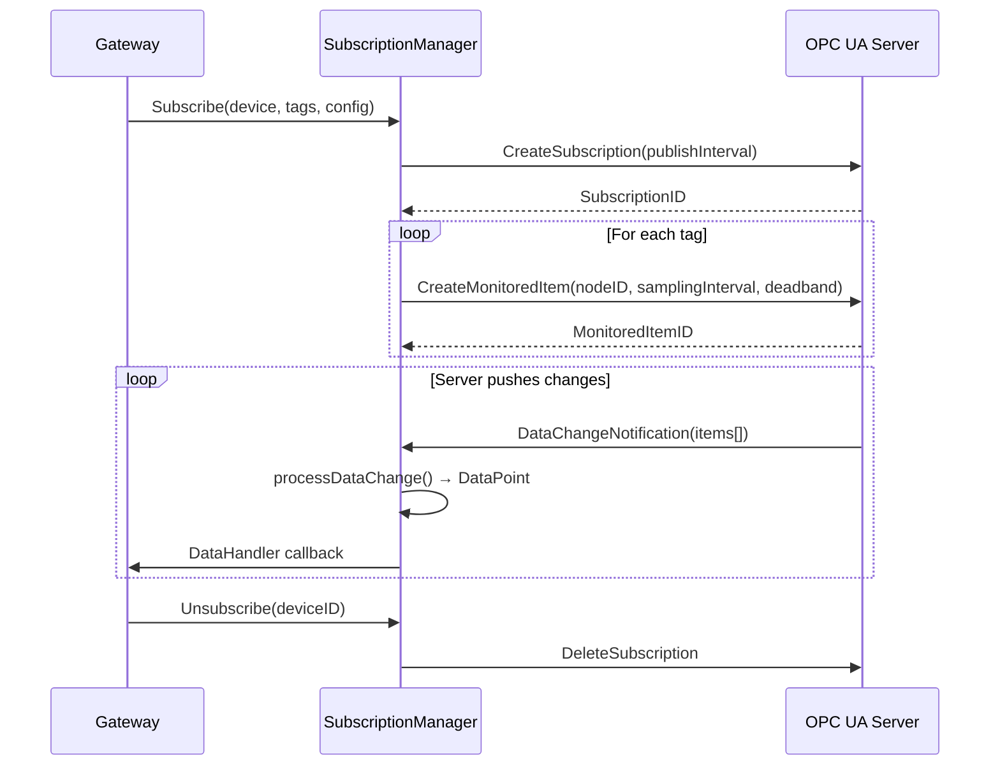
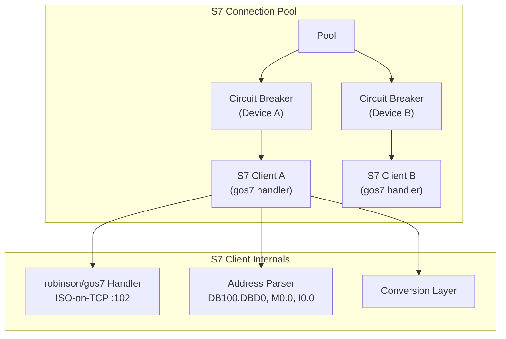
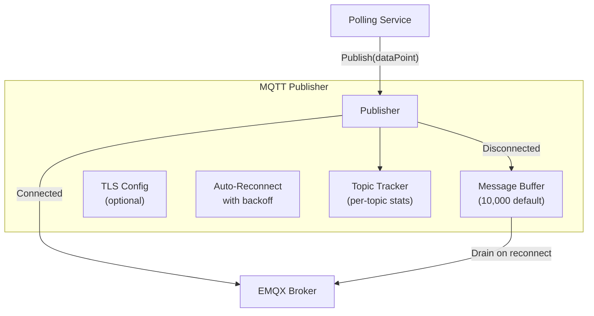
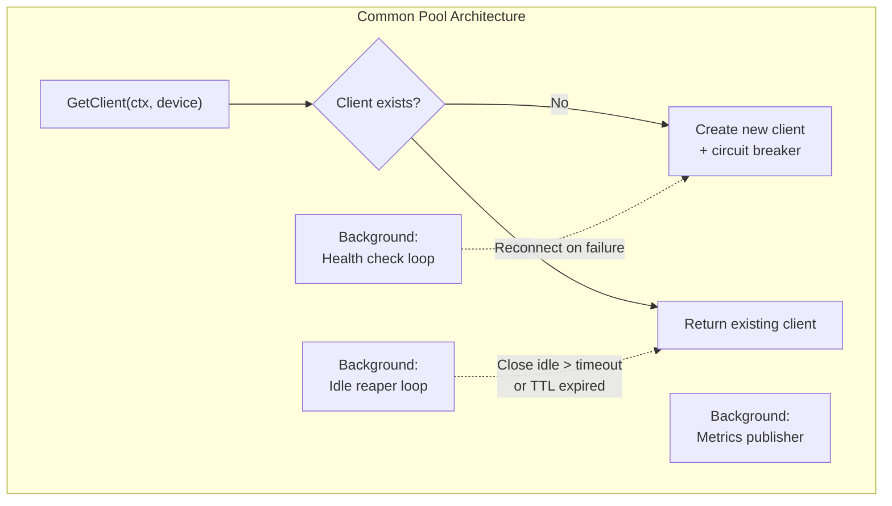

# Protocol Adapters

All industrial protocol adapters (Modbus TCP/RTU, OPC UA, Siemens S7) and the MQTT publisher. Each adapter implements the `ProtocolPool` interface from `internal/domain/protocol.go`:

```go
type ProtocolPool interface {
    ReadTags(ctx context.Context, device *Device, tags []*Tag) ([]*DataPoint, error)
    ReadTag(ctx context.Context, device *Device, tag *Tag) (*DataPoint, error)
    WriteTag(ctx context.Context, device *Device, tag *Tag, value interface{}) error
    Close() error
    HealthCheck() error
}
```

The `ProtocolManager` routes operations to the correct pool based on `device.Protocol`.

---

## 1. Modbus TCP/RTU Adapter

**Files:** `internal/adapter/modbus/`

### Architecture



### Connection Pool (`pool.go`)

- **Per-device connections**: Each device gets its own `Client` + circuit breaker
- **Max connections**: 500 default (configurable), suitable for 100–1000 devices
- **Background goroutines**:
  - `healthCheckLoop()` — periodic health check with automatic reconnect on failure
  - `idleReaperLoop()` — closes connections idle longer than `idle_timeout` (5 min default) or exceeding `MaxTTL`
  - `publishActiveConnectionMetrics()` — updates Prometheus gauge

> **What is a circuit breaker and why is it per-device?**
> A circuit breaker tracks consecutive failures for a connection. After N failures, it "opens" and immediately rejects new requests for a cooldown period — preventing the gateway from hammering an unresponsive device and causing cascading delays. By isolating breakers per-device, one failing PLC doesn't block reads to all other devices. Uses `sony/gobreaker`.

### Modbus Client (`client.go`)

**Thread safety:**

> The underlying `goburrow/modbus` library is **NOT thread-safe**. All read/write operations on a single client are serialized through an `opMu sync.Mutex`. This means concurrent tag reads to the same device are queued — a potential bottleneck for high-throughput devices.

**Batch optimization — the performance crown jewel:**

When `ReadTags()` is called with multiple tags, the client groups them into **contiguous register ranges** before issuing Modbus reads:



`buildContiguousRanges()` merges tags if the gap between addresses is ≤ 10 registers (configurable). This turns 8 individual Modbus reads into 3 batch reads — dramatically reducing round-trip overhead on slow networks.

**Coil & Discrete Input batching:**

Coils and discrete inputs use the same merge strategy via `buildCoilRanges()` with coil-specific tuning:
- **MaxCoilsPerRead**: 1000 (protocol allows up to 2000)
- **MaxGapSize**: 32 coils (only 4 bytes wasted per gap, since 8 coils pack into 1 byte)
- Bit extraction: each coil is at `byteIndex = bitOffset / 8`, `bitIndex = bitOffset % 8`, LSB-first

This means 100 scattered coils are read in 1-5 Modbus requests instead of 100 individual reads.

**Protocol limit validation:**
- Holding/input registers: max 125 per read (Modbus spec)
- Coils/discrete inputs: max 2000 per read
- Requests exceeding limits are rejected with `ErrModbusRegisterCountExceedsLimit`

**Retry logic:**
- Configurable attempts (3 default) with exponential backoff + jitter
- Only retries on transient errors (timeout, connection reset) — not on permanent errors (illegal address, data type mismatch)

### Data Conversion (`conversion.go`)

| Function | Direction | Description |
|---|---|---|
| `parseValue()` | bytes → typed | Convert raw register bytes to Go type based on `tag.DataType` |
| `valueToBytes()` | typed → bytes | Convert Go value to register bytes for writes |
| `reorderBytes()` | — | Handle byte order: BigEndian, LittleEndian, MidBigEndian (word-swap), MidLittleEndian (byte-swap) |
| `applyScaling()` | read path | `output = raw × scaleFactor + offset` |
| `reverseScaling()` | write path | `raw = (input - offset) / scaleFactor` |

> **What are MidBig/MidLittle endian byte orders?**
> Some PLCs store 32-bit values in a non-standard word-swapped order. A float32 `1234 5678` in bytes might be stored as `5678 1234` (MidBigEndian — words swapped, bytes within each word normal) or `7856 3412` (MidLittleEndian — both words and bytes swapped). These are common enough in industrial automation to warrant first-class support.

### Health & Diagnostics (`health.go`)

Per-tag diagnostics (`TagDiagnostic`) track success/error counts and timestamps for each tag individually — invaluable for identifying a single misconfigured tag among hundreds.

### File Map

| File | Purpose |
|---|---|
| `client.go` | Single-device Modbus client with batch optimization, retry, conversions |
| `pool.go` | Multi-device connection pool with circuit breakers and idle reaping |
| `health.go` | Per-device and per-tag health diagnostics |
| `types.go` | Type definitions, buffer pool, pool config defaults |
| `conversion.go` | Byte ↔ typed value conversion, scaling, byte order handling |

---

## 2. OPC UA Adapter

**Files:** `internal/adapter/opcua/`

The most complex adapter. Supports session sharing across devices, two-tier circuit breakers, fleet-wide load shaping with priority queues, OPC UA subscriptions, and full certificate-based security.

### Architecture



### Per-Endpoint Session Sharing (`session.go`)

> **Why share sessions across devices?**
> In industrial OPC UA deployments, it's common for a single OPC UA server (e.g., Kepware, Ignition) to host hundreds of devices/tags. Creating a separate TCP session per device would exhaust both gateway and server resources. Instead, the adapter creates **one session per unique endpoint** and binds multiple devices to it. This means 200 devices on the same Kepware server share a single OPC UA session.

The endpoint key is generated from: `endpoint_url + security_policy + security_mode + auth_mode + hash(credentials_or_certs)`. This ensures that changing a certificate triggers a new session (cert rotation safe) while multiple devices with identical connection settings share one.

### Two-Tier Circuit Breakers



- **Endpoint breaker** opens on connection/transport errors → all devices on that endpoint are blocked (no point retrying if the server is down)
- **Device breaker** opens on config/node-specific errors → only that device is blocked (other devices on the same endpoint keep working)
- `IsEndpointError()` and `IsDeviceError()` classify errors to route them to the correct breaker

### Load Shaping (`loadshaping.go`)

> **What is load shaping and why does it matter?**
> OPC UA servers (especially on PLCs) have limited processing capacity. If the gateway sends too many concurrent read requests, the PLC's control loop can be starved of CPU time — potentially causing production equipment to misbehave. Load shaping prevents this by limiting concurrent operations globally and per-endpoint.

**Three tiers of protection:**

1. **Deadline check**: If the request's context is already cancelled (timeout), don't even start
2. **Per-endpoint fairness**: Each endpoint has a concurrency limit, preventing one noisy endpoint from starving others
3. **Global limit**: Total in-flight operations capped across all endpoints

**Priority queues:**

| Priority | Level | Description |
|---|---|---|
| Safety | 2 (highest) | Safety-critical reads (always processed) |
| Control | 1 | Control loop reads |
| Telemetry | 0 (lowest) | Monitoring/reporting reads (shed first) |

**Brownout mode:**

When in-flight operations exceed 80% of the global maximum, `brownout mode` activates:
- **Telemetry** requests are rejected immediately with an error
- **Control** and **Safety** requests still proceed
- This gracefully degrades to essential operations when the system is overloaded

> **Cold-start jitter**: On startup, if many devices reconnect simultaneously, the load shaper spreads reconnection attempts over time to prevent PLC DOS.

### Subscriptions (`subscription.go`)

OPC UA supports a **Report-by-Exception** model: instead of polling, the server pushes data changes to the client. The `SubscriptionManager` manages this:



**Deadband filtering**: Configured per-subscription to suppress notifications for small value changes (e.g., ignore temperature changes < 0.1°C). Reduces network traffic for slowly-changing values.

**Subscription recovery**: After a session reconnect, the `SubscriptionRecoveryState` handles:
1. **Republish**: Request any notifications missed during downtime
2. **Rebind**: Re-create monitored items if the server lost subscription state

### Security (`security.go`)

Full OPC UA security support:

| Auth Mode | Description |
|---|---|
| Anonymous | No authentication (default, for development) |
| UserName | Username/password authentication |
| Certificate | X.509 certificate-based authentication |

| Security Policy | Encryption |
|---|---|
| None | No encryption (development only) |
| Basic128Rsa15 | Legacy encryption |
| Basic256 | Standard encryption |
| Basic256Sha256 | Recommended for production |
| Aes128_Sha256_RsaOaep | Modern encryption |
| Aes256_Sha256_RsaPss | Strongest available |

**Endpoint discovery**: `DiscoverAndSelectEndpoint()` queries the OPC UA server for available endpoints, scores them by security level, and selects the best match for the configured policy. When `opc_auto_select_endpoint` is enabled, the adapter automatically picks the most secure available endpoint.

**Certificate handling**: Supports PEM and DER formats, PKCS#1 and PKCS#8 private keys. Certificate content is hashed (not filename) for session key generation — allowing certificate rotation without restarting.

### File Map

| File | Purpose |
|---|---|
| `session.go` | Per-endpoint session sharing, device bindings, two-tier breaker classification |
| `pool.go` | Connection pool with session management, load shaping integration |
| `health.go` | Pool/session/device health and statistics |
| `conversion.go` | OPC UA Variant ↔ Go type conversion, status code → quality mapping |
| `loadshaping.go` | Fleet-wide load control: priority queues, brownout mode, per-endpoint fairness |
| `security.go` | Certificate loading, endpoint discovery, security config validation |
| `subscription.go` | OPC UA subscription management with deadband filtering and recovery |

---

## 3. Siemens S7 Adapter

**Files:** `internal/adapter/s7/`

### Architecture



### Connection Pool (`pool.go`)

Follows the same pattern as Modbus:
- Per-device clients with circuit breakers
- Background health check + idle reaper + metrics publishing
- `GetClient(ctx, device)` creates or retrieves connections by device ID

### S7 Client (`client.go`)

Uses the `robinson/gos7` library for ISO-on-TCP communication (port 102).

**Address format**: S7 tags use addresses like:
- `DB100.DBD0` — Data Block 100, Double Word at byte offset 0
- `M0.0` — Merker (memory) byte 0, bit 0
- `I0.0` — Input byte 0, bit 0
- `Q0.0` — Output byte 0, bit 0

The client parses these addresses to determine the S7 area, DB number, byte offset, and bit position.

**Connection parameters:**
- `rack` and `slot` identify the PLC within a Siemens rack system
- Default PDU size: 480 bytes
- Port: 102 (ISO-on-TCP standard)
- `MaxMultiReadItems = 20` — max items per `AGReadMulti` call
- `MaxMultiWriteItems = 20` — max items per `AGWriteMulti` call

**Batch writes (`WriteTags`):**

`WriteTags()` aggregates multiple write operations into batched `AGWriteMulti` calls (up to 20 items per PDU). Boolean writes are excluded from batching because they require read-modify-write to preserve adjacent bits in the same byte — these are processed individually via `WriteTag()`. Per-item errors are tracked via `S7DataItem.Error` fields. At the pool level, the entire batch executes through a single circuit breaker call.

### Data Conversion (`conversion.go`)

Same pattern as Modbus: `parseValue()` for reads, `valueToBytes()` for writes. Supports bool, int16, int32, float32, float64, uint16, uint32, string.

### File Map

| File | Purpose |
|---|---|
| `client.go` | Single-device S7 client with address parsing and error handling |
| `pool.go` | Multi-device connection pool with circuit breakers |
| `health.go` | Per-device health diagnostics and pool statistics |
| `types.go` | Type definitions, S7 area codes, word length constants |
| `conversion.go` | S7 byte ↔ Go type conversion |

---

## 4. MQTT Publisher

**File:** `internal/adapter/mqtt/publisher.go`

The outbound side of the gateway — publishes data points to the EMQX broker and buffers messages during broker downtime.

### Architecture



**Key behaviors:**
- **Auto-reconnect**: On broker disconnect, the publisher automatically reconnects with configurable delay
- **Message buffering**: During broker downtime, messages queue in a bounded buffer (10,000 default). When the broker reconnects, buffered messages drain in order
- **Topic tracking**: Each published topic is tracked with counters and timestamps — this data powers the Web UI's "Active Topics" view
- **TLS support**: Optional certificate-based encryption for broker connections
- **Batch publishing**: `PublishBatch()` for efficient multi-point publishing

**Stats exposed:**
- Messages published / failed / buffered
- Bytes sent
- Reconnection count
- Per-topic activity (last publish time, message count)

---

## 5. Cross-Adapter Patterns

### Pattern: Circuit Breakers Everywhere

All three protocol pools use `sony/gobreaker` for fault isolation:

```
Request → Circuit Breaker → {
  CLOSED:    Execute operation normally
  OPEN:      Reject immediately with ErrCircuitBreakerOpen
  HALF-OPEN: Allow one probe request to test recovery
}
```

State transitions: Closed → (N consecutive failures) → Open → (timeout) → Half-Open → (success) → Closed

**Per-device overrides:** Each device can optionally specify a `CircuitBreakerConfig` in its `ConnectionConfig` with fields: `MaxRequests`, `Interval`, `Timeout`, `FailureThreshold`, `FailureRatio`. Any zero-value field falls back to the pool default. This allows tuning breaker sensitivity per device — e.g., a flaky sensor might tolerate more failures before tripping.

### Pattern: Retry with Exponential Backoff + Jitter

All adapters retry transient errors with:
```
delay = baseDelay × 2^attempt + random(0, baseDelay)
```
The jitter prevents **thundering herd**: if 100 devices all lose connection simultaneously, randomized retry timing spreads the reconnection load instead of hitting the server with 100 simultaneous connections.

### Pattern: Connection Pooling



All three pools support a **MaxTTL** (connection time-to-live) that enforces a hard cap on connection age regardless of activity. The idle reaper checks both idle timeout AND MaxTTL expiry, closing connections that exceed either threshold. This prevents long-lived connections from accumulating stale state or leaking server resources.

### Pattern: Data Quality Signaling

Every `DataPoint` carries a `Quality` field:

| Quality | Meaning | When Set |
|---|---|---|
| `good` | Value is reliable | Successful read, device online |
| `bad` | Value is unreliable | Read error, device error |
| `uncertain` | Value may be stale | During reconnection, partial read |
| `timeout` | Read timed out | Context deadline exceeded |
| `config_error` | Tag misconfigured | Invalid node ID, address, data type |
| `device_failure` | Device is unresponsive | Connection failed, circuit breaker open |
| `not_connected` | No connection to device | Before initial connection |

Downstream consumers (SCADA, dashboards) use quality to decide whether to display, alarm on, or discard a value.
